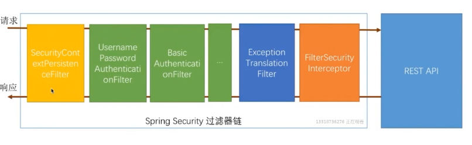
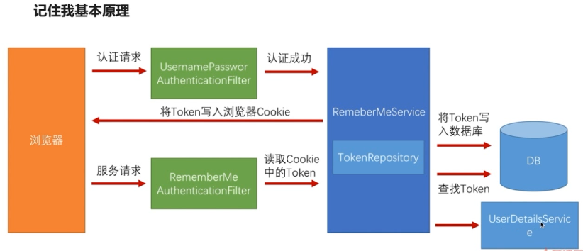

# 使用 Maven Module 搭建spring boot项目（整合Spring Security、Spring Social、spring OAuth）二

## Spring Security 开发基于表单的认证

### 简介

​	在以上开发的RESTful服务中，都是一种暴露而不安全的服务，任何人都可以随意访问。需要对访问进行合理的权限分配，对用户的身份进行认证和授权，保证服务的安全性和合法性，spring security 框架就是基于此而诞生的。

**Spring Security 核心功能：**

1. 认证（你是谁）
2. 授权（你能做什么）
3. 攻击防护（防止伪造身份）

### 基本原理

#### 开启Spring Security

​	在默认情况下，Spring Security 服务器中所有的服务都保护起来了，要访问某一个服务，都需要进行身份验证。

在`application.properties`中添加启动配置，默认开启`HttpBasic`方式进行验证

```xml
# spring security 默认配置(默认为true)
security.basic.enabled = true
```

若在未进行配置的情况下，用户名默认为`user`，并且登陆密码会在启动时临时生成，并在控制台输出

```
Using default security password: 99066b9e-054f-496f-9f29-4014eee36109
```

#### 自定义安全验证

1. 目的：写出重用的模块，跟认证授权相应的代码都写在相应的项目中，并可以被其他模块引用
2. 更改默认的验证方式，在浏览器项目中创建配置类，开启自定义配置

```java
**
 * WebSecurityConfigurerAdapter: Spring Security 在web应用上配置适配器
 */
@Configuration
public class BrowserSecurityConfig extends WebSecurityConfigurerAdapter {
/**
    * Spring Security 默认配置的代码演示
   */
   @Override
   protected void configure(HttpSecurity http) throws Exception {
      //最简单的配置
//http.httpBasic()//使用httpbasic验证，默认使用
      http.formLogin()//使用表单验证的意思
            .and()//
            .authorizeRequests()//对请求做授权
            .anyRequest()//任何请求
            .authenticated();//都需要身份验证
   }
}
```

3. 启动服务后，系统的认证方式从`HttpBasic`更改为`Form`方法

#### Security基本原理

##### 核心类简单介绍

​	Spring security 最核心的是一组过滤器链(一组Filter)，所有的功能都是建立在此基础上的，绿色中的过滤器是Spring security最核心的过滤器，作用是验证用户身份，每一种过滤器用来处理一种认证方式


`UsernamePasswordAuthenticationFilter` ：处理表单登陆验证

`BasicAuthenticationFilter` ：处理`HttpBasic`登陆验证

`FilterSecurityInterceptor` ：核心过滤链中最后一关，依据配置，判断当前请求能不能访问REST服务，如果不匹配，则抛出异常（根据不同原因）

`ExceptionTranslationFilter` ：捕获`FilterSecurityInterceptor`抛出的异常并处理(例如引导用户到登陆页面)

​	**通过配置可以选用绿色的过滤器，但非绿色的过滤器一定会在过滤器链上执行(`FilterSecurityInterceptor`不能关闭，`ExceptionTranslationFilter`一定在`FilterSecurityInterceptor`前)**


##### 内部流程解析

1. 访问访问已经配置好受保护的REST服务: `<http://localhost:8080/user>`
2. 进入`FilterSecurityInterceptor`

```java
public class FilterSecurityInterceptor{
	public void invoke(FilterInvocation fi){
		InterceptorStatusToken token = super.beforeInvocation(fi);//验证，不符合抛出异常
	}
} 
```

3. 抛出异常，被捕获

```java
public class ExceptionTranslationFilter{
	public void doFilter(ServletRequest req, ServletResponse res, FilterChain chain){
		try {
            //执行下一个过滤器，也就是FilterSecurityInterceptor
    		chain.doFilter(request, response);
    		this.logger.debug("Chain processed normally");
		} catch (IOException var9) {
    		throw var9;
		} catch (Exception var10) {
            //抛出异常，捕获
    		Throwable[] causeChain = this.throwableAnalyzer.determineCauseChain(var10);
    		RuntimeException ase = 		(AuthenticationException)this.throwableAnalyzer.getFirstThrowableOfType(AuthenticationException.class, causeChain);
    	if(ase == null) {
    		ase = (AccessDeniedException)this.throwableAnalyzer.getFirstThrowableOfType(AccessDeniedException.class, causeChain);
    	}
    	this.handleSpringSecurityException(request, response, chain, (RuntimeException)ase);//处理异常，并且引导用户处理

		}
	}
	} 
}
```

4. 引导用户登陆，用户登陆完毕
5. 进入用户名密码校验过滤器

```java
public class UsernamePasswordAuthenticationFilter{
	public Authentication attemptAuthentication(HttpServletRequest request, HttpServletResponse 		response) throws AuthenticationException {
    	if(this.postOnly && !request.getMethod().equals("POST")) {
        	throw new AuthenticationServiceException("Authentication method not supported: " + 				request.getMethod());
    	} else {
        	String username = this.obtainUsername(request);
        	String password = this.obtainPassword(request);
        	if(username == null) {
            	username = "";
        	}
        	if(password == null) {
            	password = "";
        	}
        	username = username.trim();
        	UsernamePasswordAuthenticationToken authRequest = new UsernamePasswordAuthenticationToken(username, password);
        	this.setDetails(request, authRequest);
        	return this.getAuthenticationManager().authenticate(authRequest);
    	}
	}
}
```

6. 进入`FilterSecurityInterceptor`，再次验证，通过验证，进入服务，服务返回数据


#### 自定义认证逻辑

##### Security处理用户信息校验逻辑

Spring Security 提供两个接口`UserDetailService`与`UserDetail`，用于校验用户信息逻辑

```java
package org.springframework.security.core.userdetails;

public interface UserDetailsService {
    UserDetails loadUserByUsername(String username) throws UsernameNotFoundException;
}
```

```java
package org.springframework.security.core.userdetails;

import org.springframework.security.core.GrantedAuthority;
/**
* 封装了spring security 登陆所需要的所有信息
*/
public interface UserDetails extends Serializable {
    Collection<? extends GrantedAuthority> getAuthorities();//权限信息
    String getPassword();
    String getUsername();
/*
 * 以下四个方法是可以实现自定义校验逻辑的
*/
    boolean isAccountNonExpired();//账户没有过期返回true
    boolean isAccountNonLocked();//账户是不是被锁定了(冻结)
boolean isCredentialsNonExpired();//密码是否过期
boolean isEnabled();//账户是不是可用(是否逻辑删除)
}
```

##### 自定义处理用户信息校验逻辑

```java
@Component
public class MyUserDetailsService implements UserDetailsService{

    private Logger logger = LoggerFactory.getLogger(getClass());

    /**
     *  模拟注入Dao或Mapper
     */
    //@Autowired
    //private UserDao userDao;

    /**
     * 开发中，所有的动态数据都需要从数据库中或其他数据储存介质读取
     * 包括权限列表
     */
    @Override
    public UserDetails loadUserByUsername(String username) throws UsernameNotFoundException {
        //模拟根据用户名使用Dao或Mapper寻找用户
        logger.info("登陆用户名： " + username);
        //User:spring security框架提供的一个实现了UserDetails接口的实现类
        //三个参数:username,password,authorities：授权
        //分割String类型为授权集合
        return new User(username,"123456", AuthorityUtils.commaSeparatedStringToAuthorityList("admin"));
    }
}

```

以上代码返回了一个User类，是Spring Security默认提供的一个UserDetails接口实现类，以上的构造器传入了3个参数，但是没有传入账号是否过期、是否被锁定，密码是否过期，是否可用(是否逻辑删除)等属性参数，这样默认都为true，账号可用。

若需要增加账号其他逻辑判断，则可以修改为

```java
return new User(username,"123456",true,true,true,true
                AuthorityUtils.commaSeparatedStringToAuthorityList("admin"));
```

##### 处理密码加解密

1. Spring Security 提供密码加密的接口，并且提供一个常用的密码处理类`BCryptPasswordEncoder`

```java
package org.springframework.security.crypto.password;

public interface PasswordEncoder {
/*
* var1:原始密码
* return:返回加密后的密码
*/
    String encode(CharSequence var1);
    
/**
* 用户输入的密码与数据库密码进行匹配
*/
    boolean matches(CharSequence var1, String var2);
}
```

2. 配置Spring Security提供的密码加密类

```java
@Configuration
public class BrowserSecurityConfig extends WebSecurityConfigurerAdapter {
   /**
    * 配置一个PasswordEncoder加密的实现类
    * 可以自定义加密类如使用MD5、SHA1等实现加密逻辑然后实现PasswordEncoder
    */
   @Bean
   public PasswordEncoder passwordEncoder() {
      return new BCryptPasswordEncoder();
   }
}
```

3. 在后台出，从数据库中读取出的密码应是用户注册时已经通过加密添加入数据库中。在UserDetails返回后，spring security 会从前台传过来的密码进行加密后，才会跟我们生成的UserDetails中的密码进行比对。
4. `BCryptPasswordEncoder`是Spring 提供的一个强大的密码加密工具类，同样的字符串进行加密，每次结果都会不一样，加密时，使用随机盐进行对取得得密码再次进行处理。安全性更强大。

对于`BCryptPasswordEncoder`的强大，原理还不清楚，在网上查了些资料，如下：

>spring security中的BCryptPasswordEncoder方法采用SHA-256 +随机盐+密钥对密码进行加密。SHA系列是Hash算法，不是加密算法，使用加密算法意味着可以解密（这个与编码/解码一样），但是采用Hash处理，其过程是不可逆的。

>加密(encode)：注册用户时，使用SHA-256+随机盐+密钥把用户输入的密码进行hash处理，得到密码的hash值，然后将其存入数据库中。

>密码匹配(matches)：用户登录时，密码匹配阶段并没有进行密码解密（因为密码经过Hash处理，是不可逆的），而是使用相同的算法把用户输入的密码进行hash处理，得到密码的hash值，然后将其与从数据库中查询到的密码hash值进行比较。如果两者相同，说明用户输入的密码正确。

>这正是为什么处理密码时要用hash算法，而不用加密算法。因为这样处理即使数据库泄漏，黑客也很难破解密码（破解密码只能用彩虹表）。


#### 个性化认证流程

一定要注意spring boot默认资源位置，不然会出现404状态

Spring boot 默认将/**所有访问映射到以下目录

```
classpath:/static
classpath:/public
classpath:/resources
classpath:/META-INF/resources/
```

##### 自定义登陆页面

###### 页面请求配置

1. 修改配置

在核心配置中添加`loginPage`配置

```java
@Configuration
public class BrowserSecurityConfig extends WebSecurityConfigurerAdapter {

	@Override
	protected void configure(HttpSecurity http) throws Exception {
   	//最简单的配置
   	//http.httpBasic()//使用httpbasic验证，默认使用
   		http.formLogin()//使用表单验证的意思
         .loginPage("/vic-login.html")
         .and()//
         .authorizeRequests()//对请求做授权
         .anyRequest()//任何请求
         .authenticated();//都需要身份验证
	}
}
```

2. 资源目录下添加相应的页面

在资源目录下`resources/vic-login.html`增加相应页面

```html
<!DOCTYPE html>
<html>
<head>
<meta charset="UTF-8">
<title>登录</title>
</head>
<body>
   <h2>标准登录页面</h2>
   <h3>表单登录</h3>
   <form action="/authentication/form" method="post">
      <table>
         <tr>
            <td>用户名:</td> 
            <td><input type="text" name="username"></td>
         </tr>
         <tr>
            <td>密码:</td>
            <td><input type="password" name="password"></td>
         </tr>

         <tr>
            <td colspan="2"><button type="submit">登录</button></td>
         </tr>
      </table>
   </form>
</body>
</html>

```

3. 启动服务

页面错误，提示：ERR_TOO_MANY_REDIRECTS（从定向过多）

原因：需要验证登陆时，需要跳转到`vic-login.html`，但本身`vic-login.html`也需要授权(在前面配置中,对所有访问都实行了验证)，因此会陷入一个死循环

解决：增加配置

```java
http.formLogin()//使用表单验证的意思
      .loginPage("/vic-login.html")
      .and()//
      .authorizeRequests()//对请求做授权
      .antMatchers("/vic-login.html").permitAll()
      .anyRequest()//任何请求
      .authenticated();//都需要身份验证
```

4. 处理登陆请求

在我们的页面中，表达提交的地址定位到`/authentication/form` ，但在Spring Security  `UsernamePasswordAuthenticationFilter.java`默认配置中处理的是`/login` 请求

```java
public UsernamePasswordAuthenticationFilter() {
    super(new AntPathRequestMatcher("/login", "POST"));
}
```

因此引入自定义配置的处理登陆请求的地址

```java
http.formLogin()//使用表单验证的意思
         .loginPage("/vic-login.html")//自定义登陆页面
         .loginProcessingUrl("/authentication/form")//登陆页面登陆跳转地址
         .and()//
         .authorizeRequests()//对请求做授权
         .antMatchers("/vic-login.html").permitAll()
         .anyRequest()//任何请求
         .authenticated();//都需要身份验证
```

5. 启动报错

控制台输出：

```
This application has no explicit mapping for /error, so you are seeing this as a fallback.

Fri Oct 06 14:49:33 CST 2017
There was an unexpected error (type=Forbidden, status=403).
Could not verify the provided CSRF token because your session was not found.
```

原因：spring security 默认情况下提供了一个叫跨站请求伪造的一个防护

解决：修改配置，暂时关闭请求

```java
 http.formLogin()//使用表单验证的意思
         .loginPage("/vic-login.html")//自定义登陆页面
         .loginProcessingUrl("/authentication/form")//登陆页面登陆跳转地址
         .and()//
         .authorizeRequests()//对请求做授权
         .antMatchers("/vic-login.html").permitAll()
         .anyRequest()//任何请求
         .authenticated()//都需要身份验证
         .and()
         .csrf().disable();//关闭跨站伪造服务
```

**注：这里对跨站伪造服务不了解，择日进行研究**

---

###### 服务请求配置

​	虽然现在可以使用自定义的登陆页面，但是离我们的目标还是有点距离的。我们在页面上请求我们的RESTful服务请求，我们处理是返回一个自定义的html页面，这个是不合理的，RestFul服务应该返回的是状态码或者是json数据，但我们返回的是一个html，如果是html请求，那么我们应该返回是html，不是则返回json（理应想spring security的错误处理机制一样）。我们的目标是实现一个可重用的模块，可重用的目标是，有多个模块使用同一个模块，但是不可能所有的模块都使用这一个我们刚刚自定义的登陆页面。如果定义其他模块可以使用自己的页面，如果不配置就使用我们默认的配置页面


1. 创建处理服务

```java
@RestController
public class BrowserSecurityController {

   private Logger logger = LoggerFactory.getLogger(getClass());

   /**
    * 把当前请求缓存到session里
    */
   private RequestCache requestCache = new HttpSessionRequestCache();

   /**
    * Spring security 提供的一个跳转工具
    */
   private RedirectStrategy redirectStrategy = new DefaultRedirectStrategy();

   @Autowired
   private SecurityProperties securityProperties;
   
/**
 * 当需要身份认证时，跳转到这里
 * @return 包装后的错误信息
 */
//@RequestMapping(SecurityConstants.DEFAULT_UNAUTHENTICATION_URL)
@RequestMapping("/authentication/require")
@ResponseStatus(code = HttpStatus.UNAUTHORIZED)//返回状态码 401未授权
public SimpleResponse requireAuthentication(HttpServletRequest request, HttpServletResponse response)throws IOException {

   SavedRequest savedRequest = requestCache.getRequest(request, response);//获取引发跳转的请求

   if (savedRequest != null) {
      String targetUrl = savedRequest.getRedirectUrl();
      logger.info("引发跳转的请求是:" + targetUrl);
      if (StringUtils.endsWithIgnoreCase(targetUrl, ".html")) {//判断跳转url是否以.html结尾
         redirectStrategy.sendRedirect(request, response, securityProperties.getBrowser().getLoginPage());//用户定义或系统默认
      }
   }
   //如果不是html请求，那么返回一个自定义对象作为json数据返回
   return new SimpleResponse("访问的服务需要身份认证，请引导用户到登录页");
}
```

2. 定义信息回显包装类

```java
/**
 * 返回信息实体包装
 */
public class SimpleResponse {
   public SimpleResponse(Object content){ this.content = content; }
//定义object意味着我们可以返回任何对象
   private Object content;
   public Object getContent() { return content; }
   public void setContent(Object content) {this.content = content; }
}
```

3. 在项目中`application.properties`配置自定义的登陆页

```properties
# 配置自定义跳转登陆的页面
vic.security.browser.loginPage = /vic-login.html
```

4. 系统配置封装

系统配置封装的目的是实现可配置化，自定义化。简单来说就是：配置覆盖系统默认

定义系统封装实体结构：

```
SecurityProperties                        # 系统总配置
      | - - - BrowserProperties           # 浏览器相关配置
      | - - - ValidateCodeProperties      # 验证码相关配置
      | - - - OAuthProperties             # OAuth相关配置
      | - - - SocialProperties            # 社交登陆相关配置
```

5. 定义各个配置类

```java
public class BrowserProperties {
    /**
     * 默认值，用户没有配置就使用默认值
     * 若用户自定义配置则使用用户配置的值
     */
    private String loginPage = "vic-login.html";
    public String getLoginPage() { return loginPage; }
    public void setLoginPage(String loginPage) {this.loginPage = loginPage; }
}
```

```java
@ConfigurationProperties(prefix = "vic.security")//读取配置文件中vic.security的配置
public class SecurityProperties {

    //browser读取vic.security.browser属性
    private BrowserProperties browser = new BrowserProperties();

    public BrowserProperties getBrowser() {
        return browser;
    }

    public void setBrowser(BrowserProperties browser) {
        this.browser = browser;
    }
}
```

```java
@Configuration
@EnableConfigurationProperties(SecurityProperties.class)//使自定义配置生效
public class SecurityCoreConfig {
}
```

5. 修改需要身份跳转的请求，并且对配置的请求权限进行放开

```java
http.formLogin()//使用表单验证的意思
         //.loginPage("/vic-login.html")//自定义登陆页面
    	.loginPage("/authentication/require")//自定义登陆页面
    	.and()
			.authorizeRequests()
			.antMatchers("/authentication/require",
					securityProperties.getBrowser().getLoginPage()).permitAll()
```

6. 总结

   `/authentication/require`的实现逻辑可以自定义配置，不同的系统根据不同的业务处理进行自定义


##### 自定义登陆成功处理

###### Spring Security默认的登陆成功处理器

​	Spring Security默认的处理登陆成功的机制是:登陆成功后，跳转到引发登陆的那个请求上（如：访问/user需要进行登陆，则跳到登陆页，当登陆成功后，再次跳转到/user）

Spring Security提供`AuthenticationSuccessHandler`接口供实现登陆成功跳转，默认使用其实现类`SavedRequestAwareAuthenticationSuccessHandler `： 跳转到之前缓存器的那个请求

```java
package org.springframework.security.web.authentication;

/*
* authentication:封装了认证相关的信息
* 包括:认证请求的一些信息，session
* 认证通过后的UserDetails用户信息
*/
public interface AuthenticationSuccessHandler {
    void onAuthenticationSuccess(HttpServletRequest request, HttpServletResponse response, Authentication authentication) throws IOException, ServletException;
}
```

###### 自定义登陆成功处理器

1. 定义当前登陆类型，并加入`BrowserProperties `配置中，实现可配置化

```java
public enum LoginType {
    /**
     * 跳转
     */
    REDIRECT,

    /**
     * 返回json
     */
    JSON
}
```

```java
public class BrowserProperties {
    /**
     * 默认值，用户没有配置就使用默认值
     * 若用户自定义配置则使用用户配置的值
     */
    private String loginPage = "/vic-login.html";

    private LoginType loginType = LoginType.JSON; //默认是json
}
```

2. 定义处理器实现类

```java
@Component
public class VicAuthenticationSuccessHandler extends SavedRequestAwareAuthenticationSuccessHandler {
        //implements AuthenticationSuccessHandler {

    private Logger logger = LoggerFactory.getLogger(getClass());

    /**
     * spring mvc在启动的时候，自动声明这个bean
     * 作用:把对象输出为json数据
     */
    @Autowired
    private ObjectMapper objectMapper;

    @Autowired
    private SecurityProperties securityProperties;

    @Override
    public void onAuthenticationSuccess(HttpServletRequest request, HttpServletResponse response, Authentication authentication) throws IOException, ServletException {
        logger.info("登录成功");

        //这里可以增加实现逻辑，比如说从请求头中获取请求类型，根据请求类型去跳转，如果没有带指定的请求头，则按系统配置，实现参数覆盖自定义配置，自定义配置覆盖默认配置
        
        if (LoginType.JSON.equals(securityProperties.getBrowser().getLoginType())) {//自定义输出
            response.setContentType("application/json;charset=UTF-8");
            response.getWriter().write(objectMapper.writeValueAsString(authentication));
        } else {
            super.onAuthenticationSuccess(request, response, authentication);//跳转到激发登陆请求的链接
        }
    }
}
```

3. 加入配置中，使自定义的成功处理器生效

```java
public class BrowserSecurityConfig{
//注入自定义成功处理bean
@Autowired
private AuthenticationSuccessHandler vicAuthenticationSuccessHandler;
protected void configure(HttpSecurity http) throws Exception {
   //最简单的配置
   //http.httpBasic()//使用httpbasic验证，默认使用
   http.formLogin()//使用表单验证的意思
         //.loginPage("/vic-login.html")//自定义登陆页面
         .loginPage("/authentication/require")//自定义登陆页面跳转的controller
         .loginProcessingUrl("/authentication/form")//登陆页面登陆跳转地址
         .successHandler(vicAuthenticationSuccessHandler)//使用自定义登陆跳转处理
         ………
}
```

4. 启动服务，获得返回信息

```
{authorities: [{authority: "admin"}],…}
	authenticated:true
	authorities:[{authority: "admin"}]
	0:{authority: "admin"}
	credentials:null
	details:{remoteAddress: "0:0:0:0:0:0:0:1", sessionId: "9785C465BA32BB2D34BBC2FF872A878A"}
	remoteAddress:"0:0:0:0:0:0:0:1"
	sessionId:"9785C465BA32BB2D34BBC2FF872A878A"
	name:"edpmaster@123.com"
	principal:{password: null, username: "edpmaster@123.com", authorities: [{authority: "admin"}],…}
	accountNonExpired:true
	accountNonLocked:true
	authorities:[{authority: "admin"}]
	credentialsNonExpired:true
	enabled:true
	password:null
	username:"edpmaster@123.com"
```

注意：根据登陆方式的不同，Authentication里的信息也是不同的。他是一个接口，在实际当中，会根据登陆方式不同，会赋值不同的实现类


##### 自定义登陆失败处理器

###### Spring Security 默认的登陆失败处理

Spring Security提供`AuthenticationFailureHandler `接口供实现登陆失败处理，默认使用其实现类`SimpleUrlAuthenticationFailureHandler `： 用户不存在或密码错误问题。这种情况下能够实现从哪个登录页面过来的还是返回原登录页，并携带错误信息

```java
package org.springframework.security.web.authentication;

public interface AuthenticationFailureHandler {
    void onAuthenticationFailure(HttpServletRequest var1, HttpServletResponse var2, AuthenticationException var3) throws IOException, ServletException;
}
```

###### 自定义登陆失败处理

```java
@Component
public class VicAuthenticationFailureHandler extends SimpleUrlAuthenticationFailureHandler{
                //implements AuthenticationFailureHandler {
    private Logger logger = LoggerFactory.getLogger(getClass());
    @Autowired
    private ObjectMapper objectMapper;
    @Autowired
    private SecurityProperties securityProperties;
    /**
     * @param authenticationException 认证过程中产生的异常
     */
    @Override
    public void onAuthenticationFailure(HttpServletRequest request, HttpServletResponse response,
                                        AuthenticationException authenticationException) throws IOException, ServletException {
        logger.info("登录失败");
        if (LoginType.JSON.equals(securityProperties.getBrowser().getLoginType())) {
            response.setStatus(HttpStatus.INTERNAL_SERVER_ERROR.value());// 500 服务器内部异常
            response.setContentType("application/json;charset=UTF-8");
            response.getWriter().write(objectMapper.writeValueAsString(authenticationException));
        }else{
            super.onAuthenticationFailure(request, response, authenticationException);//spring boot 默认的处理方式
        }
    }
}
```

---

#### Spring Security 认证流程源码解析

##### 认证流程说明（以用户名密码登陆为入口）

```
- - 登陆请求 - (携带登陆信息) - > UsernamePasswordAuthenticationFilter - (携带未认证的Authentication) - > AuthenticationManager - - > AuthenticationProvider - - > UserDetailService - - > UserDetails - - > Authentication(已认证)
```

```
登陆请求
   | (携带登陆信息)
UsernamePasswordAuthenticationFilter
   | (携带未认证的Authentication)
AuthenticationManager
   |
AuthenticationProvider
   |
UserDetailService
   |
UserDetails
   |
Authentication(已认证)
```

###### UsernamePasswordAuthenticationFilter源码流程解析

`UsernamePasswordAuthenticationToken.java`

```java
//构造函数
public UsernamePasswordAuthenticationToken(Object principal, Object credentials) {
    super((Collection)null); //一组权限，当前没有进行身份验证，所以无权限
    this.principal = principal;//用户名
    this.credentials = credentials;//密码
    this.setAuthenticated(false);//当前存进去的信息是否经过身份验证
}

```

------

`UsernamePasswordAuthenticationFilter.java`

```java
public class UsernamePasswordAuthenticationFilter{
public Authentication attemptAuthentication(HttpServletRequest request,
      HttpServletResponse response) throws AuthenticationException {
   if (postOnly && !request.getMethod().equals("POST")) {
      throw new AuthenticationServiceException(
            "Authentication method not supported: " + request.getMethod());
   }
   //获取用户密码
   String username = obtainUsername(request);
   String password = obtainPassword(request);
   if (username == null) {username = ""; }
   if (password == null) {password = "";}
   username = username.trim();

/*
* UsernamePasswordAuthenticationToken是Authentication接口的一个实现类
*/
   UsernamePasswordAuthenticationToken authRequest = new UsernamePasswordAuthenticationToken(
         username, password);

   // Allow subclasses to set the "details" property
/*
* 将请求的一些信息，封装到上面的UsernamePasswordAuthenticationToken中
* 包括一些session信息，ip等
*/
   setDetails(request, authRequest);

/*
* this.getAuthenticationManager()返回一个AuthenticationManager对象
* 这个对象本身并不包含验证逻辑
* 作用：管理AuthenticationProvider
*/
   return this.getAuthenticationManager().authenticate(authRequest);
}
}
```

---

`ProviderManager.java `

```java
public class ProviderManager implements AuthenticationManager, MessageSourceAware,
      InitializingBean {
          
public Authentication authenticate(Authentication authentication)
      throws AuthenticationException {
   //获取Authentication的类型
   Class<? extends Authentication> toTest = authentication.getClass();
   AuthenticationException lastException = null;
   Authentication result = null;
   boolean debug = logger.isDebugEnabled();

/*
* 不同的认证方式，它的认证逻辑是不一样的（如密码登陆需要验证密码，而微信登陆则不需要验证密码）
*/
   for (AuthenticationProvider provider : getProviders()) {
       //每一种AuthenticaitonToken都有各自对应的AuthenticationProvider
      if (!provider.supports(toTest)) {
         continue;
      }

      if (debug) {
         logger.debug("Authentication attempt using "
               + provider.getClass().getName());
      }

      try {
	//真正的校验逻辑
         result = provider.authenticate(authentication);

         if (result != null) {
            copyDetails(authentication, result);
            break;
         }
      }
      catch (AccountStatusException e) {
         prepareException(e, authentication);
         // SEC-546: Avoid polling additional providers if auth failure is due to
         // invalid account status
         throw e;
      }
      catch (InternalAuthenticationServiceException e) {
         prepareException(e, authentication);
         throw e;
      }
      catch (AuthenticationException e) {
         lastException = e;
      }
   }
   //循环结束
   if (result == null && parent != null) {
      // Allow the parent to try.
      try {
         result = parent.authenticate(authentication);
      }
      catch (ProviderNotFoundException e) {
         // ignore as we will throw below if no other exception occurred prior to
         // calling parent and the parent
         // may throw ProviderNotFound even though a provider in the child already
         // handled the request
      }
      catch (AuthenticationException e) {
         lastException = e;
      }
   }

   if (result != null) {
      if (eraseCredentialsAfterAuthentication
            && (result instanceof CredentialsContainer)) {
         // Authentication is complete. Remove credentials and other secret data
         // from authentication
         ((CredentialsContainer) result).eraseCredentials();
      }

      eventPublisher.publishAuthenticationSuccess(result);
      return result;
   }

   // Parent was null, or didn't authenticate (or throw an exception).

   if (lastException == null) {
      lastException = new ProviderNotFoundException(messages.getMessage(
            "ProviderManager.providerNotFound",
            new Object[] { toTest.getName() },
            "No AuthenticationProvider found for {0}"));
   }

   prepareException(lastException, authentication);

   throw lastException;
}

}

```

---

`AbstractUserDetailsAuthenticationProvider.java`

result = provider.authenticate(authentication)的实现就是在此类中

```java
public abstract class AbstractUserDetailsAuthenticationProvider implements
      AuthenticationProvider, InitializingBean, MessageSourceAware {
public Authentication authenticate(Authentication authentication)
      throws AuthenticationException {
   Assert.isInstanceOf(UsernamePasswordAuthenticationToken.class, authentication,
         messages.getMessage(
               "AbstractUserDetailsAuthenticationProvider.onlySupports",
               "Only UsernamePasswordAuthenticationToken is supported"));

   // Determine username
   String username = (authentication.getPrincipal() == null) ? "NONE_PROVIDED"
         : authentication.getName();

   boolean cacheWasUsed = true;
   UserDetails user = this.userCache.getUserFromCache(username);

   if (user == null) {
      cacheWasUsed = false;

      try {
         user = retrieveUser(username,
               (UsernamePasswordAuthenticationToken) authentication);
      }
      catch (UsernameNotFoundException notFound) {
         logger.debug("User '" + username + "' not found");

         if (hideUserNotFoundExceptions) {
            throw new BadCredentialsException(messages.getMessage(
                  "AbstractUserDetailsAuthenticationProvider.badCredentials",
                  "Bad credentials"));
         }
         else {
            throw notFound;
         }
      }

      Assert.notNull(user,
            "retrieveUser returned null - a violation of the interface contract");
   }

   try {
      preAuthenticationChecks.check(user);
      additionalAuthenticationChecks(user,
            (UsernamePasswordAuthenticationToken) authentication);
   }
   catch (AuthenticationException exception) {
      if (cacheWasUsed) {
         // There was a problem, so try again after checking
         // we're using latest data (i.e. not from the cache)
         cacheWasUsed = false;
         user = retrieveUser(username,
               (UsernamePasswordAuthenticationToken) authentication);
         preAuthenticationChecks.check(user);
         additionalAuthenticationChecks(user,
               (UsernamePasswordAuthenticationToken) authentication);
      }
      else {
         throw exception;
      }
   }

   postAuthenticationChecks.check(user);

   if (!cacheWasUsed) {
      this.userCache.putUserInCache(user);
   }

   Object principalToReturn = user;

   if (forcePrincipalAsString) {
      principalToReturn = user.getUsername();
   }

   return createSuccessAuthentication(principalToReturn, authentication, user);
}

}
```


##### 认证结果如何在多个请求之间共享

```
登陆请求
   | (携带登陆信息)
UsernamePasswordAuthenticationFilter
   | (携带未认证的Authentication)
AuthenticationManager
   |
AuthenticationProvider
   |
UserDetailService
   |
UserDetails
   |
Authentication(已认证)
   |
SecurityContext
   |
SecurityContextHolder
   |
SecurityContextPersistenceFilter
```

```java
public abstract class AbstractAuthenticationProcessingFilter extends GenericFilterBean
      implements ApplicationEventPublisherAware, MessageSourceAware {
public void doFilter(ServletRequest req, ServletResponse res, FilterChain chain)
      throws IOException, ServletException {
     … … …
     successfulAuthentication(request, response, chain, authResult);
}
  protected void successfulAuthentication(HttpServletRequest request,
      HttpServletResponse response, FilterChain chain, Authentication authResult)
      throws IOException, ServletException {
… … …
/*
 * 将已经认证成功后的Authentication 放入 SecurityContext中，然后
 * 放进SecurityContextHolder
*/
    SecurityContextHolder.getContext().setAuthentication(authResult);
}

}

```



`SecurityContextPersistenceFilter`过滤器的作用：

1. 当请求进来时，检查Session中是否有SecurityContext，如果有则取出放到当前线程中
2. 当请求结束后，线程中有SecurityContext，则取出放进Session中


##### 获取认证用户信息

```java
@RequestMapping("/user")
public class UserController {
    /**
     * 获取当前用户信息，使用SecurityContextHolder
     */
    @GetMapping("/me")
    public Object getCurrentUser(){
        return SecurityContextHolder.getContext().getAuthentication();
    }

    /**
     * 获取当前用户信息，使用Spring自动注入，
     * spring会在后台自动在SecurityContext中寻找相应的类
     */
    @GetMapping("/me2")
    public Object getCurrentUsers(Authentication authentication){
       return authentication;
    }
}
```


#### 验证码功能

##### 实现思想

​	校验实现思路：在`UsernamePasswordAuthenticationFilter`前，加入自定义的验证码过滤器，验证通过则进入`UsernamePasswordAuthenticationFilter`，验证不通过则抛出异常

1. 验证码参数可配置

```
请求级配置 （如服务中的参数）
    | （覆盖）
应用级配置 （在配置文件中定义）
    | （覆盖）
 默认配置  （属性中的默认值）
```

对于验证码，默认配置会存在默认值，当模块自定义时，配置会覆盖默认值（通过properties指定配置），当请求参数中存在指定参数，则会覆盖默认值或配置值

2. 验证码拦截接口可配置

系统提供默认的拦截URL，通过配置，用户也可以指定验证码接口拦截的URL

3. 验证码生成逻辑可配置

通过接口化，系统提供默认的验证码生成逻辑，用户自定义的生成逻辑，可覆盖系统的默认实现

4. 基本类介绍

**验证码生成器**

`ValidateCodeGenerator` : 其作用是提供生成验证码接口

​	实现类 1) `ImageCodeGenerator` ： 图形验证码生成器，生成一个图形验证码

​	实现类 2) `SmsCodeGenerator` : 短信验证码生成器，生成一个短信验证码

**验证码处理器**

`ValidateCodeProcessor` : 其作用是封装不同校验码的处理逻辑，提供`创建`和`验证`方法

​	实现类：`AbstractValidateCodeProcessor` : 此类为抽象类

​		作用是：1) 收集所有的验证码生成器

​				2) 创建验证码：包括生成验证码、保存验证码、发送验证码（可由子类自定义实现）

​			实现类 1)`ImageCodeProcessor`：覆盖父类中的发送验证码处理逻辑

​			实现类 2)`SmsCodeProcessor`：覆盖父类中的发送验证码处理逻辑

**验证码处理器寻找器**

`ValidateCodeProcessorHolder` :其作用是

​	1) 收集所有`ValidateCodeProcessor` 的实现类

​	2) 根据请求类型，获取指定的`ValidateCodeProcessor` 

**验证码存储器**

`ValidateCodeRepository`：起作用是提供验证码保存、获取、删除

**验证码过滤器**

`ValidateCodeFilter`： 用于在Spring Security 过滤器链中进行验证

**请求逻辑**

`ValidateCodeProcessorHolder`通过请求中的TYPE(验证码类型)寻找相应类型的`ValidateCodeProcessor` 进行验证码的生成、保存和发送

##### 验证码接口定义

1. 验证码基类，所有验证码通用的属性

```java
/**
 * 验证码属性，字符串验证码、过期时间
 * created by chuIllusions_tan 20180228
 *
 */
public class ValidateCode implements Serializable {

	private String code;

	private LocalDateTime expireTime;

	public ValidateCode(String code, int expireIn){
		this.code = code;
		this.expireTime = LocalDateTime.now().plusSeconds(expireIn);
	}

	public ValidateCode(String code, LocalDateTime expireTime){
		this.code = code;
		this.expireTime = expireTime;
	}
	
	public boolean isExpried() {
		return LocalDateTime.now().isAfter(expireTime);
	}
	public String getCode() {
		return code;
	}

	public void setCode(String code) {
		this.code = code;
	}

	public LocalDateTime getExpireTime() {
		return expireTime;
	}

	public void setExpireTime(LocalDateTime expireTime) {
		this.expireTime = expireTime;
	}
	
}
```

2. 验证码异常类，存储验证码异常信息

```java
/**
 * 验证码异常类
 *
 * created by chuIllusions_tan 20180228
 */
public class ValidateCodeException extends AuthenticationException {

	private static final long serialVersionUID = -7285211528095468156L;

	public ValidateCodeException(String msg) {
		super(msg);
	}
}
```

3. 验证码生成器接口

```java
/**
 * 验证码生成器接口
 *
 * created by chuIllusions_tan 20180301
 */
public interface ValidateCodeGenerator {

	ValidateCode generate(ServletWebRequest request);
	
}
```

4. 验证码处理器接口

```java
/**
 * 校验码处理器，封装不同校验码的处理逻辑
 *
 * created by chuIllusions_tan 20180301
 */
public interface ValidateCodeProcessor {
	
	/**
	 * 验证码放入session时的前缀
	 */
	String SESSION_KEY_PREFIX = "SESSION_KEY_FOR_CODE_";
	
	/**
	 * 创建校验码
	 * @param request 工具类，request or response 都可以放入此包装类
	 */
	void create(ServletWebRequest request) throws Exception;

	/**
	 * 校验验证码
	 *
	 * @param servletWebRequest 工具类，request or response 都可以放入此包装类
	 */
	void validate(ServletWebRequest servletWebRequest);
}
```

5. 验证码处理器寻找器定义

主要用于寻找指定的验证码处理器

```java
@Component
public class ValidateCodeProcessorHolder {

	@Autowired
	private Map<String, ValidateCodeProcessor> validateCodeProcessors;

	public ValidateCodeProcessor findValidateCodeProcessor(ValidateCodeType type) {
		return findValidateCodeProcessor(type.toString().toLowerCase());
	}

	public ValidateCodeProcessor findValidateCodeProcessor(String type) {
		String name = type.toLowerCase() + ValidateCodeProcessor.class.getSimpleName();
		ValidateCodeProcessor processor = validateCodeProcessors.get(name);
		if (processor == null) {
			throw new ValidateCodeException("验证码处理器" + name + "不存在");
		}
		return processor;
	}

}
```

6. 验证码类型定义，主要定义了短信验证码与图片验证码

```java
/**
 * 验证码类型
 * 
 * String DEFAULT_PARAMETER_NAME_CODE_IMAGE = "imageCode";
 * 验证图片验证码时，http请求中默认的携带图片验证码信息的参数的名称
 *
 * String DEFAULT_PARAMETER_NAME_CODE_SMS = "smsCode";
 * 验证短信验证码时，http请求中默认的携带短信验证码信息的参数的名称
 * created by chuIllusions_tan 20180308
 */
public enum ValidateCodeType {
	
	/**
	 * 短信验证码
	 */
	SMS {
		@Override
		public String getParamNameOnValidate() {
			return SecurityConstants.DEFAULT_PARAMETER_NAME_CODE_SMS;
		}
	},
	/**
	 * 图片验证码
	 */
	IMAGE {
		@Override
		public String getParamNameOnValidate() {
			return SecurityConstants.DEFAULT_PARAMETER_NAME_CODE_IMAGE;
		}
	};

	/**
	 * 校验时从请求中获取的参数的名字
	 * @return
	 */
	public abstract String getParamNameOnValidate();

}
```

7. 定义验证码配置属性

```java
/**
 * 验证码需要配置的基本属性
 *
 * created by chuIllusions_tan 20180308
 */
public class CodeProperties {

    private int length = 4;  //验证码基本长度
    private int expireIn = 60;//验证码的过期时间/秒

    private String url; //拦截url可配置化

    public int getLength() {
        return length;
    }
    public void setLength(int lenght) {
        this.length = lenght;
    }
    public int getExpireIn() {
        return expireIn;
    }
    public void setExpireIn(int expireIn) {
        this.expireIn = expireIn;
    }
    public String getUrl() {
        return url;
    }
    public void setUrl(String url) {
        this.url = url;
    }

}
```

8. 定义配置属性，并加入`SecurityProperties`配置类中

```java
/**
 * 所有验证码类型属性分类
 *
 * created by chuIllusions_tan 20180308
 */
public class ValidateCodeProperties {
	//图形验证码属性
    private ImageCodeProperties image = new ImageCodeProperties();
    //短信验证码属性
    private SmsCodeProperties sms = new SmsCodeProperties();

    public ImageCodeProperties getImage() {
        return image;
    }

    public void setImage(ImageCodeProperties image) {
        this.image = image;
    }

    public SmsCodeProperties getSms() {
        return sms;
    }

    public void setSms(SmsCodeProperties sms) {
        this.sms = sms;
    }
}
```

7. 定义统一的验证码处理器，规范验证码处理的逻辑

```java
/**
 * 使用模板方法进行抽取
 * 生成可重用的验证码操作逻辑
 *
 * created by chuIllusions_tan 20180228
 */
public abstract class AbstractValidateCodeProcessor<C extends ValidateCode> implements ValidateCodeProcessor {

	/**
	 * spring中的依赖查找
	 * 所有验证码生成器
	 *
	 */
	@Autowired
	private Map<String, ValidateCodeGenerator> validateCodeGenerators;

	//验证码存储接口
	@Autowired
	private ValidateCodeRepository validateCodeRepository;

	/**
	 * 主干逻辑想通过，但处理不同
	 * 1.创建验证码
	 * 2.保存验证码
	 * 3.发送验证码
	 */
	@Override
	public void create(ServletWebRequest request) throws Exception {
		C validateCode = generate(request);
		save(request, validateCode);
		send(request, validateCode);
	}
	
	/**
	 * 生成校验码
	 * @param request
	 * @return
	 */
	@SuppressWarnings("unchecked")
	private C generate(ServletWebRequest request) {
		String type = getProcessorType(request);
		ValidateCodeGenerator validateCodeGenerator = validateCodeGenerators.get(type + "ValidateCodeGenerator");
		return (C) validateCodeGenerator.generate(request);
	}

	/**
	 * 保存校验码
	 * @param request
	 * @param validateCode
	 */
	private void save(ServletWebRequest request, C validateCode) {
		ValidateCode code = new ValidateCode(validateCode.getCode(),validateCode.getExpireTime());
		//sessionStrategy.setAttribute(request, SESSION_KEY_PREFIX + getProcessorType(request).toUpperCase(), code);
		validateCodeRepository.save(request, code, getValidateCodeType(request));
	}

	/**
	 * 发送校验码，由子类实现
	 * @param request
	 * @param validateCode
	 * @throws Exception
	 */
	protected abstract void send(ServletWebRequest request, C validateCode) throws Exception;
	/**
	 * 根据请求的url获取校验码的类型
	 * @param request
	 * @return
	 */
	private String getProcessorType(ServletWebRequest request) {
		return StringUtils.substringAfter(request.getRequest().getRequestURI(), "/code/");
	}

	@SuppressWarnings("unchecked")
	@Override
	public void validate(ServletWebRequest request) {

		ValidateCodeType processorType = getValidateCodeType(request);

		C codeInSession = (C) validateCodeRepository.get(request, processorType);

		String codeInRequest;
		try {
			codeInRequest = ServletRequestUtils.getStringParameter(request.getRequest(),
					processorType.getParamNameOnValidate());
		} catch (ServletRequestBindingException e) {
			throw new ValidateCodeException("获取验证码的值失败");
		}

		if (StringUtils.isBlank(codeInRequest)) {
			throw new ValidateCodeException(processorType + "验证码的值不能为空");
		}

		if (codeInSession == null) {
			throw new ValidateCodeException(processorType + "验证码不存在");
		}

		if (codeInSession.isExpried()) {
			validateCodeRepository.remove(request, processorType);
			throw new ValidateCodeException(processorType + "验证码已过期");
		}

		if (!StringUtils.equals(codeInSession.getCode(), codeInRequest)) {
			throw new ValidateCodeException(processorType + "验证码不匹配");
		}

		validateCodeRepository.remove(request, processorType);
	}

	/**
	 * 构建验证码放入session时的key
	 *
	 * @param request
	 * @return
	 */
	private String getSessionKey(ServletWebRequest request) {
		return SESSION_KEY_PREFIX + getValidateCodeType(request).toString().toUpperCase();
	}

	/**
	 * 根据请求的url获取校验码的类型
	 *
	 * @param request
	 * @return
	 */
	private ValidateCodeType getValidateCodeType(ServletWebRequest request) {
		String type = StringUtils.substringBefore(getClass().getSimpleName(), "CodeProcessor");
		return ValidateCodeType.valueOf(type.toUpperCase());
	}
}
```

8. 定义统一的验证码存储器，用户根据不同的环境下，存储验证码

```java
/**
 * 验证码存储接口
 * 提供给不同类型的自定义实现，浏览器项目可用session ， app项目可用redis数据库等进行验证码的保存
 *
 * created by chuIllusions_tan 20180305
 */
public interface ValidateCodeRepository {

	/**
	 * 保存验证码
	 * @param request 请求
	 * @param code 验证码实体
	 * @param validateCodeType 验证码类型
	 */
	void save(ServletWebRequest request, ValidateCode code, ValidateCodeType validateCodeType);

	/**
	 * 获取验证码
	 * @param request 请求
	 * @param validateCodeType 验证码类型
	 * @return
	 */
	ValidateCode get(ServletWebRequest request, ValidateCodeType validateCodeType);

	/**
	 * 移除验证码
	 * @param request 请求
	 * @param codeType 验证码类型
	 */
	void remove(ServletWebRequest request, ValidateCodeType codeType);

}
```


##### 图形验证码

1. 定义图形验证码配置属性

```java
/**
 * 图形验证码属性
 *
 * created by chuIllusions_tan 20180228
 */
public class ImageCodeProperties extends CodeProperties{

	//验证码的默认长度与高度
	private int width = 67;
	private int height = 23;
	
	public int getWidth() {
		return width;
	}
	public void setWidth(int width) {
		this.width = width;
	}
	public int getHeight() {
		return height;
	}
	public void setHeight(int height) {
		this.height = height;
	}

}
```

2. 定义图片验证码实体类

```java
/**
 * 图片验证码
 * created by chuIllusions_tan 20180228
 *
 */
public class ImageCode extends ValidateCode {

   private BufferedImage image;
   
   public ImageCode(BufferedImage image, String code, int expireIn){
      super(code,expireIn);
      this.image = image;
   }
   
   public ImageCode(BufferedImage image, String code, LocalDateTime expireTime){
      super(code,expireTime);
      this.image = image;
   }

   public BufferedImage getImage() {
      return image;
   }

   public void setImage(BufferedImage image) {
      this.image = image;
   }

}
```

3. 定义图片验证码生成器

```java
/**
 * 图片验证码生成器
 *
 * created by chuIllusions_tan 20180301
 */
public class ImageCodeGenerator implements ValidateCodeGenerator {

	private SecurityProperties securityProperties;

	@Override
	public ImageCode generate(ServletWebRequest request) {
         //实现参数覆盖配置
		int width = ServletRequestUtils.getIntParameter(request.getRequest(), "width",
				securityProperties.getCode().getImage().getWidth());
		int height = ServletRequestUtils.getIntParameter(request.getRequest(), "height",
				securityProperties.getCode().getImage().getHeight());
		BufferedImage image = new BufferedImage(width, height, BufferedImage.TYPE_INT_RGB);

		Graphics g = image.getGraphics();

		Random random = new Random();

		g.setColor(getRandColor(200, 250));
		g.fillRect(0, 0, width, height);
		g.setFont(new Font("Times New Roman", Font.ITALIC, 20));
		g.setColor(getRandColor(160, 200));
		for (int i = 0; i < 155; i++) {
			int x = random.nextInt(width);
			int y = random.nextInt(height);
			int xl = random.nextInt(12);
			int yl = random.nextInt(12);
			g.drawLine(x, y, x + xl, y + yl);
		}

		String sRand = "";
		for (int i = 0; i < securityProperties.getCode().getImage().getLength(); i++) {
			String rand = String.valueOf(random.nextInt(10));
			sRand += rand;
			g.setColor(new Color(20 + random.nextInt(110), 20 + random.nextInt(110), 20 + random.nextInt(110)));
			g.drawString(rand, 13 * i + 6, 16);
		}

		g.dispose();

		return new ImageCode(image, sRand, securityProperties.getCode().getImage().getExpireIn());
	}
	
	/**
	 * 生成随机背景条纹
	 * 
	 * @param fc
	 * @param bc
	 * @return
	 */
	private Color getRandColor(int fc, int bc) {
		Random random = new Random();
		if (fc > 255) {
			fc = 255;
		}
		if (bc > 255) {
			bc = 255;
		}
		int r = fc + random.nextInt(bc - fc);
		int g = fc + random.nextInt(bc - fc);
		int b = fc + random.nextInt(bc - fc);
		return new Color(r, g, b);
	}

	public SecurityProperties getSecurityProperties() {
		return securityProperties;
	}

	public void setSecurityProperties(SecurityProperties securityProperties) {
		this.securityProperties = securityProperties;
	}

}
```

4. 图片验证码处理器

```java
/**
 * 图片验证码处理器
 *
 * created by chuIllusions_tan 20180301
 *
 */
@Component("imageValidateCodeProcessor")
public class ImageCodeProcessor extends AbstractValidateCodeProcessor<ImageCode> {

	/**
	 * 发送图形验证码，将其写到响应中
	 */
	@Override
	protected void send(ServletWebRequest request, ImageCode imageCode) throws Exception {
		ImageIO.write(imageCode.getImage(), "JPEG", request.getResponse().getOutputStream());
	}

}
```


##### 短信验证码

1. 定义短信验证码配置属性

```java
/**
 * 短信验证码属性
 * created by chuIllusions_tan 20180301
 */
public class SmsCodeProperties extends CodeProperties{

}
```

2. 定义短信验证码实体类

```java
/**
 * 短信验证码
 * created by chuIllusions_tan 20170308
 */
public class SmsCode extends ValidateCode{

    public SmsCode(String code, int expireIn) {
        super(code, expireIn);
    }

    public SmsCode(String code, LocalDateTime expireTime) {
        super(code, expireTime);
    }
}
```

3. 定义短信验证码生成器

```java
/**
 * 短信验证码生成器
 *
 * created by chuIllusions_tan 20180301
 */
public class SmsCodeGenerator implements ValidateCodeGenerator {

	@Autowired
	private SecurityProperties securityProperties;

	/**
	 * 短信验证码生成
	 * @param request 请求
	 * @return 验证码实现类
	 */
	@Override
	public ValidateCode generate(ServletWebRequest request) {
		String code = RandomStringUtils.randomNumeric(securityProperties.getCode().getSms().getLength());
		return new SmsCode(code, securityProperties.getCode().getSms().getExpireIn());
	}

	public SecurityProperties getSecurityProperties() {
		return securityProperties;
	}

	public void setSecurityProperties(SecurityProperties securityProperties) {
		this.securityProperties = securityProperties;
	}
}
```

4. 短信验证码处理器

```java
/**
 * 短信验证码处理器
 * created by chuIllusions_tan 20180301
 */
@Component("smsValidateCodeProcessor")
public class SmsCodeProcessor extends AbstractValidateCodeProcessor<ValidateCode> {

	/**
	 * 短信验证码发送器
	 * 需要进行bean配置,默认使用核心包中的DefaultSmsCodeSender
	 */
	@Autowired
	private SmsCodeSender smsCodeSender;

	/**
	 * 发送处理逻辑不一样，需要重新实现
	 */
	@Override
	protected void send(ServletWebRequest request, ValidateCode validateCode) throws Exception {
		String mobile = ServletRequestUtils.getRequiredStringParameter(request.getRequest(), SecurityConstants.DEFAULT_PARAMETER_NAME_MOBILE);
		smsCodeSender.send(mobile, validateCode.getCode());
	}

}
```

5. 定义短信发送商规范接口，并提供一个默认实现类

```java
/**
 * 短信验证码发送者实现发送接口
 * created by chuIllusions_tan 20180301
 */
public interface SmsCodeSender {

	/**
	 * 短信验证码发送逻辑
	 * 需要开发者继承此接口，并实现业务处理逻辑
	 * @param mobile 手机号
	 * @param code 验证码
	 */
	void send(String mobile, String code);

}
```

```java
/**
 * 短信验证码发送者实现发送接口默认实现类
 * 自定义可以覆盖默认实现类
 * created by chuIllusions_tan 20180301
 */
public class DefaultSmsCodeSender implements SmsCodeSender {

	@Override
	public void send(String mobile, String code) {
		//模拟实现
		System.out.println("向手机"+mobile+"发送短信验证码"+code);
	}

}
```

##### 验证码实体类配置

目的：提供默认的图片验证、短信验证码生成器等。

```java
/**
 * 验证码相关的扩展点配置。配置在这里的bean，业务系统都可以通过声明同类型或同名的bean来覆盖安全
 * 模块默认的配置。
 *
 * created by chuIllusions_tan 20180308
 */
@Configuration
public class ValidateCodeBeanConfig {
   
   @Autowired
   private SecurityProperties securityProperties;
   
   /**
    * 图片验证码图片生成器
    * @return ValidateCodeGenerator图片验证码生成器
    */
   @Bean
   @ConditionalOnMissingBean(name = "imageValidateCodeGenerator")
   public ValidateCodeGenerator imageValidateCodeGenerator() {
      ImageCodeGenerator codeGenerator = new ImageCodeGenerator();
      codeGenerator.setSecurityProperties(securityProperties);
      return codeGenerator;
   }

   /**
    * 短信验证码生成器
    *  @return ValidateCodeGenerator短信验证码生成器
    */
   @Bean
   @ConditionalOnMissingBean(name = "smsValidateCodeGenerator")
   public ValidateCodeGenerator smsValidateCodeGenerator() {
      SmsCodeGenerator codeGenerator = new SmsCodeGenerator();
      codeGenerator.setSecurityProperties(securityProperties);
      return codeGenerator;
   }
   
   /**
    * 短信验证码发送器
    * @return SmsCodeSender 默认实现类
    */
   @Bean
   @ConditionalOnMissingBean(SmsCodeSender.class)
   public SmsCodeSender smsCodeSender() {
      return new DefaultSmsCodeSender();
   }

}
```

##### 验证码校验过滤器的生成

生成过滤器，主要是为了加入Spring Security过滤器链中，并且在`UsernamePasswordAuthenticationFilter`之前

```java
/**
 * 生成过滤器，负责对验证码进行校验
 * InitializingBean:初始化bean后完成一些指定的业务处理逻辑
 * OncePerRequestFilter:在spring中，filter都默认继承OncePerRequestFilter,确保在一次请求只通过一次filter，而不需要重复执行
 *
 * created by chuIllusions_tan 20180308
 */
@Component("validateCodeFilter")
public class ValidateCodeFilter extends OncePerRequestFilter implements InitializingBean {

   /**
    * 验证码校验失败处理器
    */

   @Autowired
   private AuthenticationFailureHandler authenticationFailureHandler;

   /**
    * 系统配置信息
    */
   @Autowired
   private SecurityProperties securityProperties;

   /**
    * 系统中的校验码处理器
    */
   @Autowired
   private ValidateCodeProcessorHolder validateCodeProcessorHolder;

   /**
    * 存放所有需要校验验证码的url
    */
   private Map<String, ValidateCodeType> urlMap = new HashMap<>();

   /**
    * 验证请求url与配置的url是否匹配的工具类
    */
   private AntPathMatcher pathMatcher = new AntPathMatcher();

   /**
    * 初始化要拦截的url配置信息
    */
   @Override
   public void afterPropertiesSet() throws ServletException {
      super.afterPropertiesSet();

      //从系统中读取信息，放入不同的类型
      urlMap.put(SecurityConstants.DEFAULT_LOGIN_PROCESSING_URL_FORM, ValidateCodeType.IMAGE);
      addUrlToMap(securityProperties.getCode().getImage().getUrl(), ValidateCodeType.IMAGE);

      urlMap.put(SecurityConstants.DEFAULT_LOGIN_PROCESSING_URL_MOBILE, ValidateCodeType.SMS);
      addUrlToMap(securityProperties.getCode().getSms().getUrl(), ValidateCodeType.SMS);
   }

   /**
    * 从系统中配置的需要校验验证码的URL根据校验的类型放入map
    * 
    * @param urlString 配置的url字符串,每条url用,分割
    * @param type 验证码类型
    */
   protected void addUrlToMap(String urlString, ValidateCodeType type) {
      if (StringUtils.isNotBlank(urlString)) {
         String[] urls = StringUtils.splitByWholeSeparatorPreserveAllTokens(urlString, ",");
         for (String url : urls) {
            urlMap.put(url, type);
         }
      }
   }

   @Override
   protected void doFilterInternal(HttpServletRequest request, HttpServletResponse response, FilterChain chain)
         throws ServletException, IOException {

      ValidateCodeType type = getValidateCodeType(request);
      if (type != null) {
         logger.info("校验请求(" + request.getRequestURI() + ")中的验证码,验证码类型" + type);
         try {
            validateCodeProcessorHolder.findValidateCodeProcessor(type)
                  .validate(new ServletWebRequest(request, response));
            logger.info("验证码校验通过");
         } catch (ValidateCodeException exception) {
            authenticationFailureHandler.onAuthenticationFailure(request, response, exception);
            return;//防止继续请求
         }
      }

      chain.doFilter(request, response);

   }

   /**
    * 获取校验码的类型，如果当前请求不需要校验，则返回null
    * 
    * @param request
    * @return
    */
   private ValidateCodeType getValidateCodeType(HttpServletRequest request) {
      ValidateCodeType result = null;
      if (!StringUtils.equalsIgnoreCase(request.getMethod(), "get")) {
         Set<String> urls = urlMap.keySet();
         for (String url : urls) {
            if (pathMatcher.match(url, request.getRequestURI())) {
               result = urlMap.get(url);
            }
         }
      }
      return result;
   }

}
```

##### 登陆页面改造

1. 图形验证码：``
2. 短信验证码：`<a href="/code/sms?mobile=13012345678">发送验证码</a>`

##### 配置成为Spring security 过滤器中的一员

```java
/**
 * 校验码相关安全配置
 *
 * created by chuIllusions_tan 20180308
 */
@Component("validateCodeSecurityConfig")
public class ValidateCodeSecurityConfig extends SecurityConfigurerAdapter<DefaultSecurityFilterChain, HttpSecurity> {

   @Autowired
   private Filter validateCodeFilter;

   /**
    * 将自定义的验证码校验过滤器加入spring sucurity的过滤器链中
    * 为保证能在自定义的短信验证码登录AuthenticationFilter(自定义的像UsernamePasswordAuthentication类实现的功能)能比其他Authentication过滤器先在执行
    * 因此将自定义的过滤器加在spring security 过滤器链中的AbstractPreAuthenticatedProcessingFilter
    *
    * @param http HttpSecurity
    * @throws Exception
    */
   @Override
   public void configure(HttpSecurity http) throws Exception {
      http.addFilterBefore(validateCodeFilter, AbstractPreAuthenticatedProcessingFilter.class);
   }
   
}
```

##### 开启服务

```java
/**
 * 生成校验码的请求处理器
 * 
 * created by chuIllusions_tan on 20180309
 *
 */
@RestController
public class ValidateCodeController {

   @Autowired
   private ValidateCodeProcessorHolder validateCodeProcessorHolder;

   /**
    * 创建验证码，根据验证码类型不同，调用不同的 {@link ValidateCodeProcessor}接口实现
    * 
    * 默认的处理验证码的url前缀
    * String DEFAULT_VALIDATE_CODE_URL_PREFIX = "/code";
    * @param request
    * @param response
    * @param type
    * @throws Exception
    */
   @GetMapping(SecurityConstants.DEFAULT_VALIDATE_CODE_URL_PREFIX + "/{type}")
   public void createCode(HttpServletRequest request, HttpServletResponse response, @PathVariable String type)
         throws Exception {
       //根据类型从验证码处理器中找到验证码生成器，并生成验证码
      validateCodeProcessorHolder.findValidateCodeProcessor(type).create(new ServletWebRequest(request, response));
   }

}
```


#### 记住我功能

##### 记住我基本原理




当其他的的过滤器无法认证时（如`UsernamePasswordAuthenticationFilter`），`RememberMeAuthenticationFilter`会尝试进行验证

##### 功能实现

1. 页面添加属性，属性名必须为`remember-me`

```html
<input name="remember-me" type="checkbox" value="true" />记住我
```

2. 配置`TokenRepository`相关配置

```java
@Configuration
public class BrowserSecurityBeanConfig {
    
	@Autowired
	private DataSource dataSource;

	/**
	 * 配置是否开启remmemberMe功能
	 * 只有配置中存在turing.security.browser.remember-me" 并且值为true才会生效
	 * @return
	 */
	@Bean
	@ConditionalOnProperty(prefix = "turing.security.browser", name = "remember-me", havingValue = "true")
	public PersistentTokenRepository persistentTokenRepository() {
		JdbcTokenRepositoryImpl tokenRepository = new JdbcTokenRepositoryImpl();
		tokenRepository.setDataSource(dataSource);
        //数据库不存在，则会创建，如果存在则会报错
		tokenRepository.setCreateTableOnStartup(true);//启动的时候建表
		return tokenRepository;
	}

	//其他配置省略
}
```

3. Security安全配置中实现配置，开启RememberMe功能，此特性为浏览器特性特有，因此配置在浏览器项目的核心配置中

```java
@Configuration
public class BrowserSecurityConfig  extends WebSecurityConfigurerAdapter {

	@Autowired
	private SecurityProperties securityProperties;

	//配置RemmberMe所需要的数据操作仓库
	@Autowired(required = false)
	private PersistentTokenRepository persistentTokenRepository;

	@Autowired
	private UserDetailsService userDetailsService;

	/**
	 * 配置浏览器特有的安全配置，并且读取全局配置，加入spring security安全配置中
	 * @param http
	 * @throws Exception
	 */
	@Override
	protected void configure(HttpSecurity http) throws Exception {

		//是否开启remmemberMe功能
		if (persistentTokenRepository != null){
			http.rememberMe()
					.tokenRepository(persistentTokenRepository)//配置数据每个用户对应的token
                .tokenValiditySeconds(securityProperties.getBrowser().getRememberMeSeconds())
                //在浏览器属性配置中增加rememberMe的过期时间
					.userDetailsService(userDetailsService);//拿到用户名后从该user找到用户
		}

		//省略其他相关配置
	}
}
```

#####  RememberMe源码解析

###### 普通登陆处理

1. `AbstractAuthenticationProcessingFilter.java`

```java
/**
 * spring提供的登陆验证处理器
 */
public abstract class AbstractAuthenticationProcessingFilter extends GenericFilterBean
      implements ApplicationEventPublisherAware, MessageSourceAware {
/**
* 登陆成功
*/
protected void successfulAuthentication(HttpServletRequest request,
      HttpServletResponse response, FilterChain chain, Authentication authResult)
      throws IOException, ServletException {

   if (logger.isDebugEnabled()) {
      logger.debug("Authentication success. Updating SecurityContextHolder to contain: "
            + authResult);
   }
   //将认证信息放入Context中
   SecurityContextHolder.getContext().setAuthentication(authResult);
   //rememberMe处理
   rememberMeServices.loginSuccess(request, response, authResult);

   // Fire event
   if (this.eventPublisher != null) {
      eventPublisher.publishEvent(new InteractiveAuthenticationSuccessEvent(
            authResult, this.getClass()));
   }

   successHandler.onAuthenticationSuccess(request, response, authResult);
}
}

```

2. `AbstractRememberMeServices.java`

```java
public abstract class AbstractRememberMeServices implements RememberMeServices,
      InitializingBean, LogoutHandler {

public final void loginSuccess(HttpServletRequest request,
      HttpServletResponse response, Authentication successfulAuthentication) {
   //是否开启RemmberMe，检查请求参数中是否带remember-me参数
   if (!rememberMeRequested(request, parameter)) {
      logger.debug("Remember-me login not requested.");
      return;
   }

   onLoginSuccess(request, response, successfulAuthentication);
}
 
}
```

3. `PersistentTokenBasedRememberMeServices.java`

```java
public class PersistentTokenBasedRememberMeServices extends AbstractRememberMeServices {
protected void onLoginSuccess(HttpServletRequest request,
      HttpServletResponse response, Authentication successfulAuthentication) {
   String username = successfulAuthentication.getName();

   logger.debug("Creating new persistent login for user " + username);

   PersistentRememberMeToken persistentToken = new PersistentRememberMeToken(
         username, generateSeriesData(), generateTokenData(), new Date());
   try {
		//写入token
      tokenRepository.createNewToken(persistentToken);
		//写入浏览器
      addCookie(persistentToken, request, response);
   }
   catch (Exception e) {
      logger.error("Failed to save persistent token ", e);
   }
}
}

```

###### 普通访问处理

1. `RememberMeAuthenticationFilter.java`

```java
public class RememberMeAuthenticationFilter extends GenericFilterBean implements
      ApplicationEventPublisherAware {
public void doFilter(ServletRequest req, ServletResponse res, FilterChain chain)
      throws IOException, ServletException {
   HttpServletRequest request = (HttpServletRequest) req;
   HttpServletResponse response = (HttpServletResponse) res;

//判断是否已经有认证过的信息
   if (SecurityContextHolder.getContext().getAuthentication() == null) {
//如果前面的没验证，尝试使用rememberMe登陆
      Authentication rememberMeAuth = rememberMeServices.autoLogin(request,
            response);

      if (rememberMeAuth != null) {
         // Attempt authenticaton via AuthenticationManager
         try {
            rememberMeAuth = authenticationManager.authenticate(rememberMeAuth);

            // Store to SecurityContextHolder
            SecurityContextHolder.getContext().setAuthentication(rememberMeAuth);

            onSuccessfulAuthentication(request, response, rememberMeAuth);

            if (logger.isDebugEnabled()) {
               logger.debug("SecurityContextHolder populated with remember-me token: '"
                     + SecurityContextHolder.getContext().getAuthentication()
                     + "'");
            }

            // Fire event
            if (this.eventPublisher != null) {
               eventPublisher
                     .publishEvent(new InteractiveAuthenticationSuccessEvent(
                           SecurityContextHolder.getContext()
                                 .getAuthentication(), this.getClass()));
            }

            if (successHandler != null) {
               successHandler.onAuthenticationSuccess(request, response,
                     rememberMeAuth);

               return;
            }

         }
         catch (AuthenticationException authenticationException) {
            if (logger.isDebugEnabled()) {
               logger.debug(
                     "SecurityContextHolder not populated with remember-me token, as "
                           + "AuthenticationManager rejected Authentication returned by RememberMeServices: '"
                           + rememberMeAuth
                           + "'; invalidating remember-me token",
                     authenticationException);
            }

            rememberMeServices.loginFail(request, response);

            onUnsuccessfulAuthentication(request, response,
                  authenticationException);
         }
      }

      chain.doFilter(request, response);
   }
   else {
      if (logger.isDebugEnabled()) {
         logger.debug("SecurityContextHolder not populated with remember-me token, as it already contained: '"
               + SecurityContextHolder.getContext().getAuthentication() + "'");
      }

      chain.doFilter(request, response);
   }
}


}
```

2. `AbstractRememberMeServices.java`

```java
public abstract class AbstractRememberMeServices implements RememberMeServices,
      InitializingBean, LogoutHandler {
public final Authentication autoLogin(HttpServletRequest request,
      HttpServletResponse response) {
   String rememberMeCookie = extractRememberMeCookie(request);

   if (rememberMeCookie == null) {
      return null;
   }

   logger.debug("Remember-me cookie detected");

   if (rememberMeCookie.length() == 0) {
      logger.debug("Cookie was empty");
      cancelCookie(request, response);
      return null;
   }

   UserDetails user = null;

   try {
      String[] cookieTokens = decodeCookie(rememberMeCookie);
      user = processAutoLoginCookie(cookieTokens, request, response);
      userDetailsChecker.check(user);

      logger.debug("Remember-me cookie accepted");

      return createSuccessfulAuthentication(request, user);
   }

   cancelCookie(request, response);
   return null;
}

}
```

3. `PersistentTokenBasedRememberMeServices.java`

```java
public class PersistentTokenBasedRememberMeServices extends AbstractRememberMeServices {
protected UserDetails processAutoLoginCookie(String[] cookieTokens,
      HttpServletRequest request, HttpServletResponse response) {

   if (cookieTokens.length != 2) {
      throw new InvalidCookieException("Cookie token did not contain " + 2
            + " tokens, but contained '" + Arrays.asList(cookieTokens) + "'");
   }

   final String presentedSeries = cookieTokens[0];
   final String presentedToken = cookieTokens[1];
   
//数据库查询
   PersistentRememberMeToken token = tokenRepository
         .getTokenForSeries(presentedSeries);

   if (token == null) {
      // No series match, so we can't authenticate using this cookie
      throw new RememberMeAuthenticationException(
            "No persistent token found for series id: " + presentedSeries);
   }

   // We have a match for this user/series combination
   if (!presentedToken.equals(token.getTokenValue())) {
      // Token doesn't match series value. Delete all logins for this user and throw
      // an exception to warn them.
      tokenRepository.removeUserTokens(token.getUsername());

      throw new CookieTheftException(
            messages.getMessage(
                  "PersistentTokenBasedRememberMeServices.cookieStolen",
                  "Invalid remember-me token (Series/token) mismatch. Implies previous cookie theft attack."));
   }

   if (token.getDate().getTime() + getTokenValiditySeconds() * 1000L < System
         .currentTimeMillis()) {
      throw new RememberMeAuthenticationException("Remember-me login has expired");
   }

   // Token also matches, so login is valid. Update the token value, keeping the
   // *same* series number.
   if (logger.isDebugEnabled()) {
      logger.debug("Refreshing persistent login token for user '"
            + token.getUsername() + "', series '" + token.getSeries() + "'");
   }

   PersistentRememberMeToken newToken = new PersistentRememberMeToken(
         token.getUsername(), token.getSeries(), generateTokenData(), new Date());

   try {
      tokenRepository.updateToken(newToken.getSeries(), newToken.getTokenValue(),
            newToken.getDate());
      addCookie(newToken, request, response);
   }
   catch (Exception e) {
      logger.error("Failed to update token: ", e);
      throw new RememberMeAuthenticationException(
            "Autologin failed due to data access problem");
   }

   return getUserDetailsService().loadUserByUsername(token.getUsername());
}

}

```

#### 短信登陆

​	前面已经实现了短信验证码的校验，校验通过后，需要根据手机号实现登陆。用户名密码登陆是spring security的默认实现，整个流程都是固定在代码中，虽然提供了部分接口使得可以进行扩展，但核心的流程是无法更改的，需要实现自定义的身份验证逻辑。

##### 登陆实现原理

​	Spring security 中密码登陆请求处理如下，我们需要仿造这个流程，写一套短信验证码登陆校验。

```
用户名密码登陆请求
   | (携带登陆信息)
UsernamePasswordAuthenticationFilter
   | (携带未认证的UsernamePasswordAuthenticationToken)
AuthenticationManager
   |
AuthenticationProvider（由DaoAuthenticationProvider实现）
   |
UserDetailService
   |
UserDetails
   |
Authentication(已认证)
   |
SecurityContext
   |
SecurityContextHolder
   |
SecurityContextPersistenceFilter
```

自定义验证短信登陆流程

```
手机登陆请求
   | (携带登陆信息)
SmsAuthenticationFilter
   | (携带未认证的SmsAuthenticationToken)
AuthenticationManager
   |
AuthenticationProvider（由SmsAuthenticationProvider实现）
   |
UserDetailService
   |
UserDetails
   |
Authentication(已认证)
   |
SecurityContext
   |
SecurityContextHolder
   |
SecurityContextPersistenceFilter
```

总结：我们需要仿造一个`UsernamePasswordAuthenticationFilter`、`UsernamePasswordAuthenticationToken`、`DaoAuthenticationProvider`即可

##### 编码实现

1. 定义Token

```java
/**
 * 短信登录验证信息封装类
 * 
 * created by chuIllusions_tan 20180308
 *
 */
public class SmsCodeAuthenticationToken extends AbstractAuthenticationToken {

	private static final long serialVersionUID = SpringSecurityCoreVersion.SERIAL_VERSION_UID;

	//初始化为手机号,验证完成为UserDetail
	private final Object principal;

	/**
	 * 初始化传入手机，设置校验状态
	 * @param mobile 手机号
	 */
	public SmsCodeAuthenticationToken(String mobile) {
		super(null);
		this.principal = mobile;
		setAuthenticated(false);
	}

	/**
	 * 校验成功后的初始化Token信息
	 *
	 * @param principal 用户信息
	 * @param authorities 权限信息
	 */
	public SmsCodeAuthenticationToken(Object principal,
			Collection<? extends GrantedAuthority> authorities) {
		super(authorities);
		this.principal = principal;
		super.setAuthenticated(true); // must use super, as we override
	}

	public Object getCredentials() {
		return null;
	}

	public Object getPrincipal() {
		return this.principal;
	}

	public void setAuthenticated(boolean isAuthenticated) throws IllegalArgumentException {
		if (isAuthenticated) {
			throw new IllegalArgumentException(
					"Cannot set this token to trusted - use constructor which takes a GrantedAuthority list instead");
		}

		super.setAuthenticated(false);
	}

	@Override
	public void eraseCredentials() {
		super.eraseCredentials();
	}
}
```

2. 定义Provider，Provider需要加入到ProviderManager进行管理

```java
/**
 * 自定义Provider校验短信验证码验证
 *
 * created by chuIllusions_tan 20180228
 */
public class SmsCodeAuthenticationProvider implements AuthenticationProvider {

	private UserDetailsService userDetailsService;

	/**
	 * 验证逻辑
	 */
	@Override
	public Authentication authenticate(Authentication authentication) throws AuthenticationException {

		SmsCodeAuthenticationToken authenticationToken = (SmsCodeAuthenticationToken) authentication;
		//根据手机号获取用户信息
		UserDetails user = userDetailsService.loadUserByUsername((String) authenticationToken.getPrincipal());

		if (user == null) {
			throw new InternalAuthenticationServiceException("无法获取用户信息");
		}
		
		SmsCodeAuthenticationToken authenticationResult = new SmsCodeAuthenticationToken(user, user.getAuthorities());
		
		authenticationResult.setDetails(authenticationToken.getDetails());

		return authenticationResult;
	}

	/**
	 * 声明当前Provider支持验证哪一个类型的Token
	 */
	@Override
	public boolean supports(Class<?> authentication) {
		return SmsCodeAuthenticationToken.class.isAssignableFrom(authentication);
	}

	public UserDetailsService getUserDetailsService() {
		return userDetailsService;
	}

	public void setUserDetailsService(UserDetailsService userDetailsService) {
		this.userDetailsService = userDetailsService;
	}

}
```

3. 定义Filter

```java
/**
 * 自定义手机登陆过滤器
 * created by chuIllusions_tan 20180228
 *
 */
public class SmsCodeAuthenticationFilter extends AbstractAuthenticationProcessingFilter {
    //请求中手机好的参数名
	private String mobileParameter = SecurityConstants.DEFAULT_PARAMETER_NAME_MOBILE;

	private boolean postOnly = true;


	/**
	 * 只拦截指定的请求
	 */
	public SmsCodeAuthenticationFilter() {
        //手机登陆匹配哪个请求地址
		super(new AntPathRequestMatcher(SecurityConstants.DEFAULT_LOGIN_PROCESSING_URL_MOBILE, "POST"));
	}

	public Authentication attemptAuthentication(HttpServletRequest request, HttpServletResponse response)
			throws AuthenticationException {
		if (postOnly && !request.getMethod().equals("POST")) {
			throw new AuthenticationServiceException("Authentication method not supported: " + request.getMethod());
		}

		String mobile = obtainMobile(request);

		if (mobile == null) {
			mobile = "";
		}

		mobile = mobile.trim();

		SmsCodeAuthenticationToken authRequest = new SmsCodeAuthenticationToken(mobile);

		// Allow subclasses to set the "details" property
		setDetails(request, authRequest);

		return this.getAuthenticationManager().authenticate(authRequest);
	}


	/**
	 * 获取手机号
	 */
	protected String obtainMobile(HttpServletRequest request) {
		return request.getParameter(mobileParameter);
	}

	protected void setDetails(HttpServletRequest request, SmsCodeAuthenticationToken authRequest) {
		authRequest.setDetails(authenticationDetailsSource.buildDetails(request));
	}


	public void setMobileParameter(String usernameParameter) {
		Assert.hasText(usernameParameter, "Username parameter must not be empty or null");
		this.mobileParameter = usernameParameter;
	}

	public void setPostOnly(boolean postOnly) {
		this.postOnly = postOnly;
	}

	public final String getMobileParameter() {
		return mobileParameter;
	}

}
```

4. 组合生成短信登陆配置

```java
/**
 * 自定义短信验证码身份验证配置
 * 合适浏览器、APP项目
 *
 * created by chuIllusions_tan 20180228
 */
@Component
public class SmsCodeAuthenticationSecurityConfig extends SecurityConfigurerAdapter<DefaultSecurityFilterChain, HttpSecurity> {
	
	@Autowired
	private AuthenticationSuccessHandler turingAuthenticationSuccessHandler;
	
	@Autowired
	private AuthenticationFailureHandler turingAuthenticationFailureHandler;
	
	@Autowired
	private UserDetailsService userDetailsService;
	
	@Override
	public void configure(HttpSecurity http) throws Exception {

		//配置认证过滤器
		SmsCodeAuthenticationFilter smsCodeAuthenticationFilter = new SmsCodeAuthenticationFilter();
		smsCodeAuthenticationFilter.setAuthenticationManager(http.getSharedObject(AuthenticationManager.class));
		smsCodeAuthenticationFilter.setAuthenticationSuccessHandler(turingAuthenticationSuccessHandler);
		smsCodeAuthenticationFilter.setAuthenticationFailureHandler(turingAuthenticationFailureHandler);

		//配置provider
		SmsCodeAuthenticationProvider smsCodeAuthenticationProvider = new SmsCodeAuthenticationProvider();
		smsCodeAuthenticationProvider.setUserDetailsService(userDetailsService);

		//Token是不需要配置的

		//加入到ProviderManager
		http.authenticationProvider(smsCodeAuthenticationProvider)
				//过滤器加入安全链中,在UsernamePasswordAuthenticationFilter后中加入
			.addFilterAfter(smsCodeAuthenticationFilter, UsernamePasswordAuthenticationFilter.class);
		
	}

}
```

5. 将配置应用在Spring Security核心配置中

```java
@Configuration
public class BrowserSecurityConfig  extends WebSecurityConfigurerAdapter {
    //短信登录过滤器配置
	@Autowired
	private SmsCodeAuthenticationSecurityConfig smsCodeAuthenticationSecurityConfig;
    
    @Override
    protected void configure(HttpSecurity http) throws Exception {
       	http.apply(smsCodeAuthenticationSecurityConfig);
    }
    
    //...其他配置省略
}
```

