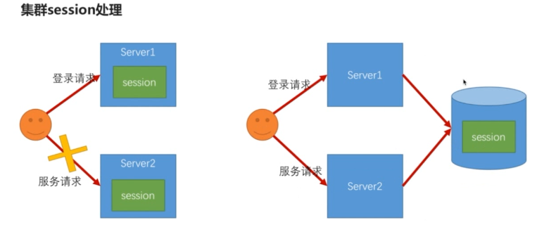

# 使用 Maven Module 搭建spring boot项目（整合Spring Security、Spring Social、spring OAuth）四

## Spring boot 中应用 Spring Session

spring session 只对浏览器环境下才生效,因此在浏览器项目中加入依赖

```xml
<dependency>
    <groupId>org.springframework.session</groupId>
    <artifactId>spring-session</artifactId>
</dependency>
```

### 单机Session管理

#### Session 超时和并发处理

##### spring session 配置

```properties
# session 默认30分钟超时
server.session.timeout = 600
```

若配置session超时时间少于1分钟,则会设置为1分钟,也就是60秒

设置超时时间源码分析:

```java
package org.springframework.boot.context.embedded.tomcat;

public class TomcatEmbeddedServletContainerFactory{
    
    //配置session
    private void configureSession(Context context) {
        //获得session的超时时间
        long sessionTimeout = this.getSessionTimeoutInMinutes();
        context.setSessionTimeout((int)sessionTimeout);
        if (this.isPersistSession()) {
            Manager manager = context.getManager();
            if (manager == null) {
                manager = new StandardManager();
                context.setManager((Manager)manager);
            }

            this.configurePersistSession((Manager)manager);
        } else {
            context.addLifecycleListener(new TomcatEmbeddedServletContainerFactory.DisablePersistSessionListener(null));
        }

    }
    
    //获得session超时时间
    private long getSessionTimeoutInMinutes() {
        long sessionTimeout = (long)this.getSessionTimeout();
        if (sessionTimeout > 0L) {
            //将秒数转化为分数,如果小与1则按1分钟算
            sessionTimeout = Math.max(TimeUnit.SECONDS.toMinutes(sessionTimeout), 1L);
        }

        return sessionTimeout;
    }
    
}
```

##### Spring Security 对 Session 过期处理

spring security对session过期的处理可以是

1. 配置session失效的处理url(注意要放开URL的权限)

```java
http.sessionManagement()
    .invalidSessionUrl(URL)//配置session失效跳转的url
```

2. 配置seesion失效策略处理器(设置了处理器则配置失效的url就会失效)

```java
http.sessionManagement()
    .invalidSessionUrl(URL)//配置session失效跳转的url
    .invalidSessionStrategy(invalidSessionStrategy)//session过期处理器,invalidSessionUrl就会失效
```


##### Spring Security 对 Session 并发处理

控制用户在系统中只能有一个或指定个数的session

###### 并发处理的策略

1. 踢掉策略

后登录的session会使前一个登录的session失效掉,通过以下配置实现,并且可配置因并发失效处理的URL

```java
//开启session管理功能
		http.sessionManagement().maximumSessions(number)
         	.expiredUrl(URL) //处理返回给失效session的url
```

2. 禁止策略

禁止后登录的session登录进入,当前正在系统的session继续使用

```java
http.sessionManagement().maximumSessions(number)
         	.expiredUrl(URL) //处理返回给失效session的url
         	.maxSessionsPreventsLogin(true) //默认为false,不阻止登录
         	//.expiredSessionStrategy() 设置并发策略,则会让expiredUrl配置失效
```

##### 实现Session过期与并发处理

1.定义自定义session属性配置,并将其加入`BrowserProperties`中

```
/**
 * session的配置
 * created by chuIllusions_tan 20180322
 */
public class SessionProperties {
	
	/**
	 * 同一个用户在系统中的最大session数，默认1
	 */
	private int maximumSessions = 1;
	/**
	 * 达到最大session时是否阻止新的登录请求，默认为false，不阻止，新的登录会将老的登录失效掉
	 */
	private boolean maxSessionsPreventsLogin;
	/**
	 * session失效时跳转的地址
	 */
	private String sessionInvalidUrl = SecurityConstants.DEFAULT_SESSION_INVALID_URL;
	
}
```

```java
public class BrowserProperties {
    private SessionProperties session = new SessionProperties();
}
```

2. 使用模板方法定义策略抽象类,抽取相同的处理逻辑

```java
/**
 * 用于处理session失效策略（踢掉策略 与 禁止登陆策略）
 * session失效包括两种情况：session 超时、session并发
 *
 * created by chuIllusions_tan 20180304
 */
public class AbstractSessionStrategy {

	private final Logger logger = LoggerFactory.getLogger(getClass());
	/**
	 * 跳转的url
	 */
	private String destinationUrl;
	/**
	 * 重定向策略
	 */
	private RedirectStrategy redirectStrategy = new DefaultRedirectStrategy();
	/**
	 * 跳转前是否创建新的session
	 */
	private boolean createNewSession = true;
	
	private ObjectMapper objectMapper = new ObjectMapper();

	private SecurityProperties securityPropertie;

	/**
	 * @param securityPropertie
	 */
	public AbstractSessionStrategy(SecurityProperties securityPropertie) {
		String invalidSessionUrl = securityPropertie.getBrowser().getSession().getSessionInvalidUrl();
		Assert.isTrue(UrlUtils.isValidRedirectUrl(invalidSessionUrl), "url must start with '/' or with 'http(s)'");
		//Assert.isTrue(StringUtils.endsWithIgnoreCase(invalidSessionUrl, ".html"), "url must end with '.html'");
		this.destinationUrl = invalidSessionUrl;
		this.securityPropertie = securityPropertie;
	}

	protected void onSessionInvalid(HttpServletRequest request, HttpServletResponse response) throws IOException {

		if (createNewSession) {
			request.getSession();
		}

		String sourceUrl = request.getRequestURI();
		String targetUrl;

		if (StringUtils.endsWithIgnoreCase(sourceUrl, ".html")) {
			targetUrl = destinationUrl+".html";
			logger.info("session失效,跳转到"+targetUrl);
			redirectStrategy.sendRedirect(request, response, targetUrl);
		}else{
			Object result = buildResponseContent(request);
			response.setStatus(HttpStatus.UNAUTHORIZED.value());
			response.setContentType("application/json;charset=UTF-8");
			response.getWriter().write(objectMapper.writeValueAsString(result));
		}
		
	}

	/**
	 * @param request
	 * @return
	 */
	protected Object buildResponseContent(HttpServletRequest request) {
		String message = "session已失效";
		if(isConcurrency()){
			message = message + "，有可能是并发登录导致的";
		}
		return new SimpleResponse(message);
	}

	/**
	 * session失效是否是并发导致的
	 * @return
	 */
	protected boolean isConcurrency() {
		return false;
	}

	public void setCreateNewSession(boolean createNewSession) {
		this.createNewSession = createNewSession;
	}
	
}
```

3. 定义session失效策略,需要实现InvalidSessionStrategy接口

```java
/**
 * 默认的session失效处理策略
 * 
 * created by chuIllusions_tan on 20180308
 *
 */
public class AbstractInvalidSessionStrategy extends AbstractSessionStrategy implements InvalidSessionStrategy {

	public AbstractInvalidSessionStrategy(SecurityProperties securityProperties) {
		super(securityProperties);
	}

	@Override
	public void onInvalidSessionDetected(HttpServletRequest request, HttpServletResponse response)
			throws IOException, ServletException {
		onSessionInvalid(request, response);
	}

}
```


4. 定义session并发策略

```java
/**
 * 并发登录导致session失效时，默认的处理策略
 * 
 * created by chuIllusions_tan on 20180308
 *
 */
public class AbstractExpiredSessionStrategy extends AbstractSessionStrategy implements SessionInformationExpiredStrategy {

	public AbstractExpiredSessionStrategy(SecurityProperties securityPropertie) {
		super(securityPropertie);
	}


	@Override
	public void onExpiredSessionDetected(SessionInformationExpiredEvent event) throws IOException, ServletException {
		onSessionInvalid(event.getRequest(), event.getResponse());
	}


	/**
	 * 覆盖父类,证明其是并发登录的
	 * @return
	 */
	@Override
	protected boolean isConcurrency() {
		return true;
	}

}
```

5. 策略bean的配置

```java
/**
 * session管理策略相关的扩展点配置。配置在这里的bean，业务系统都可以通过声明同类型或同名的bean来覆盖安全
 * 模块默认的配置。
 *
 * created by chuIllusions_tan 20180308
 */
@Configuration
public class SessionStrategyBeanConfig {

    @Autowired
    private SecurityProperties securityProperties;

    /**
     * session失效时的处理策略配置
     * @return
     */
    @Bean
    @ConditionalOnMissingBean(InvalidSessionStrategy.class)
    public InvalidSessionStrategy invalidSessionStrategy(){
        return new AbstractInvalidSessionStrategy(securityProperties);
    }

    /**
     * 并发登录导致前一个session失效时的处理策略配置
     * @return
     */
    @Bean
    @ConditionalOnMissingBean(SessionInformationExpiredStrategy.class)
    public SessionInformationExpiredStrategy sessionInformationExpiredStrategy(){
        return new AbstractExpiredSessionStrategy(securityProperties);
    }

}
```

6. 生成session配置

```java
/**
 * 浏览器项目的安全配置
 *
 * created by chuIllusions_tan 20180227
 */
@Configuration
public class BrowserSecurityConfig  extends WebSecurityConfigurerAdapter {
	//session失效策略
    @Autowired
	private InvalidSessionStrategy invalidSessionStrategy;
	//session并发策略
	@Autowired
	private SessionInformationExpiredStrategy sessionInformationExpiredStrategy;
    
    /**
	 * 配置浏览器特有的安全配置，并且读取全局配置，加入spring security安全配置中
	 * @param http
	 * @throws Exception
	 */
	@Override
    protected void configure(HttpSecurity http) throws Exception {
        //开启session管理功能
		http.sessionManagement()
				.invalidSessionStrategy(invalidSessionStrategy)//session过期处理器
				.maximumSessions(securityProperties.getBrowser().getSession().getMaximumSessions())//用户最大session数
				.maxSessionsPreventsLogin(securityProperties.getBrowser().getSession().isMaxSessionsPreventsLogin())//是否阻止并发登录
				.expiredSessionStrategy(sessionInformationExpiredStrategy);//session并发处理器
    }
}
```


### 集群 Session 管理




#### Spring session对session存储方式的支持

```java
package org.springframework.boot.autoconfigure.session;

public enum StoreType {
	//redis //存放在非关系型数据库
    REDIS,
	//mongo
    MONGO,
	//jdbc 存放在数据库中
    JDBC,
	//跟redis类似
    HAZELCAST,
	//放在本机内存
    HASH_MAP,
	//使用默认session
    NONE;

    private StoreType() {
    }
}
```

**使用Redis的原因:**

​	Session需要频繁访问，如果放在数据库中，会造成很大的压力；另外session会有一个时效性，超时时间，还要在数据库中进行清除。

​	Redis 特点就是对数据的存储会有一个过期的时间

#### 开启支持

```yaml
spring:
#使用了session管理
  session:
    store-type: redis
```

**注意**

此前我将生产的图片也存放在seesion中了,Image并未实现序列化借口,存放在redis中都数据需要被序列化,否则可能会抛出以下异常

```
nested exception is java.lang.IllegalArgumentException: DefaultSerializer requires a Serializable payload but received an object of type [vic.security.core.validate.code.image.ImageCode]
```

## Spring Security 退出登录

Spring Security 默认的退出登录有指定的服务`/logout`

### 退出处理逻辑

spring security 退出处理逻辑:

1. 使当前session失效
2. 清除与当前用户相关的remember-me记录
3. 清空当前的SecurityContext
4. 重定向到登录页

### 相关配置

spring security 提供类似于`AuthenticationSuccessHandler`登录成功处理器的`LogoutSuccessHandler`退出成功处理器

#### 自定义LogoutSuccessHandler

1. 定义默认实现的退出成功处理器

```java
/**
 * 默认的退出成功处理器，如果设置了turing.security.browser.signOutUrl，则跳到配置的地址上，
 * 如果没配置，则返回json格式的响应。
 * 
 * created by chuIllusions_tan on 20180308
 *
 */
public class AbstractLogoutSuccessHandler implements LogoutSuccessHandler {

	private Logger logger = LoggerFactory.getLogger(getClass());

	private String signOutSuccessUrl;
	
	private ObjectMapper objectMapper;

	public AbstractLogoutSuccessHandler(String signOutSuccessUrl) {
		this.signOutSuccessUrl = signOutSuccessUrl;
	}

	@Override
	public void onLogoutSuccess(HttpServletRequest request, HttpServletResponse response, Authentication authentication)
			throws IOException, ServletException {

		logger.info("退出成功");

		if (StringUtils.isBlank(signOutSuccessUrl)) {
			response.setContentType("application/json;charset=UTF-8");
			response.setStatus(HttpStatus.OK.value());
			response.getWriter().write(objectMapper.writeValueAsString(new SimpleResponse("退出成功")));
		} else {
			response.sendRedirect(signOutSuccessUrl);
		}

	}

	public void setObjectMapper(ObjectMapper objectMapper) {
		this.objectMapper = objectMapper;
	}
}

```

2. `AuthenticationHandlerBeanConfig.java`中添加可配置Bean

```Java
	/**
	 * 退出登录时跳转的策略
	 */
	@Bean
	@ConditionalOnMissingBean(LogoutSuccessHandler.class)
	public LogoutSuccessHandler logoutSuccessHandler(){
		AbstractLogoutSuccessHandler abstractLogoutSuccessHandler= new AbstractLogoutSuccessHandler(securityProperties.getBrowser().getSignOutUrl());
		abstractLogoutSuccessHandler.setObjectMapper(objectMapper);
		return abstractLogoutSuccessHandler;
	}
```


#### 加入总配置

```java
/**
 * 浏览器项目的安全配置
 *
 * created by chuIllusions_tan 20180227
 */
@Configuration
public class BrowserSecurityConfig  extends WebSecurityConfigurerAdapter {
    @Autowired
	private LogoutSuccessHandler logoutSuccessHandler;
    
    /**
	 * 配置浏览器特有的安全配置，并且读取全局配置，加入spring security安全配置中
	 * @param http
	 * @throws Exception
	 */
	@Override
    protected void configure(HttpSecurity http) throws Exception {
        //退出登录管理
		http.logout()
				.logoutUrl("/signOut")//配置请求退出处理的URL,覆盖默认
            	//.logoutSuccessUrl("")
				.logoutSuccessHandler(logoutSuccessHandler)//配置了handler会使这条配置失效.logoutSuccessUrl("")
				.deleteCookies("JSESSIONID");//其他操作
    }
}
```