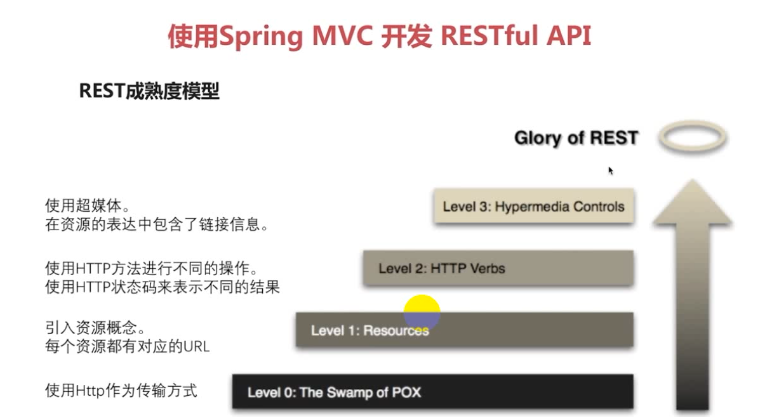
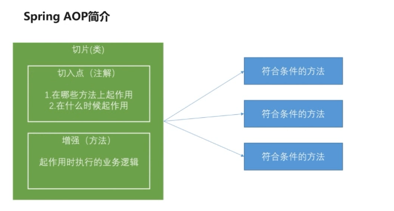
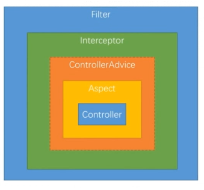
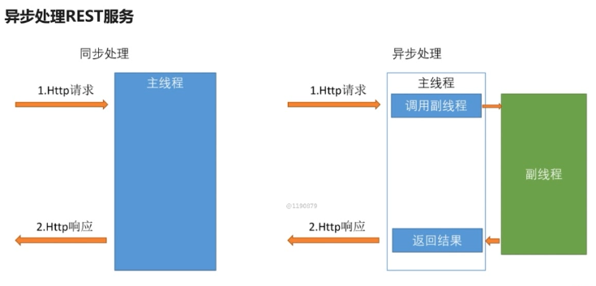
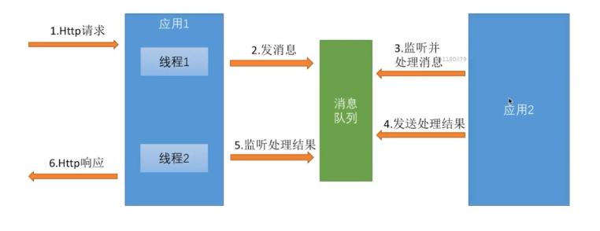
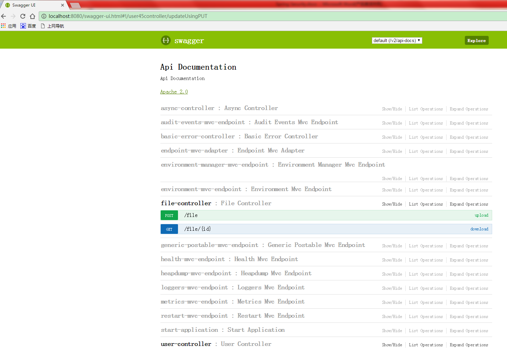
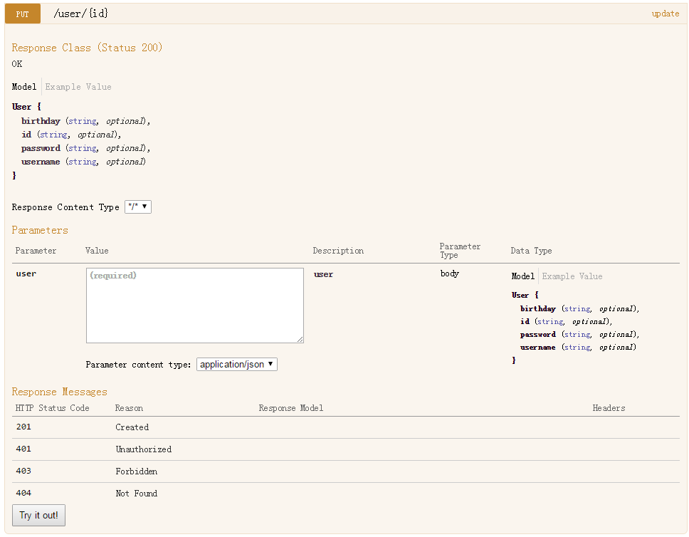
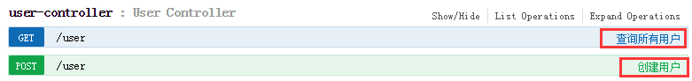
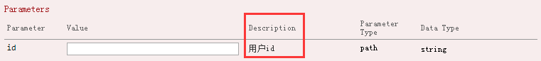
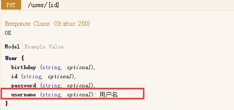

# 使用 Maven Module 搭建spring boot项目（整合Spring Security、Spring Social、spring OAuth）一
## 简介

### 项目环境、组件及目标
1. 开发环境

   Jdk1.8、Idea、Mysql、maven module

2. 使用框架组件

   spring boot 、spring security、spring social、spring oauth

3. 搭建项目目标

   深入理解spring security原理、功能及代码

   基于spring security及相关框架独立开发认证授权相关功能

   掌握抽象和封装的常见技巧，可以编写可重用的模块拱他人使用

   ​

### 基本概念
#### Spring Security
​	Spring Security是一个能够为基于Spring的企业应用系统提供声明式的安全访问控制解决方案的安全框架。它提供了一组可以在Spring应用上下文中配置的Bean，充分利用了Spring IoC，DI（控制反转Inversion of Control ,DI:Dependency Injection 依赖注入）和AOP（面向切面编程）功能，为应用系统提供声明式的安全访问控制功能，减少了为企业系统安全控制编写大量重复代码的工作。
#### Spring IO platform

​	Spring IO是构建现代应用程序的一个有凝聚力的版本化平台。这是一个模块化的企业级分布，提供了一组策略依赖关系，同时让开发人员完全控制只部署他们所需的部分。

   **主要解决问题：**

​	在使用Spring的时候，经常会使用到第三方库，一般大家都是根据经验挑选一个版本号或挑选最新的，随意性较大，其实这是有问题的，除非做过完整的测试，保证集成该版本的依赖不会出现问题，且后续集成其它第三方库的时候也不会出现问题，否则风险较大，且后续扩展会越来越困难，因为随着业务复杂度的增加，集成的第三方组件会越来会多，依赖之间的关联也会也来越复杂。

   **优点：**
   	Spring IO平台提供了各种Spring项目及其依赖项的版本。通过指定的配置添加到您的构建脚本中，您就可以声明您的依赖关系，而无需担心版本号，保证最大限度的扩展，而且该版本的依赖是经过测试的，可以完美的与其它组件结合使用。
### 项目架构

```
airports
    | - - airport-core   < - - | 
            | - - pom.xml      |
    | - - airport-browser  - - |(依赖)   <-| 
            | - - pom.xml      |           |
    | - - airport-app      - - |         <-|
            | - - pom.xml                  |(选择性依赖) 
    | - - traffic-forecast   - - - - - - - |
            | - - pom.xml
    | - - pom.xml
```
**airports: ** 项目父模块，只负责管理其下的子项目，只有一个pom文件，并且pom文件中打包方式为

*<packaging>pom</packaging>*

```xml
<modules>
        <module>airportsCore</module>
        <module>airportsBrowser</module>
        <module>airportsApp</module>
        <module>trafficForecast</module>
    </modules>
    <packaging>pom</packaging>

    <properties>
        <com.chuIllusion.version>1.0-SNAPSHOT</com.chuIllusion.version>
        <project.build.sourceEncoding>UTF-8</project.build.sourceEncoding>
        <project.reporting.outputEncoding>UTF-8</project.reporting.outputEncoding>
        <java.version>1.8</java.version>
    </properties>

    <dependencyManagement>
        <dependencies>
            <dependency>
                <groupId>io.spring.platform</groupId>
                <artifactId>platform-bom</artifactId>
                <version>Brussels-SR4</version>
                <type>pom</type>
                <scope>import</scope>
            </dependency>
            <dependency>
                <groupId>org.springframework.cloud</groupId>
                <artifactId>spring-cloud-dependencies</artifactId>
                <version>Dalston.SR2</version>
                <type>pom</type>
                <scope>import</scope>
            </dependency>
        </dependencies>
    </dependencyManagement>

    <build>
        <plugins>
            <plugin>
                <groupId>org.apache.maven.plugins</groupId>
                <artifactId>maven-compiler-plugin</artifactId>
                <version>2.3.2</version>
                <configuration>
                    <source>${java.version}</source>
                    <target>${java.version}</target>
                    <encoding>${project.build.sourceEncoding}</encoding>
                </configuration>
            </plugin>
        </plugins>
    </build>
```

**airport-core:** 核心业务逻辑，提供核心通用功能

`pom.xml`

引入核心包，包括jdbc、aop及一些基本工具类，并且引入核心组件：spring security、spring oauth、spring social

```xml
<dependencies>
    <dependency>
        <groupId>org.springframework.boot</groupId>
        <artifactId>spring-boot-starter-jdbc</artifactId>
    </dependency>
    <dependency>
        <groupId>org.mybatis.spring.boot</groupId>
        <artifactId>mybatis-spring-boot-starter</artifactId>
        <version>1.3.0</version>
    </dependency>
    <dependency>
        <groupId>mysql</groupId>
        <artifactId>mysql-connector-java</artifactId>
    </dependency>
    <dependency>
        <groupId>commons-lang</groupId>
        <artifactId>commons-lang</artifactId>
    </dependency>
    <dependency>
        <groupId>commons-collections</groupId>
        <artifactId>commons-collections</artifactId>
    </dependency>
    <dependency>
        <groupId>commons-io</groupId>
        <artifactId>commons-io</artifactId>
    </dependency>
    <dependency>
        <groupId>commons-beanutils</groupId>
        <artifactId>commons-beanutils</artifactId>
    </dependency>
    <dependency>
        <groupId>org.springframework.boot</groupId>
        <artifactId>spring-boot-configuration-processor</artifactId>
    </dependency>
    <dependency>
        <groupId>org.springframework.boot</groupId>
        <artifactId>spring-boot-starter-aop</artifactId>
    </dependency>

    <!-- spring security/social/oauth -->
    <!-- 引用spring security、spring oauth核心 -->
    <dependency>
        <groupId>org.springframework.cloud</groupId>
        <artifactId>spring-cloud-starter-oauth2</artifactId>
    </dependency>
    <!-- spring social -->
    <!-- 提供Java 配置 -->
    <dependency>
        <groupId>org.springframework.social</groupId>
        <artifactId>spring-social-config</artifactId>
    </dependency>
    <!-- 提供社交连接框架和OAuth 客户端支持 -->
    <dependency>
        <groupId>org.springframework.social</groupId>
        <artifactId>spring-social-core</artifactId>
    </dependency>
    <!-- 提供社交安全支持 -->
    <dependency>
        <groupId>org.springframework.social</groupId>
        <artifactId>spring-social-security</artifactId>
    </dependency>
    <!-- 管理web应用程序的连接 -->
    <dependency>
        <groupId>org.springframework.social</groupId>
        <artifactId>spring-social-web</artifactId>
    </dependency>
</dependencies>
```

**airport-browser:** 浏览器相关业务，依赖核心项目，拓展浏览器项目特有的功能

`pom.xml`

引入核心模块的支持，并拓展浏览器特有的支持，如session

```xml
<dependencies>
    <dependency>
        <groupId>com.chuIllusion</groupId>
        <artifactId>airports.core</artifactId>
        <version>${com.chuIllusion.version}</version>
    </dependency>

    <dependency>
        <groupId>org.springframework.session</groupId>
        <artifactId>spring-session</artifactId>
    </dependency>
    <!-- ============================== Thymeleaf模板引擎 ================================= -->
    <dependency>
        <groupId>org.springframework.boot</groupId>
        <artifactId>spring-boot-starter-thymeleaf</artifactId>
    </dependency>
</dependencies>

```

**airport-app:** App或前后端分离项目中相关业务，依赖核心项目，拓展了前后端分离项目的功能

`pom.xml`

引入核心模块的支持，并拓展App或前后端分离项目特有的支持，如使用redis代替session存储

```xml
<dependencies>
    <dependency>
        <groupId>com.turingdi</groupId>
        <artifactId>airports.core</artifactId>
        <version>1.0-SNAPSHOT</version>
    </dependency>
    <dependency>
        <groupId>org.springframework.boot</groupId>
        <artifactId>spring-boot-starter-data-redis</artifactId>
    </dependency>
</dependencies>
```


**traffic-forecast:**  项目程序，根据项目情况，选择性依赖浏览器模块或App模块

`pom.xml`

根据需求，引用浏览器核心支持或App核心支持,并且引用编译插件的支持

```xml
<dependencies>
    <!--<dependency>-->
        <!--<groupId>com.chuIllusion</groupId>-->
        <!--<artifactId>airports.browser</artifactId>-->
        <!--<version>${com.turingdi.version}</version>-->
    <!--</dependency>-->
    <dependency>
        <groupId>com.chuIllusion</groupId>
        <artifactId>airports.app</artifactId>
        <version>${com.chuIllusion.version}</version>
    </dependency>
	<!-- 引入测试框架 -->
    <dependency>
        <groupId>org.springframework.boot</groupId>
        <artifactId>spring-boot-starter-test</artifactId>
    </dependency>
</dependencies>

<build>
    <plugins>
        <plugin>
            <groupId>org.springframework.boot</groupId>
            <artifactId>spring-boot-maven-plugin</artifactId>
            <version>1.3.3.RELEASE</version>
            <executions>
                <execution>
                    <goals>
                        <!-- 重新打包现有的JAR和WAR存档，以便可以使用java -jar从命令行执行它们。 -->
                        <goal>repackage</goal>
                    </goals>
                </execution>
            </executions>
        </plugin>
    </plugins>
    <finalName>trafficForecast</finalName>
</build>
```

**注意**

1. spring boot 包扫描机制

   ​	在项目程序启动前，一定要保证spring boot 启动类一定是在所有依赖项目中父级包，启动类扫描同级包和下级包的所有类才能生效，否则如果其他项目中有使用配置的类（相对于启动类是在启动类的上一级）则无法生效，建议将使用同一命名，以下是我这几个项目包的结构，每个模块中的代码都对应在其标准包下

   ​	在核心包中：com.chuillusion.core，在浏览器包中：com.chuillusion.browser，在App包中：com.chuillusion.app，在项目程序中：com.chuIllusion.trafiicforecast，启动类在*com.chuIllusion*包中创建

2. 依赖配置

   ​	在项目中引入jdbc的依赖需要配置数据源、session的依赖需要配置session类型，否则系统启动会报错，根据系统报错信息，查找原因，排查原因，则很快可以解决问题

3. 启动类

   maven 默认 编译成jar包，使用java -jar运行命令即可将项目运行

   但是在项目中我们需要war包，则要继承`SpringBootServletInitializer`并且实现其`config`方法，否则会报错误（无法找到入口）

   ```java
   @SpringBootApplication
   public class TrafficForecastEntryApplication extends SpringBootServletInitializer {
       public TrafficForecastEntryApplication() {
       }
       protected SpringApplicationBuilder configure(SpringApplicationBuilder application) {
           return application.sources(new Class[]{TrafficForecastEntryApplication.class});
       }
       public static void main(String[] args) {
           SpringApplication.run(TrafficForecastEntryApplication.class, args);
       }
   }
   ```


## RESTFUL API

### 简介

​	**Representational State Transfer**，简称**REST**，一种软件架构风格、设计风格，而不是标准，只是提供了一组设计原则和约束条件。它主要用于客户端和服务器交互类的软件。基于这个风格设计的软件可以更简洁，更有层次，更易于实现缓存等机制。

**特点：**

1. 用URL描述资源

2. 使用HTTP方法描述行为，使用HTTP状态码表示不同的结果

   HTTP METHOD：GET(从服务器取出资源（一项或多项）)、POST(在服务器新建一个资源)、PUT(在服务器更新资源)、DELETE(从服务器删除资源)

   HTTP STATUS CODE：200（请求成功）、401（未授权）、404（未找到资源）、500（服务器内部错误）

3. 使用JSON交互数据

4. RESTful只是一种风格，并不是强制的标准

**例子：**

| URL                      | METHOD | DESRCIBE                 |
| ------------------------ | ------ | ------------------------ |
| /product                 | GET    | 列出所有商品             |
| /product?limit=10        | GET    | 返回指定数量的商品       |
| /product?limit=10&type=1 | GET    | 返回指定类型和数量的商品 |
| /product/id              | GET    | 获取指定的商品           |
| /product/id/image        | GET    | 获取指定商品的所有图片   |
| /product/id/image/id     | GET    | 获取指定商品的指定图片   |
| /product                 | POST   | 新建商品                 |
| /product/id              | PUT    | 更新指定的商品信息       |
| /prodect/id              | DELETE | 删除指定的商品           |

**成熟度模型**




### Spring Boot 中 RESTful API 开发

​	spring boot 对 RESTful API 提供了多个开发注解，在以下将会慢慢介绍

1. @RestController : 标明此controller提供RESTful API

   @RestController注解相当于@ResponseBody ＋ @Controller合在一起的作用。

2. @RequestMapping及其变体。映射HTTP请求URL到JAVA方法上

3. @RequestParam 映射请求参数到JAVA方法的参数

#### 测试框架引入

```xml
<dependency>
  <groupId>org.springframework.boot</groupId>
  <artifactId>spring-boot-starter-test</artifactId>
</dependency>
```

#### 测试用例创建

建立测试用例的目的，是为了确保我们的服务能按照我们指定的方式去运行，并且获取预期的效果

```java
//如何运行测试用例
@RunWith(SpringRunner.class)
//标记此类为测试类
@SpringBootTest
public class UserControllerTest {
    //web环境 启动的时候spring 已经创建了，直接注入就好了
    @Autowired
    private WebApplicationContext webApplicationContext;
    
    //伪造一个mvc的环境
    private MockMvc mockMvc;
    
    @Before
    public void setup() {
        mockMvc = MockMvcBuilders.webAppContextSetup(webApplicationContext).build();
    }

    //查询用例
	@Test
    public void whenQuerySuccess() throws Exception{
        //模拟请求
        mockMvc.perform(
                MockMvcRequestBuilders.get("/user")//模拟发出get请求
                .contentType(MediaType.APPLICATION_JSON_UTF8))//设置请求的contentType
                .andExpect(MockMvcResultMatchers.status().isOk())//执行之后，期望的返回结果是返回状态码是200
                //返回一个集合，包含三个元素，jsonPath解析返回的内容，并对json进行判断 $.length()集合的长度
                .andExpect(MockMvcResultMatchers.jsonPath("$.length()").value(3));

    }
}
```

**启动测试用例**

Error：

```
Error:java.lang.IllegalStateException: Unable to find a @SpringBootConfiguration, you need to use @ContextConfiguration or @SpringBootTest(classes=...) with your test
```

Cause：测试用例位置必须在Spring boot 启动类同名子包下，才能扫描打

Solve：

1. 更为测试类位置为Spring boot 启动类同名子包下

2. 添加指定启动类位置

   ```@SpringBootTest(classes = StartApplication.class)```

Error：

```
java.lang.AssertionError: Status 
Expected :200
Actual  :404
```

Cause and Solve：未建立对应的服务，应建立相应的服务

**服务的创建**

```java
@RestController
public class UserController {
    @RequestMapping(value = "/user",method = RequestMethod.GET)
    public List<User> query(){
        return null;
    }
}
```

Error：

```
Description
java.lang.AssertionError: No value at JSON path "$.length()", exception: json can not be null or empty
```

Cause：服务中的返回值为null，而测试对返回值的期待是返回数据的长度为3

Solve：使服务中返回指定的数据长度

```java
@RequestMapping(value = "/user",method = RequestMethod.GET)
public List<User> query(){
    List<User> users = new ArrayList<>();
    users.add(new User());
    users.add(new User());
    users.add(new User());
    return users;
}
```

##### `@RequestParam`注解的使用

在测试用例上添加参数传递

```java
mockMvc.perform(
        MockMvcRequestBuilders.get("/user")//模拟发出get请求
        .contentType(MediaType.APPLICATION_JSON_UTF8)//设置请求的contentType
        .param("username","victorys"))//设置参数
```

在服务中接受参数

```java
public List<User> query(
        @RequestParam(name="username",//请求中属性名
	required = true,//属性必须，否则报错
	defaultValue = "jojo") //没有则设置默认值
                String username){}
```

#### 查询用例

**掌握**

1. @PathVariable 映射URL片段到java方法的参数

2. 在url声明中使用正则表达式

3. @JsonView控制json输出内容

   jsonview使用步骤：1）使用接口声明视图；2）在值对象的get方法上指定视图；3）在controller方法上指定视图

##### UserControllerTest.java

```java
/**
 * 使用RESTful API 查询用户详情
 * /user/1 代表资源
 * get请求代表操作
 * @throws Exception
 */
@Test
public void whenGetInfoSuccess() throws Exception {
    String result = mockMvc.perform(MockMvcRequestBuilders.get("/user/1")//获取用户为1的信息
            .contentType(MediaType.APPLICATION_JSON_UTF8))
            .andExpect(MockMvcResultMatchers.status().isOk())//用状态码判断是成功还是失败，成功就是200
            .andExpect(MockMvcResultMatchers.jsonPath("$.username").value("tom"))//期望值
            .andReturn().getResponse().getContentAsString();//获得返回结果，并以字符串形式输出
    System.out.println(result);
}
**
 * 测试使用正则表达式接受资源的服务
 * @throws Exception
 */
@Test
public void whenGetInfoFail() throws Exception {
    mockMvc.perform(MockMvcRequestBuilders.get("/user/a")
            .contentType(MediaType.APPLICATION_JSON_UTF8))
            .andExpect(MockMvcResultMatchers.status().is4xxClientError());
}
```

##### UserController.java

```java
@RestController
public class UserController {

    @RequestMapping(value = "/user",method = RequestMethod.GET)
    @JsonView(User.UserSimpleView.class)
    public List<User> query(
            @RequestParam(name="username",required = true,defaultValue = "jojo")
                    String username,
            //spring提供的一个分页信息存储对象
            @PageableDefault(page = 2, size = 17, sort = "username,asc") Pageable pageable){
        List<User> users = new ArrayList<>();
        users.add(new User());
        users.add(new User());
        users.add(new User());
        return users;
    }

    /**
     * @PathVariable:将请求资源中的片段，映射到请求服务方法中的参数中
     * @JsonView:使用场景：List<User> query()方法中返回的用户信息没有包含密码信息
     *                      User getInfo()方法返回的用户信息有密码信息
     *                      1.在 User 类中 使用接口定义视图
     *                         public interface UserSimpleView {}; //简单视图
     *                         public interface UserDetailView extends UserSimpleView {};//包含简单视图内容和扩展视图内容
     *                      2.在 User 类中值对象get方法中指定视图，UserDetailView可以显示所有UserSimpleView视图的显示内容
     *                         @JsonView(UserSimpleView.class)
     *                         public String getUsername() { return username;}
     *                         @JsonView(UserDetailView.class)
                               public String getPassword() { return password;}
                           3.在controller中指定视图
     * @param id
     * @return
     */
    //@GetMapping("/{id:\\d+}")
    @JsonView(User.UserDetailView.class)
    @RequestMapping(value = "/user/{id:\\d+}",method = RequestMethod.GET)
    public User getInfo(@PathVariable(name = "id") String id) {
        System.out.println("进入getInfo服务");
        User user = new User();
        user.setUsername("tom");
        return user;
    }
}

```

##### User.java

```java
public class User {
   
   public interface UserSimpleView {};
   public interface UserDetailView extends UserSimpleView {};
   
   private String id;
   
   //@MyConstraint(message = "这是一个测试")
   //@ApiModelProperty(value = "用户名")
   private String username;
   
   @NotBlank(message = "密码不能为空")
   private String password;
   
   @Past(message = "生日必须是过去的时间")
   private Date birthday;

   @JsonView(UserSimpleView.class)
   public String getUsername() {
      return username;
   }

   public void setUsername(String username) {
      this.username = username;
   }

   @JsonView(UserDetailView.class)
   public String getPassword() {
      return password;
   }

   public void setPassword(String password) {
      this.password = password;
   }

   @JsonView(UserSimpleView.class)
   public String getId() {
      return id;
   }

   public void setId(String id) {
      this.id = id;
   }
   
   @JsonView(UserSimpleView.class)
   public Date getBirthday() {
      return birthday;
   }

   public void setBirthday(Date birthday) {
      this.birthday = birthday;
   }
}
```

**代码重构**

使用RequestMapping变体简化代码

```java
@RequestMapping("/user")
public class UserController {
    
@GetMapping
public List<User> query(){}
    
@GetMapping("/{id:\\d+}")
public User getInfo(){}

}
```

#### 创建用例

1. @RequestBody映射请求体到java方法的参数
2. 日期类型参数的处理
3. @Valid注解和BindingResult验证请求参数的合法性并处理校验结果

##### UserControllerTest.java

```java
/**
 * 使用RESTful API 创建一个用户
 * @throws Exception
 */
@Test
public void whenCreateSuccess() throws Exception {
    Date date = new Date();
    System.out.println(date.getTime());
    String content = "{\"username\":\"tom\",\"password\":null,\"birthday\":"+date.getTime()+"}";
    String reuslt = mockMvc.perform(MockMvcRequestBuilders.post("/user").contentType(MediaType.APPLICATION_JSON_UTF8)
            .content(content))
            .andExpect(MockMvcResultMatchers.status().isOk())
            .andExpect(MockMvcResultMatchers.jsonPath("$.id").value("1"))
            .andReturn().getResponse().getContentAsString();

    System.out.println(reuslt);
}
```

##### UserController.java

```java
/**
 * 通过post请求创建用户
 * @ RequestBody:若请求数据是以json字符串格式数据传输，参数无法封装到方法中的参数
 *                  使用requestBody可以解析json格式为方法体中的参数赋值
 * @ Valid 验证、校验参数
 * @param errors 校验错误信息存储器，与@Valid注解成对出现
 *               若校验不接收错误信息，则不会进入方法体，并且返回错误到请求处
 *               若已接受错误信息，则进入方法体，完成方法体内容
 */
@PostMapping
//@ApiOperation(value = "创建用户")
public User create(@Valid @RequestBody User user,BindingResult errors) {

    if(errors.hasErrors()){//是否有错误校验信息
        //流化并且打印错误信息
        errors.getAllErrors().stream().forEach(error -> System.out.println(error.getDefaultMessage()));
    }

    System.out.println(user.getId());
    System.out.println(user.getUsername());
    System.out.println(user.getPassword());
    System.out.println(user.getBirthday());

    user.setId("1");
    return user;
}
```

##### User.java

```java
@NotBlank(message = "密码不能为空")
private String password;
```

#### 修改与删除用例

##### UserControllerTest.java

```java
/**
 * 测试更新请求
 * 请求方式put请求
 * @throws Exception
 */
@Test
public void whenUpdateSuccess() throws Exception {
    Date date = new Date(LocalDateTime.now().plusYears(1).atZone(ZoneId.systemDefault()).toInstant().toEpochMilli());
    System.out.println(date.getTime());
    String content = "{\"id\":\"1\", \"username\":\"tom\",\"password\":null,\"birthday\":"+date.getTime()+"}";
    String reuslt = mockMvc.perform(MockMvcRequestBuilders.put("/user/1").contentType(MediaType.APPLICATION_JSON_UTF8)
            .content(content))
            .andExpect(MockMvcResultMatchers.status().isOk())
            .andExpect(MockMvcResultMatchers.jsonPath("$.id").value("1"))
            .andReturn().getResponse().getContentAsString();

    System.out.println(reuslt);
}

/**
 * 请求方式Delete
 */
@Test
public void whenDeleteSuccess() throws Exception {
    mockMvc.perform(MockMvcRequestBuilders.delete("/user/1")
            .contentType(MediaType.APPLICATION_JSON_UTF8))
            .andExpect(MockMvcResultMatchers.status().isOk());
}
```

##### UserConroller.java

```java
@PutMapping("/{id:\\d+}")
public User update(@Valid @RequestBody User user, BindingResult errors) {

    if (errors.hasErrors()){
        errors.getAllErrors().stream().forEach(error -> {
            FieldError fieldError = (FieldError)error;
            String message = fieldError.getField() + " " + fieldError.getDefaultMessage();
            System.out.println(message);
        });
    }

    System.out.println(user.getId());
    System.out.println(user.getUsername());
    System.out.println(user.getPassword());
    System.out.println(user.getBirthday());

    user.setId("1");
    return user;
}
/**
 * Delete请求
 * @param id
 */
@DeleteMapping("/{id:\\d+}")
public void delete(@PathVariable String id) {
    System.out.println(id);
}

```

##### User.java

```java
@NotBlank(message = "密码不能为空")
private String password;

@Past(message = "生日必须是过去的时间")
private Date birthday;
```


#### 定义校验器

##### 校验器接口定义

**MyConstrain.java**

```java
/**
 * 自定义校验注解
 *
 *  自定义校验器要声明以下必须的三个方法
 */
@Target({ElementType.METHOD, ElementType.FIELD})//使用在方法和字段上
@Retention(RetentionPolicy.RUNTIME)//运行时注解
@Constraint(validatedBy = MyConstraintValidator.class)//表名此注解用于校验  validatedBy:当前注解，用哪一个类去校验
public @interface MyConstraint {

   /**
    * 错误信息
    */
   String message();
   Class<?>[] groups() default { };
   Class<? extends Payload>[] payload() default { };
}
```

##### 定义校验器校验实现类

**MyConstraintValidator.java**

```java
/**
 * ConstraintValidator<A,B>
 *     A：使用哪个注解
 *    B：验证类型。如String，那么注解就只有String类型上起作用
 * 在类结构上，不需要声明为spring管理的类
 *        原因:spring扫描到 ConstraintValidator 接口， 自动将其实现类为自己管理的bean
 */
public class MyConstraintValidator implements ConstraintValidator<MyConstraint, Object> {

   /**
    * 在校验器中，可以注入spring容器中的任何Bean
    */
   @Autowired
   private HelloService helloService;

   /**
    * 校验器初始化工作
    * @param constraintAnnotation
    */
   @Override
   public void initialize(MyConstraint constraintAnnotation) {
      System.out.println("my validator init");
   }

   /**
    * 真正的校验逻辑
    * @param value 需要校验的值
    * @param context 验证器上下文
    * @return
    */
   @Override
   public boolean isValid(Object value, ConstraintValidatorContext context) {
      helloService.greeting("tom");//模拟校验逻辑
      System.out.println(value);
      //return false; //失败
      return true; //校验成功
   }
}

```


#### 服务器异常处理

##### Spring Boot 的错误处理机制

1. 在浏览器中输入不存在的资源地址，spring boot跳转到指定的页面，显示如下信息

```
Whitelabel Error Page
This application has no explicit mapping for /error, so you are seeing this as a fallback.
Tue Oct 03 18:46:23 CST 2017
There was an unexpected error (type=Not Found, status=404).
No message available
```

2. 在模拟非浏览器请求，spring boot返回json数据

```
{
    "timestamp": 1507028069711,
    "status": 404,
    "error": "Not Found",
    "message": "No message available",
    "path": "/xxx"
}
```

##### Spring Boot错误处理机制源码分析

1. 浏览器发出的请求

   ```
   Request Headers：
   Accept:text/html,application/xhtml+xml,application/xml;q=0.9,image/webp,*/*;q=0.8

   ```

2. 非浏览器请求

   ```
   Request Headers:
   Accept:*/*

   ```

3. 源码分析

   ```java
   @Controller //本身就是一个控制器
   @RequestMapping({"${server.error.path:${error.path:/error}}"})//处理error请求
   public class BasicErrorController extends AbstractErrorController {

   /*
   * 以下两个方法：
   * 根据请求信息不同，返回结果不同
   */
   @RequestMapping(produces = {"text/html"})
   public ModelAndView errorHtml(HttpServletRequest request, HttpServletResponse response) {
       HttpStatus status = this.getStatus(request);
       Map<String, Object> model = Collections.unmodifiableMap(this.getErrorAttributes(request, this.isIncludeStackTrace(request, MediaType.TEXT_HTML)));//返回一个HTML
       response.setStatus(status.value());
       ModelAndView modelAndView = this.resolveErrorView(request, response, status, model);
       return modelAndView == null?new ModelAndView("error", model):modelAndView;
   }

   //返回map转为json数据
   @RequestMapping
   @ResponseBody  //将map集合输出为json数据
   public ResponseEntity<Map<String, Object>> error(HttpServletRequest request) {
       Map<String, Object> body = this.getErrorAttributes(request, this.isIncludeStackTrace(request, MediaType.ALL));
       HttpStatus status = this.getStatus(request);
       return new ResponseEntity(body, status);
   }

   }
   ```

##### 自定义错误处理机制

​	默认情况下，spring boot默认的处理机制已经是可以满足我们一般的开发目标，若有特定需求，可以自定义处理方案

**定义浏览器返回的错误处理资源**

​	在资源目录下，创建`resources/error`目录，根据状态码命名错误页面，自定义错误页面的内容

**定义非浏览器（APP）返回的错误处理**

1. 自定义异常类`UserNotExistException.java`

```java
/**
 * 自定义异常
 */
public class UserNotExistException extends RuntimeException {
   private static final long serialVersionUID = -6112780192479692859L;
   private String id;
   public UserNotExistException(String id) {
      super("user not exist");
      this.id = id;
   }
   public String getId() {return id; }
   public void setId(String id) {this.id = id;}
}
```

2. 增加服务

```java
@GetMapping("/{id:\\d+}")
public User getInfo(@PathVariable(name = "id") String id) {
    throw new UserNotExistException("1");//测试异常处理
}
```

3. 使用postman发送请求，返回json信息

```
{
    "timestamp": 1507034846064,
    "status": 500,
    "error": "Internal Server Error",
    "exception": "vic.tjs.Exception.UserNotExistException",
    "message": "user not exist",
    "path": "/user/1"
}
```

4. 创建异常处理控制器

```java
/**
 * @ControllerAdvice：处理其他控制器抛出的异常，不处理http请求，只负责处理控制器抛出的异常
 * @ExceptionHandler：当任何一个控制器，抛出指定的异常，都会执行该注解下的方法进行处理
 */
@ControllerAdvice
public class ControllerExceptionHandler {

   @ExceptionHandler(UserNotExistException.class)
   @ResponseBody //返回的map集合转成json
   @ResponseStatus(HttpStatus.INTERNAL_SERVER_ERROR)//返回的htto状态码
   public Map<String, Object> handleUserNotExistException(UserNotExistException ex) {
      Map<String, Object> result = new HashMap<>();
      result.put("id", ex.getId());
      result.put("message", ex.getMessage());
      return result;
   }
}
```

5. 使用postman发送请求，返回json信息

```
{
    "id": "1",
    "message": "user not exist"
}
```

#### RESTful API的拦截（Filter、Interceptor与Aspect）

##### Filter过滤器：记录所有服务的处理时间

###### 组件自定义配置

```java
/**
 * 自定义过滤器，拦截所有服务，并且计算服务时长
 */
@Component //声明为spring管理的组件才能识别此类为过滤器
public class TimeFilter implements Filter {
   @Override
   public void doFilter(ServletRequest request, ServletResponse response, FilterChain chain)
         throws IOException, ServletException {
      System.out.println("time filter start");
      long start = new Date().getTime();
      chain.doFilter(request, response); //整个服务方法就在过滤器中执行
      System.out.println("time filter 耗时:"+ (new Date().getTime() - start));
      System.out.println("time filter finish");
   }
}
```

访问服务，console输出

```
time filter start
进入getInfo服务
time filter 耗时:240
time filter finish
time filter start
time filter 耗时:10
time filter finish
```

###### Spring boot 声明配置

取消组件

```java
//@Component //声明为spring管理的组件才能识别此类为过滤器
public class TimeFilter implements Filter {}
```

配置类配置

```java
/**
 * 配置类
 */
@Configuration
public class WebConfig{
   @Bean
   public FilterRegistrationBean timeFilter() {
      FilterRegistrationBean registrationBean = new FilterRegistrationBean();
      TimeFilter timeFilter = new TimeFilter();
      registrationBean.setFilter(timeFilter); 
      List<String> urls = new ArrayList<>();
      urls.add("/*");
      registrationBean.setUrlPatterns(urls); 
      return registrationBean; 
   }
}
```

###### Filter 应用缺点

​	由于`Filter`是在`J2EE`规范定义的，未知`sping`相关的任何东西，只能获取`request`和`response`请求，无法获取请求的`controller`信息和哪个方法处理请求的

##### Interceptor 拦截器

###### 声明拦截器

```java
/**
 * 服务时间记录拦截器
 */
@Component
public class TimeInterceptor implements HandlerInterceptor {
   /**
    * 服务方法执行前 调用
    * @param handler 服务控制器
    * @return
    * @throws Exception
    */
   @Override
   public boolean preHandle(HttpServletRequest request, HttpServletResponse response, Object handler)
         throws Exception {
      System.out.println("preHandle");
      //获得服务的控制器的信息
    System.out.println(((HandlerMethod)handler).getBean().getClass().getName());
      System.out.println(((HandlerMethod)handler).getMethod().getName());
      request.setAttribute("startTime", new Date().getTime());
      return true; //是否放行
   }
   /**
    * 服务方法执行完后 调用
    * 若服务方法抛出异常，则此方法不会被调用
    * @param handler
    * @param modelAndView
    * @throws Exception
    */
   @Override
   public void postHandle(HttpServletRequest request, HttpServletResponse response, Object handler,
         ModelAndView modelAndView) throws Exception {
      System.out.println("postHandle");
      Long start = (Long) request.getAttribute("startTime");
      System.out.println("time interceptor 耗时:"+ (new Date().getTime() - start));
   }
   /**
    * 不管服务方法是正常完成还是抛出异常，此方法都会调用
    * @param handler
    * @param exception
    * @throws Exception
    */
   @Override
   public void afterCompletion(HttpServletRequest request, HttpServletResponse response, Object handler, Exception exception)
         throws Exception {
      System.out.println("afterCompletion");
      Long start = (Long) request.getAttribute("startTime");
      System.out.println("time interceptor 耗时:"+ (new Date().getTime() - start));
      System.out.println("exception is "+ exception);
   }
}
```

###### 配置拦截器

```java
/**
 * 配置类
 */
@Configuration
public class WebConfig extends WebMvcConfigurerAdapter {
   @Autowired
   private TimeInterceptor timeInterceptor; //注入拦截器
   @Override
   public void addInterceptors(InterceptorRegistry registry) {
      registry.addInterceptor(timeInterceptor);
   }
……
}
```

###### 正常运行控制台信息

```
time filter start                                -- doFilter
preHandle                                        -- preHandle
vic.tjs.web.controller.UserController            -- preHandle
query                                            -- preHandle
postHandle                                       -- postHandle
time interceptor 耗时:167                        -- postHandle
afterCompletion                                  -- afterCompletion
time interceptor 耗时:167
exception is null
time filter 耗时:170                             -- doFilter
time filter finish
```

###### 抛出异常控制台信息

设置异常点

```
@GetMapping("/{id:\\d+}")
public User getInfo(@PathVariable(name = "id") String id) {
    throw new UserNotExistException("1");//测试异常处理
}
```

异常输出

```
time filter start
preHandle
vic.tjs.web.controller.UserController
getInfo
                                               -- 没有执行postHandle
afterCompletion
time interceptor 耗时:30
exception is null                   
time filter 耗时:40
time filter finish

```

疑问？exception为null？

解释：exception为空是因为之前配置中把异常处理了，自定义的异常控制处理器 比 拦截器中的afterCompletion 先执行，把异常处理完后才调用拦截器，因此不会获得异常信息

```java
@ControllerAdvice
public class ControllerExceptionHandler {
   @ExceptionHandler(UserNotExistException.class)
   public Map<String, Object> handleUserNotExistException(UserNotExistException ex) {}
```

解决：

1. 改造异常抛出点

```java
public User getInfo(@PathVariable(name = "id") String id) {
        throw new RuntimeException("user not exist"); }
```

2. 抛出异常

```
time filter start
preHandle
vic.tjs.web.controller.UserController
getInfo
afterCompletion
time interceptor 耗时:0
exception is java.lang.RuntimeException: user not exist
………
//拦截器会拦截所有的控制器
//以下的spring 异常处理控制器也被拦截了
preHandle
org.springframework.boot.autoconfigure.web.BasicErrorController
error
postHandle
time interceptor 耗时:0
afterCompletion
time interceptor 耗时:0
exception is null
```

###### 拦截器局限性

​	拦截器`Object handle`中的能获取请求的控制器的信息，但无法获取请求的参数的值

**DispatcherServlet.java分发请求源码分析**

```java
public class DispatcherServlet extends FrameworkServlet {
protected void doService(HttpServletRequest request, HttpServletResponse response){
    this.doDispatch(request, response);
}
protected void doDispatch(HttpServletRequest request, HttpServletResponse response){
   //此方法是调用拦截器中的preHandle
if(!mappedHandler.applyPreHandle(processedRequest, response)) {
           return;
      }
//此处真正的调用控制器，方法参数的拼装在此处进行，所以拦截器无法获取参数信息
      mv = ha.handle(processedRequest, response, mappedHandler.getHandler());
      if(asyncManager.isConcurrentHandlingStarted()) {
         return;
      }
}
}
```

##### Aspect (AOP) 切片



###### 添加依赖

在`pom.xml`中添加aop支持

```xml
<dependency>
	<groupId>org.springframework.boot</groupId>
	<artifactId>spring-boot-starter-aop</artifactId>
</dependency>
```

###### 声明切片

```java
@Aspect  //定义一个切片类
@Component
public class TimeAspect {
   /**
    * Around：什么时候执行
    * execution：在哪些符合条件的方法上执行
    * @param pjp 当前被拦截的方法信息对象
    * @return
    */
   @Around("execution(* vic.tjs.web.controller.UserController.*(..))")
   public Object handleControllerMethod(ProceedingJoinPoint pjp) throws Throwable {
      System.out.println("time aspect start");
      //获取被拦截的控制器的参数		
      Object[] args = pjp.getArgs();
      for (Object arg : args) {
         System.out.println("arg is "+arg);
      }
      long start = new Date().getTime();
      Object object = pjp.proceed(); //很像Filter中的doFilter，得到的结果就是控制器的返回值
      System.out.println("time aspect 耗时:"+ (new Date().getTime() - start));
      System.out.println("time aspect end");
      return object;
   }
}
```

控制台输出

```
time filter start #过滤器
preHandle # 拦截器
vic.tjs.web.controller.UserController$$EnhancerBySpringCGLIB$$678cdc94 #拦截器
getInfo #拦截器
time aspect start # 切片
arg is 1 #切片
进入getInfo服务 #服务
time aspect 耗时:3 #切片
time aspect end # 切片
postHandle	# 拦截器
time interceptor 耗时:83 # 拦截器
afterCompletion #拦截器
time interceptor 耗时:83
exception is null
time filter 耗时:93 #过滤器
time filter finish #过滤器
```

###### 切片局限性

​	切片不能像Filter和Interceptor能获取http请求与响应

##### 总结 && 执行顺序

​	总结：这三种拦截方式各有各好处，应根据需求选取其中一种

​	执行顺序：



#### 使用RESTful方式处理文件服务

##### 文件上传

1. 添加常用io包

```xml
<dependency>
  <groupId>commons-io</groupId>
  <artifactId>commons-io</artifactId>
</dependency>
```

2. 创建测试类，模拟上传文件

```java
/**
 * 模拟客户端实现文件上传
 * @throws Exception
 */
@Test
public void whenUploadSuccess() throws Exception {
    String result = mockMvc.perform(MockMvcRequestBuilders.fileUpload("/file")
            .file(new MockMultipartFile("file", "test.txt", "multipart/form-data", "hello upload".getBytes("UTF-8"))))
            .andExpect(MockMvcResultMatchers.status().isOk())
            .andReturn().getResponse().getContentAsString();
    System.out.println(result);
}
```

3. 创建服务

```java
/**
 * 文件上传处理控制器
 */
@RestController
@RequestMapping("/file")
public class FileController {
//上传到本地
   private String folder = "D:\\idea_location\\vicsecuritydemo\\src\\main\\java\\vic\\tjs\\web\\controller
   @PostMapping
   public FileInfo upload(MultipartFile file) throws Exception {
      //上传文件的信息
      System.out.println(file.getName());
      System.out.println(file.getOriginalFilename());
      System.out.println(file.getSize());
      File localFile = new File(folder, new Date().getTime() + ".txt");
      file.transferTo(localFile);
      return new FileInfo(localFile.getAbsolutePath());
   }
}
```

注：这里的`FileInfo`只是一个自定义的简单实体类，用来记录文件位置

##### 文件下载

1. 创建服务

```java
@GetMapping("/{id}")
public void download(@PathVariable String id, HttpServletRequest request, HttpServletResponse response) throws Exception {
   /**
    * jdk 7 语法，将流声明在try()中，调用完后可以自动关闭对应的流，简化开发
    */
   try (InputStream inputStream = new FileInputStream(new File(folder, id + ".txt"));
         OutputStream outputStream = response.getOutputStream();) {
      response.setContentType("application/x-download");
      response.addHeader("Content-Disposition", "attachment;filename=test.txt");
      IOUtils.copy(inputStream, outputStream);
      outputStream.flush();
   }
}
```

#### 异步处理RESTful服务



##### 使用Callable异步处理RESTful服务

副线程由主线程唤起

```java
@RestController
public class AsyncController {
private Logger logger = LoggerFactory.getLogger(getClass());
@RequestMapping("/order")
public Callable<String> order(){
   logger.info("主线程开始");
		Callable<String> result = new Callable<String>() {
			@Override
			public String call() throws Exception {
				logger.info("副线程开始");
				Thread.sleep(5000);
				logger.info("副线程返回");
				return "success";
			}
		};
		logger.info("执行其他事情 模拟  1 ");
		//Thread.sleep(1000);
		logger.info("执行其他事情 模拟  2 ");
		//Thread.sleep(1000);
		logger.info("主线程结束");
		//Thread.sleep(1000);
		return result;
}
}
```

补充：Callable与Runnable区别

1. Callable中的call方法有返回值，而Runnable中的run方法无返回值；
2. Callable接口的call()方法允许抛出异常；而Runnable接口的run()方法的异常只能在内部消化，不能继续上抛；

测试：开两个浏览器客户端同时发起请求，得到的结果是：

```
2018-03-16 20:45:06.860  INFO 8276 --- [p-nio-80-exec-1] vic.tjs.web.async.AsyncController        : 主线程开始
2018-03-16 20:45:06.860  INFO 8276 --- [p-nio-80-exec-1] vic.tjs.web.async.AsyncController        : 执行其他事情 模拟  1 
2018-03-16 20:45:06.860  INFO 8276 --- [p-nio-80-exec-1] vic.tjs.web.async.AsyncController        : 执行其他事情 模拟  2 
2018-03-16 20:45:06.860  INFO 8276 --- [p-nio-80-exec-1] vic.tjs.web.async.AsyncController        : 主线程结束
2018-03-16 20:45:06.860  INFO 8276 --- [      MvcAsync4] vic.tjs.web.async.AsyncController        : 副线程开始
2018-03-16 20:45:07.848  INFO 8276 --- [p-nio-80-exec-2] vic.tjs.web.async.AsyncController        : 主线程开始
2018-03-16 20:45:07.848  INFO 8276 --- [p-nio-80-exec-2] vic.tjs.web.async.AsyncController        : 执行其他事情 模拟  1 
2018-03-16 20:45:07.848  INFO 8276 --- [p-nio-80-exec-2] vic.tjs.web.async.AsyncController        : 执行其他事情 模拟  2 
2018-03-16 20:45:07.848  INFO 8276 --- [p-nio-80-exec-2] vic.tjs.web.async.AsyncController        : 主线程结束
2018-03-16 20:45:07.850  INFO 8276 --- [      MvcAsync5] vic.tjs.web.async.AsyncController        : 副线程开始
2018-03-16 20:45:11.860  INFO 8276 --- [      MvcAsync4] vic.tjs.web.async.AsyncController        : 副线程返回
2018-03-16 20:45:12.852  INFO 8276 --- [      MvcAsync5] vic.tjs.web.async.AsyncController        : 副线程返回
```

疑问：副线程的执行都是在return时返回结果？测试一下将服务中的的返回结果改为`return null;`得到如下结果

```
2018-03-16 20:51:01.144  INFO 7668 --- [p-nio-80-exec-2] vic.tjs.web.async.AsyncController        : 主线程开始
2018-03-16 20:51:01.144  INFO 7668 --- [p-nio-80-exec-2] vic.tjs.web.async.AsyncController        : 执行其他事情 模拟  1 
2018-03-16 20:51:01.144  INFO 7668 --- [p-nio-80-exec-2] vic.tjs.web.async.AsyncController        : 执行其他事情 模拟  2 
2018-03-16 20:51:01.144  INFO 7668 --- [p-nio-80-exec-2] vic.tjs.web.async.AsyncController        : 主线程结束
```

从上面的结果，可以清楚的看到，Callable线程就是在return时启动执行的。**也就是说，主线程并未结束，而是唤起了副线程，并且副线程执行返回的结果还是交给主线程，并由主线程将结果返回**，从这一点上，让我对异步这个概念混淆不清了。那跟单线程就没什么区别了。

***备注：有时间深入了解一下这个东西，毕竟知识有限***


##### 使用DefferredResult异步处理RESTful服务



1. 模拟下单队列

```java
/**
 * 模拟下单队列
 */
@Component
public class MockQueue {
   private String placeOrder;
   private String completeOrder;
   private Logger logger = LoggerFactory.getLogger(getClass());
   public String getPlaceOrder() { return placeOrder; }

   public void setPlaceOrder(String placeOrder) throws Exception {
      new Thread(() -> {
         logger.info("接到下单请求, " + placeOrder);
         try {
            Thread.sleep(1000);
         } catch (Exception e) {
            e.printStackTrace();
         }
         this.completeOrder = placeOrder;
         logger.info("下单请求处理完毕," + placeOrder);
      }).start();
   }
   public String getCompleteOrder() {return completeOrder; }
   public void setCompleteOrder(String completeOrder) {this.completeOrder = completeOrder; }
}
```

2. 在线程间传递DefferredResult

```java
@Component
public class DeferredResultHolder {
//key:订单号,value:订单处理结果
   private Map<String, DeferredResult<String>> map = new HashMap<String, DeferredResult<String>>();
   public Map<String, DeferredResult<String>> getMap() {
      return map;
   }
   public void setMap(Map<String, DeferredResult<String>> map) {
      this.map = map;
   }
}
```

3. 生成服务

```java
@RestController
public class AsyncController {
   @Autowired
   private MockQueue mockQueue;
   @Autowired
   private DeferredResultHolder deferredResultHolder;
    
   private Logger logger = LoggerFactory.getLogger(getClass());
   
   @RequestMapping("/order")
   public DeferredResult<String> order() throws Exception {
      logger.info("主线程开始");
      //随机生成订单号
      String orderNumber = RandomStringUtils.randomNumeric(8);
      mockQueue.setPlaceOrder(orderNumber);//设置订单号

      DeferredResult<String> result = new DeferredResult<>();
      deferredResultHolder.getMap().put(orderNumber, result);

      return result;
   }
}
```

4. 设置监听器

```java
/**
 * 监听下单，返回Result
 */
@Component
public class QueueListener implements ApplicationListener<ContextRefreshedEvent> {
   @Autowired
   private MockQueue mockQueue;
   @Autowired
   private DeferredResultHolder deferredResultHolder;
   private Logger logger = LoggerFactory.getLogger(getClass());
   @Override
   public void onApplicationEvent(ContextRefreshedEvent event) {
      new Thread(() -> {
         while (true) {

            if (StringUtils.isNotBlank(mockQueue.getCompleteOrder())) {
               
               String orderNumber = mockQueue.getCompleteOrder();
               logger.info("返回订单处理结果:"+orderNumber);
               deferredResultHolder.getMap().get(orderNumber).setResult("place order success");//当DeferredResult.setResult被执行，就意味着异步执行完毕需要向浏览器返回向信息
               mockQueue.setCompleteOrder(null);
               
            }else{
               try {
                  Thread.sleep(100);
               } catch (InterruptedException e) {
                  e.printStackTrace();
               }
            }
         }
      }).start();
   }
}
```

5. 调用服务，后台输出信息

```
2017-10-04 14:00:44.512  INFO 6976 --- [nio-8080-exec-1] vic.tjs.web.async.AsyncController        : 主线程开始
2017-10-04 14:00:44.516  INFO 6976 --- [      Thread-10] vic.tjs.web.async.MockQueue              : 接到下单请求, 75192809
2017-10-04 14:00:45.517  INFO 6976 --- [      Thread-10] vic.tjs.web.async.MockQueue              : 下单请求处理完毕,75192809
2017-10-04 14:00:45.597  INFO 6976 --- [       Thread-7] vic.tjs.web.async.QueueListener          : 返回订单处理结果:75192809
```

6. 页面输出信息

```
place order success
```


##### 异步服务的相关配置

```java
@Configuration
public class WebConfig extends WebMvcConfigurerAdapter {
   /**
    * 配置异步支持
    * 需要支持异步的拦截器都需要配在这里，支持异步的拦截器和addInterceptors不一样
    * @param configurer
    */
   @Override
   public void configureAsyncSupport(AsyncSupportConfigurer configurer) {
      //super.configureAsyncSupport(configurer);
      configurer.registerCallableInterceptors(...); //支持Callable的拦截器
      configurer.registerDeferredResultInterceptors(..);//支持DeferredResult的拦截器
      configurer.setDefaultTimeout(..);//异步请求的默认超时时间
      configurer.setTaskExecutor(..);//设置可重用的线程池
   }
}
```


#### Swagger自动生成文档

​	目前很多项目都是前后端分离，并且前后端开发并行工作，后端人员手动编写文档，效率低而且难度大，并且在修改代码的同时，也需要修改文档。使用文档自动生成可以解决以上这些缺点，并且很好的使前端开发人员容易的调用所有的RESTful服务

1. `pom.xml`中添加依赖

```xml
<!-- 核心包：扫描文档，生成数据 -->
<dependency>
  <groupId>io.springfox</groupId>
  <artifactId>springfox-swagger2</artifactId>
  <version>2.7.0</version>
</dependency>
<!-- 生成格式化界面 -->
<dependency>
  <groupId>io.springfox</groupId>
  <artifactId>springfox-swagger-ui</artifactId>
  <version>2.7.0</version>
</dependency
```

2. 启动器中开启注解

```java
import springfox.documentation.swagger2.annotations.EnableSwagger2;
@EnableSwagger2
public class StartApplication{}
```

3. 访问文档地址`/swagger-ui.html`
4. 页面效果





5. 自定义文档显示

`@ApiOperation`注解声明在方法中

```java
@ApiOperation(value = "创建用户")
public User create(@Valid @RequestBody User user,BindingResult errors){}
```



`@ApiParam`注解声明在方法参数中

```java
public void delete(@ApiParam(value = "用户id") @PathVariable String id){}
```



`@ApiModelProperty`注解声明在对象属性中

```java
public class User {
	@ApiModelProperty(value = "用户名")
	private String username;
}
```



#### WireMock

​	一般开发项目都会分模块进行，比如都会把前端和后端分开，在前端和后端里面也通常是分模块开发的。当开发进度不一致时，可以对依赖接口构建Mock Service，模拟不同输入/数据/场景，这样不至于影响本模块的开发进度。

1. 进入WireMock官网，进行服务器下载

`http://wiremock.org/docs/running-standalone/`

2. 将下载后的`wiremock-standalone-2.14.0.jar`运行，可以参考官方文档进行参数设置

   ```
   该文件目录下执行命令: java -jar wiremock-standalone-2.8.0.jar  - -port 8020
   # 其他参数 - - verbose 开启日志
   ```

3. 项目中使用

```xml
<dependency>
  <groupId>com.github.tomakehurst</groupId>
  <artifactId>wiremock</artifactId>
</dependency>
<!— wiremock需要依赖http工具类 -->
<dependency>
  <groupId>org.apache.httpcomponents</groupId>
  <artifactId>httpmime</artifactId>
</dependency>
```

4. 搭建服务

```java
/**
 * WireMock 服务器搭建
 */
public class MockServer {

   /**
    * 使用静态引入WireMock，直接调用方法
    */
   public static void main(String[] args) throws IOException {
      configureFor(8020);
      removeAllMappings();

      mock("/order/1", "01");
      mock("/order/2", "02");
   }

   private static void mock(String url, String file) throws IOException {
      ClassPathResource resource = new ClassPathResource("vic/response/" + file + ".txt");
      String content = StringUtils.join(FileUtils.readLines(resource.getFile(), "UTF-8").toArray(), "\n");
      stubFor(get(urlPathEqualTo(url)).willReturn(aResponse().withBody(content).withStatus(200)));
   }

}
```

5. 资源创建

在资源目录下创建文件:vic/response/01.txt

```
{
   "id":1,
   "type":"C"
   "data" : {
        "name" : "victorys",
        "age" : 22,
        "sex" : 0
        "interest" : {
            "0" : "basketball",
            "1" : "swingming"
        }
   }
}
```

通过访问/order/1或得返回结果