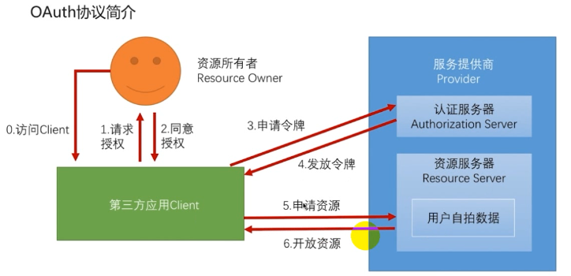
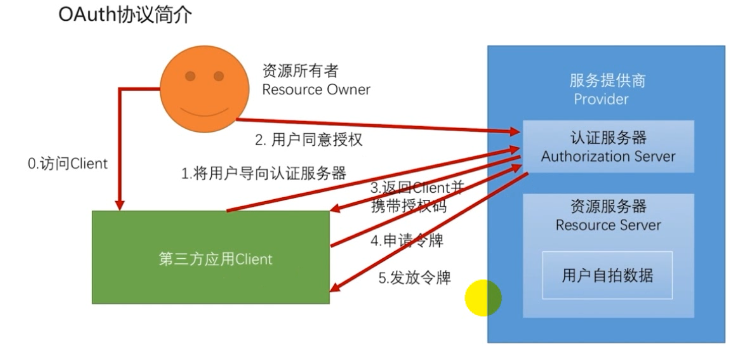
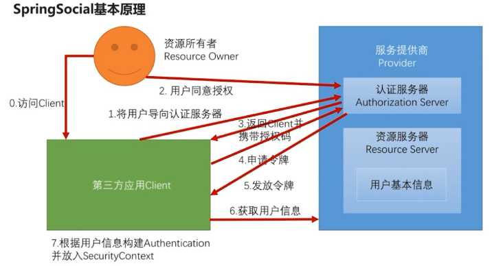
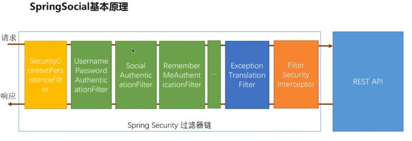
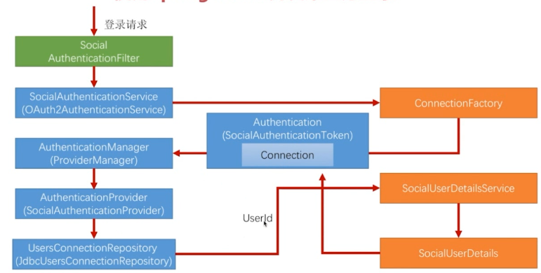
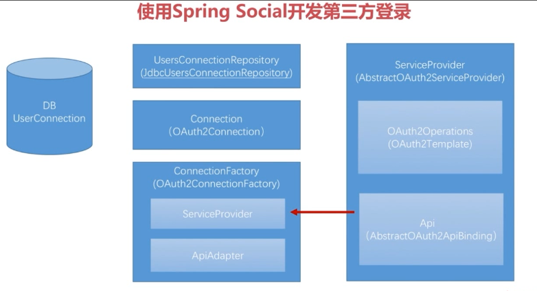

# 使用 Maven Module 搭建spring boot项目（整合Spring Security、Spring Social、spring OAuth）三

## Spring Social 开发第三方登陆

### OAuth 2.0 协议简介

#### 协议要解决的问题

某平台（如优酷）可以使用第三方（微博）登陆进入系统，关于第三方应用授权会产生以下问题

1. 优酷应用可以访问用户在微博上的所有数据
2. 用户只有修改密码才能收回授权
3. 密码泄露的可能性大大提高


#### 协议中的各种角色与运行流程

角色包括：资源所有者、客户端、服务提供商（认证服务器、资源服务器）




#### 协议中的授权模式

1. 授权码模式（Authorization Code）

授权码模式是目前最常使用的模式，以下是它的流程




1. 密码模式（Resource Owner Password Credentials）
2. 客户端模式（Client Credentials）
3. 简化模式（Implicit）

---

### Spring Social

#### 基本原理

##### Spring Social 基本流程



从第一步到第五步都是标准的OAuth协议流程，第六、七步是个性化流程

##### Spring Social 过滤器链

`SocialAuthenticationFilter`：处理社交登陆认证过滤器



##### Spring Social运行流程



##### Spring Social 各种角色

1. DBUserConnection ： 数据库
2. UserConnectionRepository（JdbcUserConnectionRepository）：用户信息连接仓库
3. Connection（OAuth2Connection）：由连接工厂创建
4. ConnectionFactory（OAuth2ConnectionFactory）：连接工厂

组成：1）ServiceProvider 定义服务提供商

​	    2）ApiAdapter ：用与匹配Api中返回的用户信息

1. ServiceProvider（AbstractOAuth2ServiceProvider）：服务提供商

组成：1）OAuth2Operations（OAuth2Template）：用于与服务提供商交互

​	    2）Api（AbstractOAuth2ApiBingding）：定义服务提供商获取用户信息




#### UsersConnectionRepository

##### 数据库表

```sql
create table vic_UserConnection (userId varchar(255) not null,
    providerId varchar(255) not null,
    providerUserId varchar(255),
    rank int not null,
    displayName varchar(255),
    profileUrl varchar(512),
    imageUrl varchar(512),
    accessToken varchar(512) not null,
    secret varchar(512),
    refreshToken varchar(512),
    expireTime bigint,
    primary key (userId, providerId, providerUserId));
create unique index vic_UserConnectionRank on vic_UserConnection(userId, providerId, rank);

```

##### 属性类创建

1. Spring Social 提供的一个社交配置类

```java
public abstract class SocialProperties {
    private String appId;
    private String appSecret;

    public SocialProperties() {
    }

    public String getAppId() {
        return this.appId;
    }

    public void setAppId(String appId) {
        this.appId = appId;
    }

    public String getAppSecret() {
        return this.appSecret;
    }

    public void setAppSecret(String appSecret) {
        this.appSecret = appSecret;
    }
}
```

2. 定义QQ和微信的属性类

```java
/**
 * 配置QQ登陆属性
 * 父类中提供appId、appSecret;
 * created by chuIllusions_tan 20180302
 */
public class QQProperties extends SocialProperties {
	
	private String providerId = "qq";

	public String getProviderId() {
		return providerId;
	}

	public void setProviderId(String providerId) {
		this.providerId = providerId;
	}
	
}
```

```java
/**
 * 微信属性
 *
 * created by chuIllusions_tan on 20280308
 */
public class WeixinProperties extends SocialProperties {
	
	/**
	 * 第三方id，用来决定发起第三方登录的url，默认是 weixin。
	 */
	private String providerId = "weixin";

	/**
	 * @return the providerId
	 */
	public String getProviderId() {
		return providerId;
	}

	/**
	 * @param providerId the providerId to set
	 */
	public void setProviderId(String providerId) {
		this.providerId = providerId;
	}
	

}
```

3. 建立社交配置类，并加入SecurityProperties核心属性配置中

```java
/**
 * 社交登陆配置
 * created by chuIllusions_tan 20180302
 */
public class SocialProperties {

	private QQProperties qq = new QQProperties();

	private WeixinProperties weixin = new WeixinProperties();

    //默认的处理社交登陆的URL
	private String filterProcessesUrl = "/auth";

	public QQProperties getQq() {
		return qq;
	}

	public void setQq(QQProperties qq) {
		this.qq = qq;
	}

	public String getFilterProcessesUrl() {
		return filterProcessesUrl;
	}

	public void setFilterProcessesUrl(String filterProcessesUrl) {
		this.filterProcessesUrl = filterProcessesUrl;
	}

	public WeixinProperties getWeixin() {
		return weixin;
	}

	public void setWeixin(WeixinProperties weixin) {
		this.weixin = weixin;
	}
}
```

**SecurityProperties.java**中加入属性配置如下

```java
/**
 * 社交登陆的相关配置,配置名:turing.security.social
 */
private SocialProperties social = new SocialProperties();
```

4. 社交用户信息回显

```java
/**
 * 简单的社交用户信息,用户页面回显
 *
 * created by chuIllusions_tan on 20180308
 */
public class SocialUserInfo {
	
	private String providerId;
	
	private String providerUserId;
	
	private String nickname;
	
	private String headimg;

	public String getProviderId() {
		return providerId;
	}

	public void setProviderId(String providerId) {
		this.providerId = providerId;
	}

	public String getProviderUserId() {
		return providerUserId;
	}

	public void setProviderUserId(String providerUserId) {
		this.providerUserId = providerUserId;
	}

	public String getNickname() {
		return nickname;
	}

	public void setNickname(String nickname) {
		this.nickname = nickname;
	}

	public String getHeadimg() {
		return headimg;
	}

	public void setHeadimg(String headimg) {
		this.headimg = headimg;
	}
	
}
```


#### SocialUserDetailsService

开启社交登陆，需要实现`SocialUserDetailsService`接口，开启社交用户匹配系统用户的查询

```java
/**
 * 自定义实现 spring security 验证逻辑
 * created by chuIllusions_tan on 2018/2/27.
 */
@Service
public class ForecastUserDetailsServiceImpl implements UserDetailsService,SocialUserDetailsService {

    private Logger logger = LoggerFactory.getLogger(this.getClass());

    @Autowired
    private PasswordEncoder passwordEncoder;

    @Autowired
    private UserMapper userMapper;

    /**
     * UserDetailsService接口实现方法
     */
    @Override
    public UserDetails loadUserByUsername(String username) throws UsernameNotFoundException {
        //spring security框架提供的一个实现了UserDetails接口的实现类
        //dao查询username信息
        SystemUser user = userMapper.findSystemUserByUsername(username);
        if (user == null){
            //AbstractUserDetailsAuthenticationProvider把UsernameNotFoundException包装其他异常，因为AbstractUserDetailsAuthenticationProvider.hideUserNotFoundExceptions=true
            throw new UsernameNotFoundException("无法找到用户名为:" + username + "的用户");
        }
        user.setPassword(passwordEncoder.encode(user.getPassword()));
        //三个参数:username,password,authorities：授权
        //分割String类型为授权集合
        return new User(username,user.getPassword(), AuthorityUtils.commaSeparatedStringToAuthorityList("admin"));
    }

    /**
     * SocialUserDetailsService接口实现方法
     * userId对应UsersConnectionRepository表中的UserId
     *
     */
    @Override
    public SocialUserDetails loadUserByUserId(String userId) throws UsernameNotFoundException {
        SystemUser user = userMapper.findSystemUserByUsername(userId);
        if (user == null){
            //AbstractUserDetailsAuthenticationProvider把UsernameNotFoundException包装其他异常，因为AbstractUserDetailsAuthenticationProvider.hideUserNotFoundExceptions=true
            throw new UsernameNotFoundException("无法找到用户名为:" + userId + "的用户");
        }
        return new SocialUser(userId,user.getPassword(),AuthorityUtils.commaSeparatedStringToAuthorityList("admin"));
    }
}
```


#### QQ登陆

##### 构造ServiceProvider

###### API

1. 定义获取用户信息接口

```java
/**
 * 自定义QQ用户信息接口
 *
 * created by chuIllusions_tan 20180302
 */
public interface QQ {
	
	QQUserInfo getUserInfo();

}
```

2. 定义用户信息接口实现类，并继承 Api 接口的子类 AbstractOAuth2ApiBinding

```java
/**
 * 用户获取QQ 用户信息
 * QQ API 实现类
 * 所有的API需要继承 AbstractOAuth2ApiBinding 提供access_token属性  RestTemplate用户发送HTTP请求
 * 多例对象，每个用户都拥有一个QQImpl实例
 * created by chuIllusions_tan 20180302
 */
public class QQImpl extends AbstractOAuth2ApiBinding implements QQ {

	private Logger logger = LoggerFactory.getLogger(this.getClass());

	//qq根据access_token(令牌)获取openId
	private static final String URL_GET_OPENID = "https://graph.qq.com/oauth2.0/me?access_token=%s";

	//获取用户信息
	private static final String URL_GET_USERINFO = "https://graph.qq.com/user/get_user_info?oauth_consumer_key=%s&openid=%s";
	
	private String appId;
	
	private String openId;

	private ObjectMapper objectMapper = new ObjectMapper();

	//走完oAuth协议获取到的accessToken
	public QQImpl(String accessToken, String appId) {
		//设置策略，发送请求时，token以参数形式在请求地址中
		super(accessToken, TokenStrategy.ACCESS_TOKEN_PARAMETER);
		
		this.appId = appId;
		
		String url = String.format(URL_GET_OPENID, accessToken);
		String result = getRestTemplate().getForObject(url, String.class);
		
		logger.info(result);

		this.openId = StringUtils.substringBetween(result, "\"openid\":\"", "\"}");
	}

	@Override
	public QQUserInfo getUserInfo(){

		String url = String.format(URL_GET_USERINFO, appId, openId);
		String result = getRestTemplate().getForObject(url, String.class);

		logger.info(result);

		QQUserInfo userInfo = null;
		try {
			userInfo = objectMapper.readValue(result, QQUserInfo.class);
			userInfo.setOpenId(openId);
			return userInfo;
		} catch (Exception e) {
			throw new RuntimeException("获取用户信息失败", e);
		}
	}
}
```

3. 定义QQ用户信息，从官网文档中获取返回的用户信息并创建对应实体类

```java
/**
 * QQ用户信息实体类
 * created by chuIllusions_tan 20180302
 */
public class QQUserInfo {
	
	/**
	 * 	返回码
	 */
	private String ret;
	/**
	 * 如果ret<0，会有相应的错误信息提示，返回数据全部用UTF-8编码。
	 */
	private String msg;
	/**
	 * 
	 */
	private String openId;
	/**
	 * 不知道什么东西，文档上没写，但是实际api返回里有。
	 */
	private String is_lost;
	/**
	 * 省(直辖市)
	 */
	private String province;
	/**
	 * 市(直辖市区)
	 */
	private String city;
	/**
	 * 出生年月
	 */
	private String year;
	/**
	 * 	用户在QQ空间的昵称。
	 */
	private String nickname;
	/**
	 * 	大小为30×30像素的QQ空间头像URL。
	 */
	private String figureurl;
	/**
	 * 	大小为50×50像素的QQ空间头像URL。
	 */
	private String figureurl_1;
	/**
	 * 	大小为100×100像素的QQ空间头像URL。
	 */
	private String figureurl_2;
	/**
	 * 	大小为40×40像素的QQ头像URL。
	 */
	private String figureurl_qq_1;
	/**
	 * 	大小为100×100像素的QQ头像URL。需要注意，不是所有的用户都拥有QQ的100×100的头像，但40×40像素则是一定会有。
	 */
	private String figureurl_qq_2;
	/**
	 * 	性别。 如果获取不到则默认返回”男”
	 */
	private String gender;
	/**
	 * 	标识用户是否为黄钻用户（0：不是；1：是）。
	 */
	private String is_yellow_vip;
	/**
	 * 	标识用户是否为黄钻用户（0：不是；1：是）
	 */
	private String vip;
	/**
	 * 	黄钻等级
	 */
	private String yellow_vip_level;
	/**
	 * 	黄钻等级
	 */
	private String level;
	/**
	 * 标识是否为年费黄钻用户（0：不是； 1：是）
	 */
	private String is_yellow_year_vip;
	
}

```

###### OAuth2Operations

**OAuth2Template.java源码分析**

```java
public class OAuth2Template implements OAuth2Operations {
public AccessGrant exchangeForAccess(String authorizationCode, String redirectUri, MultiValueMap<String, String> additionalParameters) {
    MultiValueMap<String, String> params = new LinkedMultiValueMap();
    if(this.useParametersForClientAuthentication) {
        params.set("client_id", this.clientId);
        params.set("client_secret", this.clientSecret);
    }

    params.set("code", authorizationCode);
    params.set("redirect_uri", redirectUri);
    params.set("grant_type", "authorization_code");
    if(additionalParameters != null) {
        params.putAll(additionalParameters);
    }

    return this.postForAccessGrant(this.accessTokenUrl, params);
}
    /**
     * 标准返回的是Map也就是json数据，但是各个服务提供商返回的不一定是标准格式，需要实现的服务商特殊格式处理
     */
protected AccessGrant postForAccessGrant(String accessTokenUrl, MultiValueMap<String, String> parameters) {
    return 
//希望返回的数据是json数据
this.extractAccessGrant((Map)this.getRestTemplate().postForObject(accessTokenUrl, parameters, Map.class, new Object[0]));
}

protected RestTemplate createRestTemplate() {
    ClientHttpRequestFactory requestFactory = ClientHttpRequestFactorySelector.getRequestFactory();
    RestTemplate restTemplate = new RestTemplate(requestFactory);
    List<HttpMessageConverter<?>> converters = new ArrayList(2);
    converters.add(new FormHttpMessageConverter());
    converters.add(new FormMapHttpMessageConverter());
    converters.add(new MappingJackson2HttpMessageConverter());
    restTemplate.setMessageConverters(converters);
    restTemplate.setErrorHandler(new LoggingErrorHandler());
    if(!this.useParametersForClientAuthentication) {
        List<ClientHttpRequestInterceptor> interceptors = restTemplate.getInterceptors();
        if(interceptors == null) {
            interceptors = new ArrayList();
            restTemplate.setInterceptors((List)interceptors);
        }

        ((List)interceptors).add(new PreemptiveBasicAuthClientHttpRequestInterceptor(this.clientId, this.clientSecret));
    }

    return restTemplate;
}


}
```

**OAuth2AuthenticationService.java 源码分析**

```java
public class OAuth2AuthenticationService<S> extends AbstractSocialAuthenticationService<S> {
public SocialAuthenticationToken getAuthToken(HttpServletRequest request, HttpServletResponse response) throws SocialAuthenticationRedirectException {
    String code = request.getParameter("code");
    //如果没有code，则是需要跳转到授权
    if(!StringUtils.hasText(code)) {
        OAuth2Parameters params = new OAuth2Parameters();
        params.setRedirectUri(this.buildReturnToUrl(request));
        this.setScope(request, params);
        params.add("state", this.generateState(this.connectionFactory, request));
        this.addCustomParameters(params);
        throw new SocialAuthenticationRedirectException(this.getConnectionFactory().getOAuthOperations().buildAuthenticateUrl(params));
    } else if(StringUtils.hasText(code)) {
        //获得了授权码
        try {
            String returnToUrl = this.buildReturnToUrl(request);
            //获取accessToken，调用连接工厂创建操作，获得accesstoken
            AccessGrant accessGrant = this.getConnectionFactory().getOAuthOperations().exchangeForAccess(code, returnToUrl, (MultiValueMap)null);
            Connection<S> connection = this.getConnectionFactory().createConnection(accessGrant);
            return new SocialAuthenticationToken(connection, (Map)null);
        } catch (RestClientException var7) {
            this.logger.debug("failed to exchange for access", var7);
            return null;
        }
    } else {
        return null;
    }
}

}
```

如果服务商没有按照指定的格式返回accesstoken数据，则可能会抛出如下异常：

```
授权成功后，进到我们的服务器中错误
org.springframework.web.client.RestClientException: Could not extract response: no suitable HttpMessageConverter found for response type [interface java.util.Map] and content type [text/html]
```


**自定义继承OAuth2Template**

```java
/**
 * 自定义配置Auth2Template实现
 * created by chuIllusions_tan 20180302
 */
public class QQOAuth2Template extends OAuth2Template {
   
   private Logger logger = LoggerFactory.getLogger(getClass());

   public QQOAuth2Template(String clientId, String clientSecret, String authorizeUrl, String accessTokenUrl) {
      super(clientId, clientSecret, authorizeUrl, accessTokenUrl);
      //设置为true的时候才会在请求的时候带上client_id和client_secret
      setUseParametersForClientAuthentication(true);
   }

   /**
    * 针对QQ特殊的返回方式，需要覆盖父类的处理逻辑
    * @param accessTokenUrl
    * @param parameters
    * @return
    */
   @Override
   protected AccessGrant postForAccessGrant(String accessTokenUrl, MultiValueMap<String, String> parameters) {
      String responseStr = getRestTemplate().postForObject(accessTokenUrl, parameters, String.class);
      
      logger.info("获取accessToke的响应："+responseStr);
      
      String[] items = StringUtils.splitByWholeSeparatorPreserveAllTokens(responseStr, "&");
      
      String accessToken = StringUtils.substringAfterLast(items[0], "=");
      Long expiresIn = new Long(StringUtils.substringAfterLast(items[1], "="));
      String refreshToken = StringUtils.substringAfterLast(items[2], "=");
      
      return new AccessGrant(accessToken, null, refreshToken, expiresIn);
   }
   
   @Override
   protected RestTemplate createRestTemplate() {
      RestTemplate restTemplate = super.createRestTemplate();
      //新增一个转换对象
      restTemplate.getMessageConverters().add(new StringHttpMessageConverter(Charset.forName("UTF-8")));
      return restTemplate;
   }

}
```

###### ServiceProvider

```java
/**
 * QQ Provider 需要实现 AbstractOAuth2ServiceProvider<T> T：传入QQ API类型
 * created by chuIllusions_tan 20180302
 */
public class QQServiceProvider extends AbstractOAuth2ServiceProvider<QQ> {

   private String appId;

   //导向认证地址，获取授权码
   private static final String URL_AUTHORIZE = "https://graph.qq.com/oauth2.0/authorize";

   //拿着授权码获取令牌申请地址
   private static final String URL_ACCESS_TOKEN = "https://graph.qq.com/oauth2.0/token";
   
   public QQServiceProvider(String appId, String appSecret) {
      //单例
      super(new QQOAuth2Template(appId, appSecret, URL_AUTHORIZE, URL_ACCESS_TOKEN));
      this.appId = appId;
      
   }
   
   @Override
   public QQ getApi(String accessToken) {
      return new QQImpl(accessToken, appId);
   }

}
```

##### 构造ConnectionFactory

###### ApiAdapter

```java
/**
 * 构造Adapter
 * 需要实现ApiAdapter<T> T：指当前的适配器 是 适配哪个 API
 * created by chuIllusions_tan 20180302
 */
public class QQAdapter implements ApiAdapter<QQ> {

	//服务是否为可用
	@Override
	public boolean test(QQ api) {
		return true;
	}

	/**
	 * Connection数据 与 Api 数据 的适配
	 * @param api
	 * @param values 创建Connection所需要的数据项
	 */
	@Override
	public void setConnectionValues(QQ api, ConnectionValues values) {
		QQUserInfo userInfo = api.getUserInfo();
		
		values.setDisplayName(userInfo.getNickname());
		values.setImageUrl(userInfo.getFigureurl_qq_1());
		values.setProfileUrl(null);//个人主页，QQ没有。微博就会有
		values.setProviderUserId(userInfo.getOpenId());
	}

	@Override
	public UserProfile fetchUserProfile(QQ api) {
		return null;
	}

	@Override
	public void updateStatus(QQ api, String message) {
	}

}
```

###### ConnectionFactory

```java
/**
 * 构造ConnectionFactory
 * 继承<T> T：指当前的适配器 是 适配哪个 API
 * created by chuIllusions_tan 20180302
 */
public class QQConnectionFactory extends OAuth2ConnectionFactory<QQ> {

	public QQConnectionFactory(String providerId, String appId, String appSecret) {
		super(providerId, new QQServiceProvider(appId, appSecret), new QQAdapter());
	}
}
```

##### 生成QQ配置

```java
/**
 * QQ配置
 * ConditionalOnProperty：当系统中存在指定的配置时，此配置才生效
 *
 * created by chuIllusions_tan 20180302
 */
@Configuration
@ConditionalOnProperty(prefix = "victory.security.social.qq", name = "app-id")
public class QQAutoConfig extends SocialAutoConfigurerAdapter {

	@Autowired
	private SecurityProperties securityProperties;

    /**
     * 创建连接工厂，使用自定义的连接工厂
     */
	@Override
	protected ConnectionFactory<?> createConnectionFactory() {
		QQProperties qqConfig = securityProperties.getSocial().getQq();
		return new QQConnectionFactory(qqConfig.getProviderId(), qqConfig.getAppId(), qqConfig.getAppSecret());
	}

	/**
	 * 为了解决生产多个连接工厂，覆盖父类的连接工厂创建
	 * @param connectionFactoryLocator
	 * @return
	 */
	@Override
	public UsersConnectionRepository getUsersConnectionRepository(ConnectionFactoryLocator connectionFactoryLocator) {
		return null;
	}

    /**
     * 处理视图，后面会进行讲解
     */
	@Bean({"connect/qqConnect", "connect/qqConnected"})
	@ConditionalOnMissingBean(name = "qqConnectedView")
	public View qqConnectedView() {
		return new AbstractConnectView();
	}
}
```


#### 微信登陆

##### 构造ServiceProvider

###### API

1. 定义微信API接口

```java
/**
 * 微信API调用接口
 * 
 * created by chuIllusions_tan 20180302
 *
 */
public interface Weixin {

	WeixinUserInfo getUserInfo(String openId);
	
}
```

2. 定义微信用户信息类，从微信官网文档中获取返回的用户信息，构造出用户实体类

```java
/**
 * 微信用户信息
 *
 * created by chuIllusions_tan on 20180303
 */
public class WeixinUserInfo {
	
	/**
	 * 普通用户的标识，对当前开发者帐号唯一
	 */
	private String openid;	
	/**
	 * 普通用户昵称
	 */
	private String nickname;
	/**
	 * 语言
	 */
	private String language;
	/**
	 * 普通用户性别，1为男性，2为女性
	 */
	private String sex;
	/**
	 * 普通用户个人资料填写的省份
	 */
	private String province;
	/**
	 * 普通用户个人资料填写的城市
	 */
	private String city;
	/**
	 * 国家，如中国为CN
	 */
	private String country;
	/**
	 * 用户头像，最后一个数值代表正方形头像大小（有0、46、64、96、132数值可选，0代表640*640正方形头像），用户没有头像时该项为空
	 */
	private String headimgurl;
	/**
	 * 用户特权信息，json数组，如微信沃卡用户为（chinaunicom）
	 */
	private String[] privilege;
	/**
	 * 用户统一标识。针对一个微信开放平台帐号下的应用，同一用户的unionid是唯一的。
	 */
	private String unionid;
	
}
```

3. 定义微信用户信息接口实现类，并继承 Api 接口的子类 AbstractOAuth2ApiBinding

```java
/**
 * Weixin API调用模板， scope为Request的Spring bean, 根据当前用户的accessToken创建。
 * 
 * created by chuIllusions_tan 20180303
 *
 */
public class WeixinImpl extends AbstractOAuth2ApiBinding implements Weixin {
	
	/**
	 * 
	 */
	private ObjectMapper objectMapper = new ObjectMapper();
	/**
	 * 获取用户信息的url
	 */
	private static final String URL_GET_USER_INFO = "https://api.weixin.qq.com/sns/userinfo?openid=";
	
	/**
	 * @param accessToken
	 */
	public WeixinImpl(String accessToken) {
		super(accessToken, TokenStrategy.ACCESS_TOKEN_PARAMETER);
	}
	
	/**
	 * 默认注册的StringHttpMessageConverter字符集为ISO-8859-1，而微信返回的是UTF-8的，所以覆盖了原来的方法。
	 */
	protected List<HttpMessageConverter<?>> getMessageConverters() {
		List<HttpMessageConverter<?>> messageConverters = super.getMessageConverters();
		messageConverters.remove(0);
		messageConverters.add(new StringHttpMessageConverter(Charset.forName("UTF-8")));
		return messageConverters;
	}

	/**
	 * 获取微信用户信息。
	 */
	@Override
	public WeixinUserInfo getUserInfo(String openId) {
		String url = URL_GET_USER_INFO + openId;
		String response = getRestTemplate().getForObject(url, String.class);
		if(StringUtils.contains(response, "errcode")) {
			return null;
		}
		WeixinUserInfo profile = null;
		try {
			profile = objectMapper.readValue(response,WeixinUserInfo.class);
		} catch (Exception e) {
			e.printStackTrace();
		}
		return profile;
	}

}
```

###### OAuth2Operations

```java
/**
 * 
 * 完成微信的OAuth2认证流程的模板类。国内厂商实现的OAuth2每个都不同, spring默认提供的OAuth2Template适应不了，只能针对每个厂商自己微调。
 * 
 * created by chuIllusions_tan on 20180308
 *
 */
public class WeixinOAuth2Template extends OAuth2Template {
   
   private String clientId;
   
   private String clientSecret;

   private String accessTokenUrl;
   
   private static final String REFRESH_TOKEN_URL = "https://api.weixin.qq.com/sns/oauth2/refresh_token";
   
   private Logger logger = LoggerFactory.getLogger(getClass());

   public WeixinOAuth2Template(String clientId, String clientSecret, String authorizeUrl, String accessTokenUrl) {
      super(clientId, clientSecret, authorizeUrl, accessTokenUrl);
      setUseParametersForClientAuthentication(true);
      this.clientId = clientId;
      this.clientSecret = clientSecret;
      this.accessTokenUrl = accessTokenUrl;
   }
   
   /* (non-Javadoc)
    * @see org.springframework.social.oauth2.OAuth2Template#exchangeForAccess(java.lang.String, java.lang.String, org.springframework.util.MultiValueMap)
    */
   @Override
   public AccessGrant exchangeForAccess(String authorizationCode, String redirectUri,
                                         MultiValueMap<String, String> parameters) {
      
      StringBuilder accessTokenRequestUrl = new StringBuilder(accessTokenUrl);
      
      accessTokenRequestUrl.append("?appid="+clientId);
      accessTokenRequestUrl.append("&secret="+clientSecret);
      accessTokenRequestUrl.append("&code="+authorizationCode);
      accessTokenRequestUrl.append("&grant_type=authorization_code");
      accessTokenRequestUrl.append("&redirect_uri="+redirectUri);
      
      return getAccessToken(accessTokenRequestUrl);
   }
   
   public AccessGrant refreshAccess(String refreshToken, MultiValueMap<String, String> additionalParameters) {
      
      StringBuilder refreshTokenUrl = new StringBuilder(REFRESH_TOKEN_URL);
      
      refreshTokenUrl.append("?appid="+clientId);
      refreshTokenUrl.append("&grant_type=refresh_token");
      refreshTokenUrl.append("&refresh_token="+refreshToken);
      
      return getAccessToken(refreshTokenUrl);
   }

   @SuppressWarnings("unchecked")
   private AccessGrant getAccessToken(StringBuilder accessTokenRequestUrl) {
      
      logger.info("获取access_token, 请求URL: "+accessTokenRequestUrl.toString());
      
      String response = getRestTemplate().getForObject(accessTokenRequestUrl.toString(), String.class);
      
      logger.info("获取access_token, 响应内容: "+response);
      
      Map<String, Object> result = null;
      try {
         result = new ObjectMapper().readValue(response, Map.class);
      } catch (Exception e) {
         e.printStackTrace();
      }
      
      //返回错误码时直接返回空
      if(StringUtils.isNotBlank(MapUtils.getString(result, "errcode"))){
         String errcode = MapUtils.getString(result, "errcode");
         String errmsg = MapUtils.getString(result, "errmsg");
         throw new RuntimeException("获取access token失败, errcode:"+errcode+", errmsg:"+errmsg);
      }
      
      WeixinAccessGrant accessToken = new WeixinAccessGrant(
            MapUtils.getString(result, "access_token"),
            MapUtils.getString(result, "scope"),
            MapUtils.getString(result, "refresh_token"),
            MapUtils.getLong(result, "expires_in"));
      
      accessToken.setOpenId(MapUtils.getString(result, "openid"));
      
      return accessToken;
   }
   
   /**
    * 构建获取授权码的请求。也就是引导用户跳转到微信的地址。
    */
   public String buildAuthenticateUrl(OAuth2Parameters parameters) {
      String url = super.buildAuthenticateUrl(parameters);
      url = url + "&appid="+clientId+"&scope=snsapi_login";
      return url;
   }
   
   public String buildAuthorizeUrl(OAuth2Parameters parameters) {
      return buildAuthenticateUrl(parameters);
   }
   
   /**
    * 微信返回的contentType是html/text，添加相应的HttpMessageConverter来处理。
    */
   protected RestTemplate createRestTemplate() {
      RestTemplate restTemplate = super.createRestTemplate();
      restTemplate.getMessageConverters().add(new StringHttpMessageConverter(Charset.forName("UTF-8")));
      return restTemplate;
   }

}
```

###### AccessGrant

```java
/**
 * 
 * 完成微信的OAuth2认证流程的模板类。国内厂商实现的OAuth2每个都不同, spring默认提供的OAuth2Template适应不了，只能针对每个厂商自己微调。
 * 
 * created by chuIllusions_tan on 20180308
 *
 */
public class WeixinOAuth2Template extends OAuth2Template {
   
   private String clientId;
   
   private String clientSecret;

   private String accessTokenUrl;
   
   private static final String REFRESH_TOKEN_URL = "https://api.weixin.qq.com/sns/oauth2/refresh_token";
   
   private Logger logger = LoggerFactory.getLogger(getClass());

   public WeixinOAuth2Template(String clientId, String clientSecret, String authorizeUrl, String accessTokenUrl) {
      super(clientId, clientSecret, authorizeUrl, accessTokenUrl);
      setUseParametersForClientAuthentication(true);
      this.clientId = clientId;
      this.clientSecret = clientSecret;
      this.accessTokenUrl = accessTokenUrl;
   }
   
   /* (non-Javadoc)
    * @see org.springframework.social.oauth2.OAuth2Template#exchangeForAccess(java.lang.String, java.lang.String, org.springframework.util.MultiValueMap)
    */
   @Override
   public AccessGrant exchangeForAccess(String authorizationCode, String redirectUri,
                                         MultiValueMap<String, String> parameters) {
      
      StringBuilder accessTokenRequestUrl = new StringBuilder(accessTokenUrl);
      
      accessTokenRequestUrl.append("?appid="+clientId);
      accessTokenRequestUrl.append("&secret="+clientSecret);
      accessTokenRequestUrl.append("&code="+authorizationCode);
      accessTokenRequestUrl.append("&grant_type=authorization_code");
      accessTokenRequestUrl.append("&redirect_uri="+redirectUri);
      
      return getAccessToken(accessTokenRequestUrl);
   }
   
   public AccessGrant refreshAccess(String refreshToken, MultiValueMap<String, String> additionalParameters) {
      
      StringBuilder refreshTokenUrl = new StringBuilder(REFRESH_TOKEN_URL);
      
      refreshTokenUrl.append("?appid="+clientId);
      refreshTokenUrl.append("&grant_type=refresh_token");
      refreshTokenUrl.append("&refresh_token="+refreshToken);
      
      return getAccessToken(refreshTokenUrl);
   }

   @SuppressWarnings("unchecked")
   private AccessGrant getAccessToken(StringBuilder accessTokenRequestUrl) {
      
      logger.info("获取access_token, 请求URL: "+accessTokenRequestUrl.toString());
      
      String response = getRestTemplate().getForObject(accessTokenRequestUrl.toString(), String.class);
      
      logger.info("获取access_token, 响应内容: "+response);
      
      Map<String, Object> result = null;
      try {
         result = new ObjectMapper().readValue(response, Map.class);
      } catch (Exception e) {
         e.printStackTrace();
      }
      
      //返回错误码时直接返回空
      if(StringUtils.isNotBlank(MapUtils.getString(result, "errcode"))){
         String errcode = MapUtils.getString(result, "errcode");
         String errmsg = MapUtils.getString(result, "errmsg");
         throw new RuntimeException("获取access token失败, errcode:"+errcode+", errmsg:"+errmsg);
      }
      
      WeixinAccessGrant accessToken = new WeixinAccessGrant(
            MapUtils.getString(result, "access_token"),
            MapUtils.getString(result, "scope"),
            MapUtils.getString(result, "refresh_token"),
            MapUtils.getLong(result, "expires_in"));
      
      accessToken.setOpenId(MapUtils.getString(result, "openid"));
      
      return accessToken;
   }
   
   /**
    * 构建获取授权码的请求。也就是引导用户跳转到微信的地址。
    */
   public String buildAuthenticateUrl(OAuth2Parameters parameters) {
      String url = super.buildAuthenticateUrl(parameters);
      url = url + "&appid="+clientId+"&scope=snsapi_login";
      return url;
   }
   
   public String buildAuthorizeUrl(OAuth2Parameters parameters) {
      return buildAuthenticateUrl(parameters);
   }
   
   /**
    * 微信返回的contentType是html/text，添加相应的HttpMessageConverter来处理。
    */
   protected RestTemplate createRestTemplate() {
      RestTemplate restTemplate = super.createRestTemplate();
      restTemplate.getMessageConverters().add(new StringHttpMessageConverter(Charset.forName("UTF-8")));
      return restTemplate;
   }

}
```


###### ServiceProvider

```java
/**
 * 
 * 微信的OAuth2流程处理器的提供器，供spring social的connect体系调用
 * 
 * created by chuIllusions_tan 20180303
 *
 */
public class WeixinServiceProvider extends AbstractOAuth2ServiceProvider<Weixin> {
   
   /**
    * 微信获取授权码的url
    */
   private static final String URL_AUTHORIZE = "https://open.weixin.qq.com/connect/qrconnect";
   /**
    * 微信获取accessToken的url
    */
   private static final String URL_ACCESS_TOKEN = "https://api.weixin.qq.com/sns/oauth2/access_token";

   /**
    * @param appId
    * @param appSecret
    */
   public WeixinServiceProvider(String appId, String appSecret) {
      super(new WeixinOAuth2Template(appId, appSecret,URL_AUTHORIZE,URL_ACCESS_TOKEN));
   }


   @Override
   public Weixin getApi(String accessToken) {
      return new WeixinImpl(accessToken);
   }

}
```

##### 构造ConnectionFactory

###### ApiAdapter

```java
/**
 * 微信 api适配器，将微信 api的数据模型转为spring social的标准模型。
 * 
 * created by chuIllusions_tan on 20180308
 */
public class WeixinAdapter implements ApiAdapter<Weixin> {
   
   private String openId;
   
   public WeixinAdapter() {}
   
   public WeixinAdapter(String openId){
      this.openId = openId;
   }

   /**
    * @param api
    * @return
    */
   @Override
   public boolean test(Weixin api) {
      return true;
   }

   /**
    * @param api
    * @param values
    */
   @Override
   public void setConnectionValues(Weixin api, ConnectionValues values) {
      WeixinUserInfo profile = api.getUserInfo(openId);
      values.setProviderUserId(profile.getOpenid());
      values.setDisplayName(profile.getNickname());
      values.setImageUrl(profile.getHeadimgurl());
   }

   /**
    * @param api
    * @return
    */
   @Override
   public UserProfile fetchUserProfile(Weixin api) {
      return null;
   }

   /**
    * @param api
    * @param message
    */
   @Override
   public void updateStatus(Weixin api, String message) {
      //do nothing
   }

}
```

###### ConnectionFactory

```java
/**
 * 微信连接工厂
 * 
 * created by chuIllusions_tan on 20180308
 *
 */
public class WeixinConnectionFactory extends OAuth2ConnectionFactory<Weixin> {
	
	/**
	 * @param appId
	 * @param appSecret
	 */
	public WeixinConnectionFactory(String providerId, String appId, String appSecret) {
		super(providerId, new WeixinServiceProvider(appId, appSecret), new WeixinAdapter());
	}
	
	/**
	 * 由于微信的openId是和accessToken一起返回的，所以在这里直接根据accessToken设置providerUserId即可，不用像QQ那样通过QQAdapter来获取
	 */
	@Override
	protected String extractProviderUserId(AccessGrant accessGrant) {
		if(accessGrant instanceof WeixinAccessGrant) {
			return ((WeixinAccessGrant)accessGrant).getOpenId();
		}
		return null;
	}
	
	/* (non-Javadoc)
	 * @see org.springframework.social.connect.support.OAuth2ConnectionFactory#createConnection(org.springframework.social.oauth2.AccessGrant)
	 */
	public Connection<Weixin> createConnection(AccessGrant accessGrant) {
		return new OAuth2Connection<Weixin>(getProviderId(), extractProviderUserId(accessGrant), accessGrant.getAccessToken(),
				accessGrant.getRefreshToken(), accessGrant.getExpireTime(), getOAuth2ServiceProvider(), getApiAdapter(extractProviderUserId(accessGrant)));
	}

	/* (non-Javadoc)
	 * @see org.springframework.social.connect.support.OAuth2ConnectionFactory#createConnection(org.springframework.social.connect.ConnectionData)
	 */
	public Connection<Weixin> createConnection(ConnectionData data) {
		return new OAuth2Connection<Weixin>(data, getOAuth2ServiceProvider(), getApiAdapter(data.getProviderUserId()));
	}
	
	private ApiAdapter<Weixin> getApiAdapter(String providerUserId) {
		return new WeixinAdapter(providerUserId);
	}
	
	private OAuth2ServiceProvider<Weixin> getOAuth2ServiceProvider() {
		return (OAuth2ServiceProvider<Weixin>) getServiceProvider();
	}

	
}
```

##### 生成微信配置

```java
/**
 * 微信登录配置
 * 
 * created by chuIllusions_tan on 20180308
 *
 */
@Configuration
@ConditionalOnProperty(prefix = "victorys.security.social.weixin", name = "app-id")
public class WeixinAutoConfiguration extends SocialAutoConfigurerAdapter {

	@Autowired
	private SecurityProperties securityProperties;

	/*
	 * 获取微信配置，生成微信的连接工厂
	 * 
	 * @see
	 * org.springframework.boot.autoconfigure.social.SocialAutoConfigurerAdapter
	 * #createConnectionFactory()
	 */
	@Override
	protected ConnectionFactory<?> createConnectionFactory() {
		WeixinProperties weixinConfig = securityProperties.getSocial().getWeixin();
		return new WeixinConnectionFactory(weixinConfig.getProviderId(), weixinConfig.getAppId(),
				weixinConfig.getAppSecret());
	}

	@Override
	public UsersConnectionRepository getUsersConnectionRepository(ConnectionFactoryLocator connectionFactoryLocator) {
		return null;
	}

	@Bean({"connect/weixinConnect", "connect/weixinConnected"})
	@ConditionalOnMissingBean(name = "weixinConnectedView")
	public View weixinConnectedView() {
		return new AbstractConnectView();
	}
}
```

#### 社交总配置

1. 配置SpringSocialConfigurer，实现对SocialAuthenticationFilter的配置

```java
/**
 * 自定义配置SocialConfigurer,覆盖其默认拍配置
 * 作用：SocialAuthenticationFilter初始化完成后，重新设置它的某些属性
 *
 * created by chuIllusions_tan 20180302
 */
public class AbstractSpringSocialConfigurer extends SpringSocialConfigurer {
	
	private String filterProcessesUrl;//实现可配置的社交登陆拦截url

    //实现可扩展化Filter类
	private SocialAuthenticationFilterPostProcessor socialAuthenticationFilterPostProcessor;
	
	public AbstractSpringSocialConfigurer(String filterProcessesUrl) {
		this.filterProcessesUrl = filterProcessesUrl;
	}
	
	@Override
	protected <T> T postProcess(T object) {
		SocialAuthenticationFilter filter = (SocialAuthenticationFilter) super.postProcess(object);
		//设置社交登陆拦截的url
		filter.setFilterProcessesUrl(filterProcessesUrl);
		if (socialAuthenticationFilterPostProcessor != null) {
			//为SocialAuthenticationFilter增加额外的属性
			//在不同的项目下会有不同的实现
			socialAuthenticationFilterPostProcessor.process(filter);
		}
		return (T) filter;
	}

	public SocialAuthenticationFilterPostProcessor getSocialAuthenticationFilterPostProcessor() {
		return socialAuthenticationFilterPostProcessor;
	}

	public void setSocialAuthenticationFilterPostProcessor(SocialAuthenticationFilterPostProcessor socialAuthenticationFilterPostProcessor) {
		this.socialAuthenticationFilterPostProcessor = socialAuthenticationFilterPostProcessor;
	}

	public String getFilterProcessesUrl() {
		return filterProcessesUrl;
	}

	public void setFilterProcessesUrl(String filterProcessesUrl) {
		this.filterProcessesUrl = filterProcessesUrl;
	}
}

```

2. SocialAuthenticationFilterPostProcessor社交验证过滤器后置处理器接口定义

```java
/**
 * 定义后处理器接口，处理不同模式下授权后返回的信息
 * 如果不进行配置，则不修改SocialAuthenticationFilter里的任何属性值
 * 默认不进行设置，即没有实现类
 * 根据不同的环境，可以自定义接口的实现，对SocialAuthenticationFilter进行属性扩展
 * 
 * 在前后端分离的项目中，一般都需要返回不一样的社交登陆验证信息，比如说给Filter设置登陆成功处理器
 *
 * created by chuIllusions_tan 20180305
 */
public interface SocialAuthenticationFilterPostProcessor {
	
	void process(SocialAuthenticationFilter socialAuthenticationFilter);

}
```

3. 总配置

```java
/**
 * 配置社交登陆配置
 * created by chuIllusions_tan 20180302
 */
@Configuration
@EnableSocial//开启社交项目的支持
public class SocialConfig extends SocialConfigurerAdapter {
	private Logger logger = LoggerFactory.getLogger(this.getClass());
	
	@Autowired
	private DataSource dataSource;

	@Autowired
	private SecurityProperties securityProperties;

    //开启社交用户自动注册
	@Autowired(required = false)
	private ConnectionSignUp connectionSignUp;

    //是否有后置处理器去增强过滤器的配置
	@Autowired(required = false)
	private SocialAuthenticationFilterPostProcessor socialAuthenticationFilterPostProcessor;

    //配置UsersConnectionRepository
	@Override
	public UsersConnectionRepository getUsersConnectionRepository(ConnectionFactoryLocator connectionFactoryLocator) {
		JdbcUsersConnectionRepository repository = new JdbcUsersConnectionRepository(dataSource, connectionFactoryLocator, Encryptors.noOpText());
		repository.setTablePrefix("vic_");//加入表前缀
		if(connectionSignUp != null) {
			repository.setConnectionSignUp(connectionSignUp);
		}
		return repository;
	}

	/**
	 * 全局配置SocailConfig
	 * @return
	 */
	@Bean(name = SecurityConstants.DEFAULT_SPRING_SOCIAL_CONFIGURER_BEAN_NAME)
	public SpringSocialConfigurer socialSecurityConfig() {
		String filterProcessesUrl = securityProperties.getSocial().getFilterProcessesUrl();
		AbstractSpringSocialConfigurer configurer = new AbstractSpringSocialConfigurer(filterProcessesUrl);
		//设置注册地址
		configurer.signupUrl(securityProperties.getBrowser().getSignUpUrl());
		//设置后置处理器，对过滤器进行增强改造
		configurer.setSocialAuthenticationFilterPostProcessor(socialAuthenticationFilterPostProcessor);
		return configurer;
	}

	/**
	 * spring social 提供的工具类，可以获取获取到的第三方用户信息
	 * @param connectionFactoryLocator spring boot 已经有此类的实现
	 * @return ProviderSignInUtils
	 */
	@Bean
	public ProviderSignInUtils providerSignInUtils(ConnectionFactoryLocator connectionFactoryLocator) {
		UsersConnectionRepository usersConnectionRepository = getUsersConnectionRepository(connectionFactoryLocator);
		return new ProviderSignInUtils(connectionFactoryLocator,usersConnectionRepository);
	}

	/**
	 * 配置默认的社交绑定状态信息输出器
	 * 可扩展
	 */
	@Bean
	@ConditionalOnMissingBean(AbstractConnectionViewProcessor.class)
	public AbstractConnectionViewProcessor connectionViewProcessor(ObjectMapper objectMapper){
		DefaultConnectionViewProcessor processor = new DefaultConnectionViewProcessor(objectMapper);
		return processor;
	}
}
```


#### Spring Social额外配置

##### 社交注册

​	当以上流程就是走完整个OAuth协议的流程，拿到了服务提供商的用户信息，但是成功后却引发了另外一个跳转：/signup。

###### 源码分析

**SocialAuthenticationProvider 源码跟踪**

```java
package org.springframework.social.security;

public class SocialAuthenticationProvider implements AuthenticationProvider {

    public boolean supports(Class<? extends Object> authentication) {
        return SocialAuthenticationToken.class.isAssignableFrom(authentication);
    }

    public Authentication authenticate(Authentication authentication) throws AuthenticationException {
        Assert.isInstanceOf(SocialAuthenticationToken.class, authentication, "unsupported authentication type");
        Assert.isTrue(!authentication.isAuthenticated(), "already authenticated");
        SocialAuthenticationToken authToken = (SocialAuthenticationToken)authentication;
        String providerId = authToken.getProviderId();
        //获得Connection
        Connection<?> connection = authToken.getConnection();
		//在系统用户中不存在对应第三方用户的记录
        String userId = this.toUserId(connection);
        if(userId == null) {
			//扔出这个异常，会跳转到注册
            throw new BadCredentialsException("Unknown access token");
        } else {
            UserDetails userDetails = this.userDetailsService.loadUserByUserId(userId);
            if(userDetails == null) {
                throw new UsernameNotFoundException("Unknown connected account id");
            } else {
                return new SocialAuthenticationToken(connection, userDetails, authToken.getProviderAccountData(), this.getAuthorities(providerId, userDetails));
            }
        }
    }

    //根据Connection获取系统用户的信息
    protected String toUserId(Connection<?> connection) {
        List<String> userIds = this.usersConnectionRepository.findUserIdsWithConnection(connection);
        return userIds.size() == 1?(String)userIds.iterator().next():null;
    }

}
```

**SocialAuthenticationFilter源码跟踪**

```java
public class SocialAuthenticationFilter extends AbstractAuthenticationProcessingFilter{
private Authentication doAuthentication(SocialAuthenticationService<?> authService, HttpServletRequest request, SocialAuthenticationToken token) {
    try {
        if(!authService.getConnectionCardinality().isAuthenticatePossible()) {
            return null;
        } else {
            token.setDetails(this.authenticationDetailsSource.buildDetails(request));
            Authentication success = this.getAuthenticationManager().authenticate(token);
            Assert.isInstanceOf(SocialUserDetails.class, success.getPrincipal(), "unexpected principle type");
            this.updateConnections(authService, token, success);
            return success;
        }
    } catch (BadCredentialsException var5) {
	//捕获到该异常就会进行跳转到默认的注册页或者自定义的注册页
        if(this.signupUrl != null) {
            this.sessionStrategy.setAttribute(new ServletWebRequest(request), ProviderSignInAttempt.SESSION_ATTRIBUTE, new ProviderSignInAttempt(token.getConnection()));
            throw new SocialAuthenticationRedirectException(this.buildSignupUrl(request));
        } else {
            throw var5;
        }
    }
}
}
```

###### 解决方案

1. 开启指定的注册页面

1）新增一个注册页面，并且将注册页面url实现可配置化，并且通知SocialConfiguer注册页，并放开注册页的访问权限。

在以上`SocialConfig.java`代码展示中已经配置

```java
//设置注册地址
configurer.signupUrl(securityProperties.getBrowser().getSignUpUrl())
```

2）社交用户信息的传递

当我们在授权获取用户信息后，跳到了注册页上，那么怎么将第三方用户信息传递到注册页面上，注册后，怎么告诉social，刚注册的用户怎么关联上授权用户的信息；Spring 提供了工具类，解决问题：①注册时拿到spring social 信息；②注册完成如何传递用户id给spring social

`SocialConfig.java`中的配置

```java
/**
	 * spring social 提供的工具类，可以获取获取到的第三方用户信息
	 * @param connectionFactoryLocator spring boot 已经有此类的实现
	 * @return ProviderSignInUtils
	 */
	@Bean
	public ProviderSignInUtils providerSignInUtils(ConnectionFactoryLocator connectionFactoryLocator) {
		UsersConnectionRepository usersConnectionRepository = getUsersConnectionRepository(connectionFactoryLocator);
		return new ProviderSignInUtils(connectionFactoryLocator,usersConnectionRepository);
	}
```

`ProviderSignInUtils`工具类需要在有session的环境下才能使用，否则无效

3）构建获取社交用户信息的服务

`BrowserSecurityController.java`中新增服务

```java
@Autowired
private ProviderSignInUtils providerSignInUtils;
@GetMapping("/social/user")
public SocialUserInfo getSocialUserInfo(HttpServletRequest request) {
   SocialUserInfo userInfo = new SocialUserInfo();
   Connection<?> connection = providerSignInUtils.getConnectionFromSession(new ServletWebRequest(request));
   userInfo.setProviderId(connection.getKey().getProviderId());
   userInfo.setProviderUserId(connection.getKey().getProviderUserId());//openid
   userInfo.setNickname(connection.getDisplayName());
   userInfo.setHeadimg(connection.getImageUrl());
   return userInfo;
}
```

4）Connection信息的存储

查看`SocialAuthenticationFilter`中源码，中当需要跳转注册页面时，执行下代码，将Connection放入session中

```java
this.sessionStrategy.setAttribute(new ServletWebRequest(request), ProviderSignInAttempt.SESSION_ATTRIBUTE, new ProviderSignInAttempt(token.getConnection()));
```

5）创建注册服务

`UserController.java`中注册服务

```java
@Autowired
private ProviderSignInUtils providerSignInUtils;

@PostMapping("/regist")
public void regist(User user, HttpServletRequest request) {
   //实现注册业务，注册成功后返回用户唯一标签
    //实现逻辑.........
   //不管是注册用户还是绑定用户，都会拿到一个用户唯一标识。
   String userId = user.getUsername();
    
   //工具类实现注册关联
   providerSignInUtils.doPostSignUp(userId, new ServletWebRequest(request));
}
```


2. 开启关联注册

当用户使用第三方登陆时，授权获取信息成功后，不是跳转的注册页面，而是进入系统。开启默认注册

1）源码分析

`SocialAuthenticationProvider.java`

```java
public class SocialAuthenticationProvider implements AuthenticationProvider {
	public Authentication authenticate(Authentication authentication) throws AuthenticationException {
        String userId = this.toUserId(connection);
  	}
    
	protected String toUserId(Connection<?> connection) {
        //查看是否有系统关联的用户存在
    List<String> userIds =  this.usersConnectionRepository.findUserIdsWithConnection(connection);
    return userIds.size() == 1?(String)userIds.iterator().next():null;
	}

}
```

`JdbcUsersConnectionRepository.java`

```java
public class JdbcUsersConnectionRepository implements UsersConnectionRepository {
    private ConnectionSignUp connectionSignUp;//对象存在时，开启默认创建用户
    
	public List<String> findUserIdsWithConnection(Connection<?> connection) {
    	ConnectionKey key = connection.getKey();
    	List<String> localUserIds = this.jdbcTemplate.queryForList("select userId from " + this.tablePrefix + "UserConnection where providerId = ? and providerUserId = ?", String.class, new Object[]{key.getProviderId(), key.getProviderUserId()});
    	//如果没有查到对象，并且connectionSignUp对象存在
		if(localUserIds.size() == 0 && this.connectionSignUp != null) {
			//执行方法，返回新用户的Id
        	String newUserId = this.connectionSignUp.execute(connection);
        	if(newUserId != null) {
            	this.createConnectionRepository(newUserId).addConnection(connection);
            	return Arrays.asList(new String[]{newUserId});
        	}
    	}

    	return localUserIds;
	}

}
```

2） 自定义ConnectionSignUp

```java
/**
 * 自定义社交登陆，开启默认注册
 * created by chuIllusions_tan 20180303
 */
@Component
public class DemoConnectionSignUp implements ConnectionSignUp {
   @Override
   public String execute(Connection<?> connection) {
      //根据业务创建逻辑,实现注册
      //根据社交用户信息默认创建用户并返回用户唯一标识
      return connection.getDisplayName();
   }
}
```

`SocialConfig.java`中加入`UserUsersConnectionRepository`配置中

```java
//注入
	@Autowired(required = false)
	private ConnectionSignUp connectionSignUp;
@Override
	public UsersConnectionRepository getUsersConnectionRepository(ConnectionFactoryLocator connectionFactoryLocator) {
		JdbcUsersConnectionRepository repository = new JdbcUsersConnectionRepository(dataSource, connectionFactoryLocator, Encryptors.noOpText());
		repository.setTablePrefix("vic_");//加入表前缀
		if(connectionSignUp != null) {
			repository.setConnectionSignUp(connectionSignUp);
		}
		return repository;
	}
```

###### BUG

1. 问题：

这里我遇到了一个问题：

SocialAuthenticationProvider中使用的是InMemoryUsersConnectionRepository导致无法通过验证，每次都要重新注册，但是我们明明已经配置好JdbcUsersConnectionRepository为默认的操作数据库Connection，很奇怪的是我们在注册时候调用ProviderSignInUtils的自动注册方法，确是使用JdbcUsersConnectionRepository

**SocialAuthenticationProvider中的UsersConnectionRepository为InMemoryUsersConnectionRepository**

**ProviderSignInUtils中的UsersConnectionRepository为JdbcUsersConnectionRepository**

2. 源码分析：

`SocialConfiguration.java`

```java
@Configuration
public class SocialConfiguration {
   //会在set方法中注入所有的socialConfigurers ， QQAutoConfig等都实现了此接口
    private List<SocialConfigurer> socialConfigurers;

    
    @Bean
    public UsersConnectionRepository usersConnectionRepository(ConnectionFactoryLocator connectionFactoryLocator) {
        UsersConnectionRepository usersConnectionRepository = null;
        Iterator i$ = this.socialConfigurers.iterator();

        //找到多个接口的实现进行遍历
        while(i$.hasNext()) {
            SocialConfigurer socialConfigurer = (SocialConfigurer)i$.next();
            //调用方法获取UsersConnectionRepository
            UsersConnectionRepository ucrCandidate = socialConfigurer.getUsersConnectionRepository(connectionFactoryLocator);
            if(ucrCandidate != null) {
                usersConnectionRepository = ucrCandidate;
                break;
            }
        }

        Assert.notNull(usersConnectionRepository, "One configuration class must implement getUsersConnectionRepository from SocialConfigurer.");
        return usersConnectionRepository;
    }

}
```

`socialConfigurer.getUsersConnectionRepository(connectionFactoryLocator);`

如果子类没有覆盖方法，则会默认调用父类的获取UsersConnectionRepository方法，返回的就是InMemoryUsersConnectionRepository

```java
public abstract class SocialConfigurerAdapter implements SocialConfigurer {

    public UsersConnectionRepository getUsersConnectionRepository(ConnectionFactoryLocator connectionFactoryLocator) {
        return new InMemoryUsersConnectionRepository(connectionFactoryLocator);
    }
}
```

3. 分析：

因为初始化顺序的问题，`SocialConfiguration`中有多个，例如`QQAutoConfig`，在遍历寻找UserConnectionRepository中

`socialConfigurer.getUsersConnectionRepository(connectionFactoryLocator);`,则调用父类返回默认的`InMemoryUsersConnectionRepository`

4. 解决：

在自定义`SocialConfiguration`实现类中，覆盖其父类的`getUsersConnectionRepository`方法，返回`null`则可以解决这个问题，返回`null`时则会继续遍历下一个，直达在总配置`SocialConfig`返回我们覆盖的获得该类的方法

修改配置，微信配置也如此

```java
public class QQAutoConfig extends SocialAutoConfigurerAdapter {
    /**
	 * 为了解决生产多个连接工厂，覆盖父类的连接工厂创建
	 * @param connectionFactoryLocator
	 * @return
	 */
	@Override
	public UsersConnectionRepository getUsersConnectionRepository(ConnectionFactoryLocator connectionFactoryLocator) {
		return null;
	}
}
```


##### 社交账号的绑定与解绑

系统当前用户需要绑定第三方账号或系统当前用户解绑第三方账号

绑定的流程跟社交登陆的流程是大同小异的；解绑实现逻辑比较简单，是从数据库中删除当前账户与第三方账户的记录