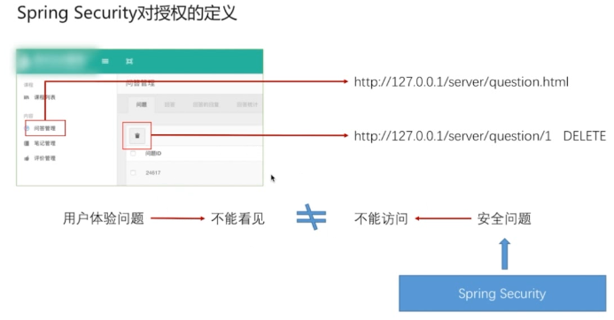
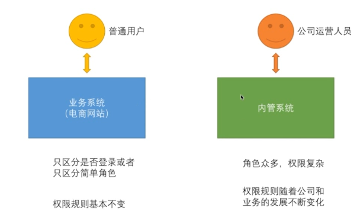
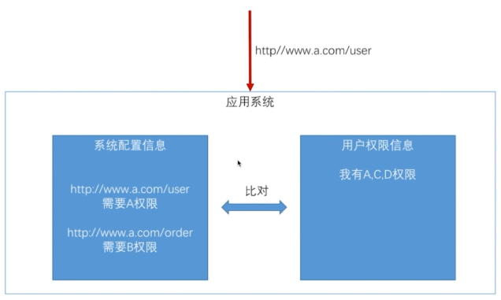
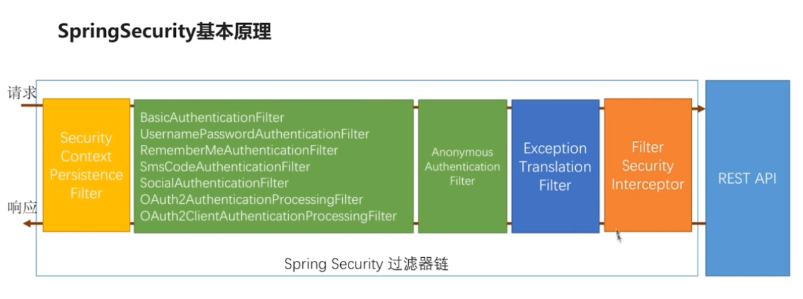
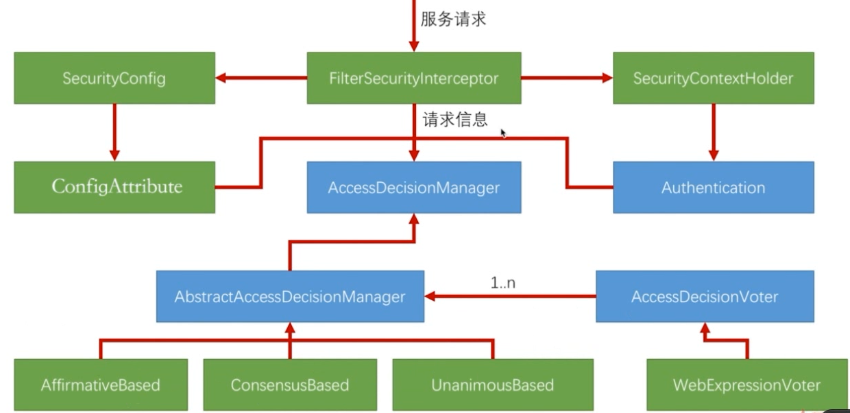
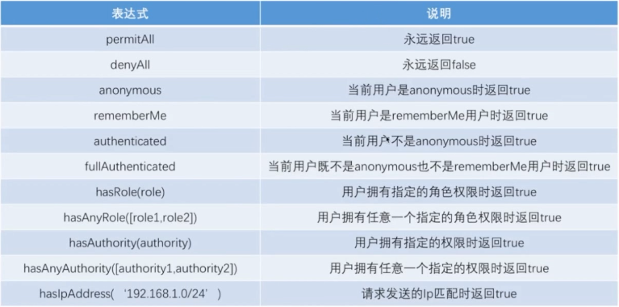
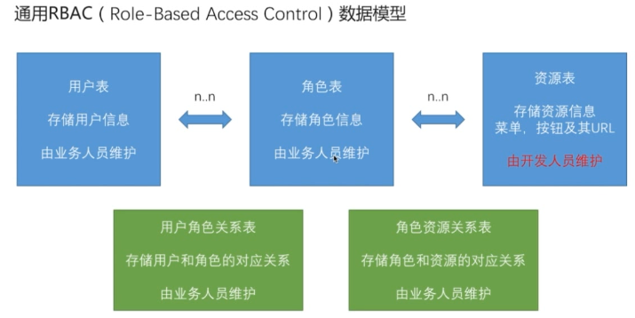

# Spring Security 权限控制及整合Thymeleaf引擎模板

## Spring Security 权限控制

### Spring Security 对权限的定义





对权限的控制，可以通过简单的权限规则、复杂的权限规则进行自定义的配置

#### 简单规则（权限规则基本不变）



#### 区分是否登陆

```java
.authorizeRequests()//对请求做授权
.antMatchers(SecurityConstants.DEFAULT_UNAUTHENTICATION_URL,
      SecurityConstants.DEFAULT_LOGIN_PROCESSING_URL_MOBILE,
      securityProperties.getBrowser().getLoginPage(),
      SecurityConstants.DEFAULT_VALIDATE_CODE_URL_PREFIX+"/*",
      securityProperties.getBrowser().getSignUpUrl(),
      "/user/regist",
      "/session/invalid",
      securityProperties.getBrowser().getSignOutUrl()
   ).permitAll() //不用登陆就可以访问
.anyRequest()//任何请求
.authenticated()//都需要身份验证  //需要登陆才能访问
```

#### 区分简单角色

```java
.authorizeRequests()//对请求做授权
.antMatchers(SecurityConstants.DEFAULT_UNAUTHENTICATION_URL,
      SecurityConstants.DEFAULT_LOGIN_PROCESSING_URL_MOBILE,
      securityProperties.getBrowser().getLoginPage(),
      SecurityConstants.DEFAULT_VALIDATE_CODE_URL_PREFIX+"/*",
      securityProperties.getBrowser().getSignUpUrl(),
      "/user/regist",
      "/session/invalid",
      securityProperties.getBrowser().getSignOutUrl()
   ).permitAll()
.antMatchers("/roles/*").hasRole("ADMIN")//有什么角色才能访问
.anyRequest()//任何请求
.authenticated()//都需要身份验证
```

#### Spring Security 中用户的权限设置

```java
@Component
public class MyUserDetailsService implements UserDetailsService,SocialUserDetailsService {
    @Override
    public SocialUserDetails loadUserByUserId(String userId) throws UsernameNotFoundException {
        String password = passwordEncoder.encode("123456");//此时应该是用户登记密码时的流程
        logger.info("数据库密码是: " + password);
        return new SocialUser(userId,password,
                true,true,true,true,
                AuthorityUtils.commaSeparatedStringToAuthorityList("admin,ROLE_USER"));
    }
}
```

在生成`UserDetails` 和`SocialUserDetail` 接口实现类时，构造函数中都需要传入权限集合

`Collection<?extends GrantedAuthority> authorities`类型的参数

上面代码中，通过`AuthorityUtils`工具类将字符串切割成权限集合

**在权限配置中，`antMatchers("/roles/*").hasRole("ADMIN"),hasRole所对应的角色字符串为：ROLE_ADMIN`**

(下文会解析为什么是有这样的命名规范)

在restful服务中，一个url通常对应不同httpmethod的请求，针对不同请求可以进行权限配置

```java
.antMatchers(HttpMethod.GET,"/roles/*").hasRole("ADMIN") //针对URL的get请求作权限
```


### Spring Security 授权源码分析

#### 流程分析



`FilterSecurityInterceptor`与`ExceptionTranslationFilter`是授权相关的类。

`FilterSecurityInterceptor`根据未能授权原因抛出异常给`ExceptionTranslationFilter`处理。 

`AnonymousAuthenticationFilter`：（匿名认证过滤器）处于所有验证过滤器链中的最后一个

#### 授权分析



`AccessDecisionManager`(访问决定管理者)管理着一组Voter

`AccessDecisionVoter`(投票者)。

投票逻辑：

1. `AffirmativeBased`(所有投票者中有一个过则通过，是spring 的默认实现)
2. `ConsensusBased`(否定票与赞成票，多者胜出)
3. `UnanimousBased`(只要有一个投票者不过则不过)

SecurityConfig：配置信息

Authentication：验证信息，含用户权限信息

#### 源码分析

1) `AnonymousAuthenticationFilter.java` 匿名认证过滤器，当其他认证都不通过，最后尝试此过滤器

```java
public class AnonymousAuthenticationFilter{

public void doFilter(ServletRequest req, ServletResponse res, FilterChain chain)
      throws IOException, ServletException {
   //判断在前面的认证过程中是否已经创建了Authentication
   if (SecurityContextHolder.getContext().getAuthentication() == null) {
      //创建出一个匿名Authentication
SecurityContextHolder.getContext().setAuthentication(
            createAuthentication((HttpServletRequest) req));
   }
   else {
      if (logger.isDebugEnabled()) {
         logger.debug("SecurityContextHolder not populated with anonymous token, as it already contained: '"
               + SecurityContextHolder.getContext().getAuthentication() + "'");
      }
   }

   chain.doFilter(req, res);
}

protected Authentication createAuthentication(HttpServletRequest request) {
   AnonymousAuthenticationToken auth = new AnonymousAuthenticationToken(key,
         principal, authorities);
   auth.setDetails(authenticationDetailsSource.buildDetails(request));

   return auth;
}

public AnonymousAuthenticationFilter(String key) {
   this(key, "anonymousUser", AuthorityUtils.createAuthorityList("ROLE_ANONYMOUS"));
}

}

```

2) `FilterSecurityInterceptor.java`

```java
public class FilterSecurityInterceptor extends AbstractSecurityInterceptor implements
      Filter {

   private FilterInvocationSecurityMetadataSource securityMetadataSource;
   private boolean observeOncePerRequest = true;

   public void doFilter(ServletRequest request, ServletResponse response,
         FilterChain chain) throws IOException, ServletException {
      FilterInvocation fi = new FilterInvocation(request, response, chain);
      invoke(fi);
   }

   public void invoke(FilterInvocation fi) throws IOException, ServletException {
      if ((fi.getRequest() != null)
            && (fi.getRequest().getAttribute(FILTER_APPLIED) != null)
            && observeOncePerRequest) {
         // filter already applied to this request and user wants us to observe
         // once-per-request handling, so don't re-do security checking
         fi.getChain().doFilter(fi.getRequest(), fi.getResponse());
      }
      else {
         // first time this request being called, so perform security checking
         if (fi.getRequest() != null) {
            fi.getRequest().setAttribute(FILTER_APPLIED, Boolean.TRUE);
         }
         //权限认证在这里面完成，如果这里抛出异常会给ExceptionTranslationFilter处理
         InterceptorStatusToken token = super.beforeInvocation(fi);

         try {
//服务器中的服务
            fi.getChain().doFilter(fi.getRequest(), fi.getResponse());
         }
         finally {
            super.finallyInvocation(token);
         }

         super.afterInvocation(token, null);
      }
   }
}
```

3) `AbstractSecurityInterceptor.java`

```java
public abstract class AbstractSecurityInterceptor{
protected InterceptorStatusToken beforeInvocation(Object object) {
   Assert.notNull(object, "Object was null");
   final boolean debug = logger.isDebugEnabled();

   if (!getSecureObjectClass().isAssignableFrom(object.getClass())) {
      throw new IllegalArgumentException(
            "Security invocation attempted for object "
                  + object.getClass().getName()
                  + " but AbstractSecurityInterceptor only configured to support secure objects of type: "
                  + getSecureObjectClass());
   }
   //从配置信息中获取信息，需要的权限，封装成ConfigAttribute
   Collection<ConfigAttribute> attributes = this.obtainSecurityMetadataSource()
         .getAttributes(object);

   if (attributes == null || attributes.isEmpty()) {
      if (rejectPublicInvocations) {
         throw new IllegalArgumentException(
               "Secure object invocation "
                     + object
                     + " was denied as public invocations are not allowed via this interceptor. "
                     + "This indicates a configuration error because the "
                     + "rejectPublicInvocations property is set to 'true'");
      }

      if (debug) {
         logger.debug("Public object - authentication not attempted");
      }

      publishEvent(new PublicInvocationEvent(object));

      return null; // no further work post-invocation
   }

   if (debug) {
      logger.debug("Secure object: " + object + "; Attributes: " + attributes);
   }

   if (SecurityContextHolder.getContext().getAuthentication() == null) {
      credentialsNotFound(messages.getMessage(
            "AbstractSecurityInterceptor.authenticationNotFound",
            "An Authentication object was not found in the SecurityContext"),
            object, attributes);
   }
   //获取当前的Authentication
   Authentication authenticated = authenticateIfRequired();

   // Attempt authorization
   try {
//获得Authentication、当前请求信息和ConfigAttribute后，进行投票
      this.accessDecisionManager.decide(authenticated, object, attributes);
   }
   catch (AccessDeniedException accessDeniedException) {
      publishEvent(new AuthorizationFailureEvent(object, attributes, authenticated,
            accessDeniedException));

      throw accessDeniedException;
   }

   if (debug) {
      logger.debug("Authorization successful");
   }

   if (publishAuthorizationSuccess) {
      publishEvent(new AuthorizedEvent(object, attributes, authenticated));
   }

   // Attempt to run as a different user
   Authentication runAs = this.runAsManager.buildRunAs(authenticated, object,
         attributes);

   if (runAs == null) {
      if (debug) {
         logger.debug("RunAsManager did not change Authentication object");
      }

      // no further work post-invocation
      return new InterceptorStatusToken(SecurityContextHolder.getContext(), false,
            attributes, object);
   }
   else {
      if (debug) {
         logger.debug("Switching to RunAs Authentication: " + runAs);
      }

      SecurityContext origCtx = SecurityContextHolder.getContext();
      SecurityContextHolder.setContext(SecurityContextHolder.createEmptyContext());
      SecurityContextHolder.getContext().setAuthentication(runAs);

      // need to revert to token.Authenticated post-invocation
      return new InterceptorStatusToken(origCtx, true, attributes, object);
   }
}

}
```

4) `AffirmativeBased.java`

```java
public class AffirmativeBased extends AbstractAccessDecisionManager {
public void decide(Authentication authentication, Object object,
      Collection<ConfigAttribute> configAttributes) throws AccessDeniedException {
   int deny = 0;
   //所有的投票者投票
   for (AccessDecisionVoter voter : getDecisionVoters()) {
//投票后返回投票结果
      int result = voter.vote(authentication, object, configAttributes);

      if (logger.isDebugEnabled()) {
         logger.debug("Voter: " + voter + ", returned: " + result);
      }

      switch (result) {
//有一个投票者则通过
      case AccessDecisionVoter.ACCESS_GRANTED:
         return;

      case AccessDecisionVoter.ACCESS_DENIED:
         deny++;

         break;

      default:
         break;
      }
   }

   if (deny > 0) {
      throw new AccessDeniedException(messages.getMessage(
            "AbstractAccessDecisionManager.accessDenied", "Access is denied"));
   }

   // To get this far, every AccessDecisionVoter abstained
   checkAllowIfAllAbstainDecisions();
}


}
```

#### 分析hasRole角色配置

前面配置提到 :

`antMatchers("/roles/*").hasRole("ADMIN"),hasRole所对应的角色字符串为：ROLE_ADMIN`

`ExpressionUrlAuthorizationConfigurer.java`源码跟踪

```java
public final class ExpressionUrlAuthorizationConfigurer{
public ExpressionUrlAuthorizationConfigurer<H>.ExpressionInterceptUrlRegistry hasRole(String role) {
    return this.access(ExpressionUrlAuthorizationConfigurer.hasRole(role));
}

private static String hasRole(String role) {
    Assert.notNull(role, "role cannot be null");
    if(role.startsWith("ROLE_")) {
        throw new IllegalArgumentException("role should not start with 'ROLE_' since it is automatically inserted. Got '" + role + "'");
    } else {
//最终返回sping security 需要判断的一个完整的表达式
        return "hasRole('ROLE_" + role + "')";
    }
}
}
```

因此在`hasRole`中只需要配置角色名称`ADMIN`，而配置用户角色权限的时候，需要配置`ROLE_ADMIN`


### Spring Security 权限表达式



在spring security中，每个权限表达式都对应一个方法，这个方法跟在`antMatchers("/roles/*")`，

不支持`.antMatchers("/roles/*").hasRole("ADMIN")`多个并列调用。

但是可以使用另外一个提供的方法处理并列逻辑

```java
antMatchers("/roles/*")
.access("hasRole('ADMIN') andhasIpAddress('192.168.1.235')")
```


### 复杂规则权限开发

#### RBAC模型



#### 开发自定义的权限模块

新建一个子模块项目，命名为`chu-authorize`

`pom.xml` 文件定义

```xml
<project xmlns="http://maven.apache.org/POM/4.0.0"
         xmlns:xsi="http://www.w3.org/2001/XMLSchema-instance"
         xsi:schemaLocation="http://maven.apache.org/POM/4.0.0 http://maven.apache.org/xsd/maven-4.0.0.xsd">
    <parent>
        <artifactId>vic-security</artifactId>
        <groupId>vic.tjs.security</groupId>
        <version>1.0-SNAPSHOT</version>
    </parent>
    <modelVersion>4.0.0</modelVersion>

    <artifactId>chu-authorize</artifactId>

    <dependencies>
        <dependency>
            <groupId>javax.servlet</groupId>
            <artifactId>javax.servlet-api</artifactId>
        </dependency>
        <dependency>
            <groupId>org.springframework.security</groupId>
            <artifactId>spring-security-core</artifactId>
        </dependency>
    </dependencies>

</project>
```

`RbacService` 定义

```java
import javax.servlet.http.HttpServletRequest;

import org.springframework.security.core.Authentication;

/**
 * RBAC接口
 *
 */
public interface RbacService {

   /**
    * 权限认证
    * @param request 请求
    * @param authentication 认证信息
    * @return
    */
   boolean hasPermission(HttpServletRequest request, Authentication authentication);

}

package vic.tjs.authorize.rbac; 
/**
 * RBAC接口实现类
 */
@Component("rbacService")
public class RbacServiceImpl implements RbacService {
   
   private AntPathMatcher antPathMatcher = new AntPathMatcher();

   //实现处理逻辑
   @Override
   public boolean hasPermission(HttpServletRequest request, Authentication authentication) {
      Object principal = authentication.getPrincipal();
      
      boolean hasPermission = false;
      
      if (principal instanceof UserDetails) {
         
         String username = ((UserDetails)principal).getUsername();
         //读取模拟用户所拥有权限的所有URL
         Set<String> urls = new HashSet<>();
         for (String url : urls) {
            if(antPathMatcher.match(url, request.getRequestURI())){
               hasPermission = true;
               break;
            }
         }
         
      }
      return hasPermission;
   }
}
```

#### 使用自定义认证

```java
config.anyRequest().access("@rbacService.hasPermission(request,authentication)");
```


## Spring Security 整合 Thymeleaf 引擎模板

> 参考[Thymeleaf官方整合Security文档](https://www.thymeleaf.org/doc/articles/springsecurity.html)

### 目的：

更方便的在thymeleaf中使用security安全表达式

### jar包

引用 Spring security 和 Thymeleaf 整合包

```xml
<dependency>  
   <groupId>org.thymeleaf.extras</groupId>  
   <artifactId>thymeleaf-extras-springsecurity4</artifactId>  
</dependency>  
```

### 引入测试权限

```java
config.antMatchers("/thymeleaf/admins/**").hasAnyRole("ADMIN")
				.antMatchers("/thymeleaf/users/**").hasAnyRole("USER")
```

### 页面引用

```html
<html xmlns="http://www.w3.org/1999/xhtml"
      xmlns:th="http://www.thymeleaf.org"
      xmlns:sec="http://www.thymeleaf.org/thymeleaf-extras-springsecurity4">
```

### 例子

```html
<span sec:authorize="isAuthenticated()">
                | Logged user: <span sec:authentication="name"></span> |
                Roles: <span sec:authentication="principal.authorities"></span> |
                <a th:href="@{/logout}">登出</a>
            </span>
```

**标签解释**
`sec:authorize` : 基于表达式的计算结果，条件性的渲染内容，接受spring security 权限表达式（本文上部分已列出常用的表达式），若权限认证成功，则标签执行（理解为：显示），否则不执行（理解为：不显示）

`sec:authentication` :渲染认证对象的属性， 获取Authentication对象中的信息，并执行输出


备注： 待时间充足，将更深入的了解整合的其他功能

